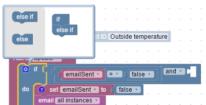
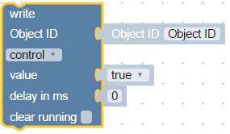
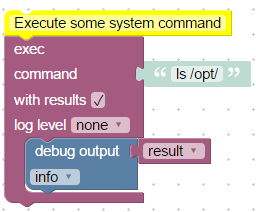
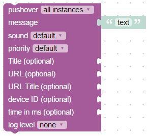
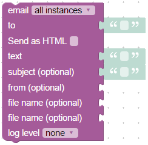
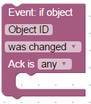
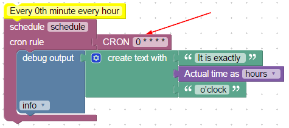
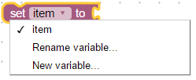
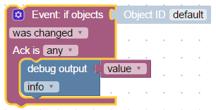

# Inhalt

- [Beschreibung](#beschreibung)
- [Getting started](#getting-started)
    - [Beispiel 1](#beispiel-1)
    - [Beispiel 2](#beispiel-2)
    - [Beispiel 3](#beispiel-3)
- [Blöcke](#blocks)
    - [Systemblöcke](#systemblöcke)
        - [Debug Ausgabe](#debug-ausgabe)
        - [Kommentar](#kommentar)
        - [Steuere State](#steuere-state)
        - [Aktualisiere State](#aktualisiere-state)
<<<<<<< HEAD
        - [Binde States](#binde-states)
        - [Schreibe States](#schreibe-states)
        - [Erzeuge State](#erzeuge-state)
        - [Wert von Objekt ID](#wert-von-objekt-id)
=======
        - [Bind states](#bind-states)
        - [Write states](#write-states)
        - [Create state](#create-state)
        - [Get value of state](#get-value-of-state)
>>>>>>> parent of ab7fb3b... Update blockly_de.md
        - [Get Object ID](#get-object-id)
    - [Aktionsblöcke](#aktionsblöcke)
        - [Exec - Kommando](#exec---kommando)
        - [request URL](#request-url)
    - [SendTo Blöcke](#sendTo-blöcke)
        - [Send to telegram](#send-to-telegram)
        - [Send to SayIt](#send-to-sayit)
        - [Send to pushover](#send-to-pushover)
        - [Send email](#send-email)
        - [Custom sendTo block](#custom-sendto-block)
    - [Datum und Zeit Blöcke](#datum-und-zeit-blöcke)
        - [Time comparision](#time-comparision)
        - [Actual time comparision](#actual-time-comparision)
        - [Get actual time im specific format](#get-actual-time-im-specific-format)
        - [Get time of astro events for today](#get-time-of-astro-events-for-today)
    - [Convert blocks](#convert-blocks)
        - [Convert to number](convert-to-number)
        - [Convert to boolean](convert-to-boolean)
        - [Get type of variable](get-type-of-variable)
        - [Convert to date/time object](convert-to-datetime-object)
        - [Convert date/time object to string](convert-datetime-object-to-string)    
        - [Convert JSON to object](convert-json-to-object)
        - [Convert object to JSON](convert-object-to-json)
    - [Trigger](#trigger)
        - [Trigger on states change](#trigger-on-states-change)
        - [Trigger on state change](#trigger-on-state-change)
        - [Trigger info](#trigger-info)
        - [Schedule](#schedule)
        - [Trigger on astro event](#trigger-on-astro-event)
        - [Named schedule](#named-schedule)
        - [Clear schedule](#clear-schedule)
        - [CRON dialog](#cron-dialog)
        - [CRON rule](#cron-rule)
    - [Timeouts](#timeouts)
        - [Delayed execution](#delayed-execution)
        - [Clear delayed execution](#clear-delayed-execution)
        - [Execution by interval](#execution-by-interval)
        - [Stop execution by interval](#stop-execution-by-interval)
    - [Logic](#logic)
        - [If else block](#if-else-block)
        - [Comparision block](#comparision-block)
        - [Logical AND/OR block](#logical-and-or-block)
        - [Negation block](#negation-block)
        - [Logical value TRUE/FALSE](#logical-value-true-false)
        - [null block](#null-block)
        - [Test block](#test-block)
    - [Loops](#loops)
        - [Repeat N times](#repeat-n-times)
        - [Repeat while](#repeat-while)
        - [Count](#count)
        - [For each](#for-each)
        - [Break out of loop](#break-out-of-loop)
    - [Math](#math)
        - [Number value](#number-value)
        - [Arithmetical operations +-\*/^](#arithmetical-operations--)
        - [Square root, Abs, -, ln, log10, e^, 10^](#square-root-abs---ln-log10-e-10)
        - [sin, cos, tan, asin, acos, atan](#sin-cos-tan-asin-acos-atan)
        - [Math constants: pi, e, phi, sqrt(2), sqrt(1/2), infinity](#math-constants-pi-e-phi-sqrt2-sqrt12-infinity)
        - [Is even, odd, prime, whole, positive, negative, divisibly by](#is-even-odd-prime-whole-positive-negative-divisibly-by)
        - [Modify variably by value plus or minus](#modify-variably-by-value-plus-or-minus)
        - [Round, floor, ceil value](#round-floor-ceil-value)
        - [Operations on the list of values: sum, min, max, average, median, modes, deviation, random item](#operations-on-the-list-of-values-sum-min-max-average-median-modes-deviation-random-item)
        - [Modulus](#modulus)
        - [Limit some value by min and max](#limit-some-value-by-min-and-max)
        - [Random value from 0 to 1](#random-value-from-0-to-1)
        - [Random value between min and max](#random-value-between-min-and-max)
    - [Text](#text)
        - [String value](#string-value)
        - [Concatenate strings](#concatenate-strings)
        - [Append string to variable](#append-string-to-variable)
        - [Length of string](#length-of-string)
        - [Is string empty](#is-string-empty)
        - [Find position in string](#find-position-in-string)
        - [Get symbol in string on specific position](#get-symbol-in-string-on-specific-position)
        - [Get substring](#get-substring)
        - [Convert to upper case or to lower case](#Convert-to-upper-case-or-to-lower-case)
        - [Trim string](#trim-string)
    - [Lists](#lists)
        - [Create empty list](#create-empty-list)
        - [Create list with values](#create-list-with-values)
        - [Create list with same value N times](#create-list-with-same-value-n-times)
        - [Get length of list](#get-length-of-list)
        - [Is list empty](#is-list-empty)
        - [Find position of item in list](#Find-position-of-item-in-list)
        - [Get item in list](#get-item-in-list)
        - [Set item in list](#set-item-in-list)
        - [Get sublist of list](#get-sublist-of-list)
        - [Convert text to list and vice versa](#convert-text-to-list-and-vice-versa)
    - [Colour](#colour)
        - [Colour value](#colour-value)
        - [Random colour](#random-colour)
        - [RGB colour](#rgb-colour)
        - [Mix colours](#mix-colours)
    - [Variables](#variables)
        - [Set variable's value](#set-variables-value)
        - [Get variable's value](#get-variables-value)
    - [Functions](#functions)
        - [Create function from blocks with no return value](#create-function-from-blocks-with-no-return-value)
        - [Create function from blocks with return value](#create-function-from-blocks-with-return-value)
        - [Return value in function ](#return-value-in-function)
        - [Create custom function with no return value](#create-custom-function-with-no-return-value)
        - [Create custom function with return value](#create-custom-function-with-return-value)
        - [Call function](#call-function)


&nbsp;
# Beschreibung
Blockly ist ein grafischer Editor, der es Nutzern erlaubt Skripte durch zusammenfügen von Blöchen zu erzeugen. 
Er wurde für Nutzer entwickelt, die keine Erfahrung in Programmierung von Computern besitzen.


&nbsp;
# Getting started

## Beispiel 1
**Zustand eines Datenpunkts bei Änderung eines anderen Datenpunkts ändern**


Dies ist das klassische Beispiel bei Änderung eines Datenpunktes etwas anderes zu schalten.

Hier wird das Licht an oder ausgeschaltet wenn Bewegung bzw. keine Bewegung erkannt wird.

Zuerst den Block "Triggers=>Falls Objekt" einfügen. Die Objekt ID auswählen um den Zustand des Objekts als Trigger für dieses Skript zu benutzen.

Einen anderen Block - "System=>Steuere" hinzufügen und im Dialog den anderen Zustand der durch den Trigger geändert werden soll auswählen.

In diesen Steuerungsblock einen Block "System=>Wert von Objekt ID" einfügen und im Dialog das Objekt "Bewegung" auswählen, um dessen Zustand in "Licht": zu schreiben.

**Es gibt bei den Trigger Blöcken eine spezielle Variable "Wert". Diese wird immer hier definiert und kann für verschiedene Zwecke verwendet werden. Sie enthält den aktuellen Wert des triggernden Objekts und man kann daher einfacherer Skripte erzeugen indem man den Block "Variable=>Objekt ID" benutzt und ihn in "Wert" umbenennt.**


&nbsp;
Beispiel zum importieren:

```
<xml xmlns="http://www.w3.org/1999/xhtml">
  <block type="comment" id="s7s**k+Cc_KjDnJW`(h~" x="12" y="63">
    <field name="COMMENT">Switch light ON or OFF it motion detected or IDLE</field>
    <next>
      <block type="on_ext" id="#}:B(M-o5:/]k,_msr%y">
        <mutation items="1"></mutation>
        <field name="CONDITION">ne</field>
        <field name="ACK_CONDITION"></field>
        <value name="OID0">
          <shadow type="field_oid" id="o~6)!C0IVy{WD%Km(lkc">
            <field name="oid">javascript.0.Motion</field>
          </shadow>
        </value>
        <statement name="STATEMENT">
          <block type="control" id="(ZqzhS_7*jGpk;`zJAZg">
            <mutation delay_input="false"></mutation>
            <field name="OID">javascript.0.Light</field>
            <field name="WITH_DELAY">FALSE</field>
            <value name="VALUE">
              <block type="get_value" id="a-E@UcwER=knNljh@:M/">
                <field name="ATTR">val</field>
                <field name="OID">javascript.0.Motion</field>
              </block>
            </value>
          </block>
        </statement>
      </block>
    </next>
  </block>
</xml>
```


&nbsp;
## Beispiel 2 
**Licht bei Bewegung anschalten und ausschalten wenn 10 Minuten keine Bewegung.**


Wenn der Zustand "Bewegung" mit dem Wert "wahr" aktualisiert wird, mache:
- schalte "Licht" an
- starte die Verzögerung von 10 Minuten um "Licht" auszuschalten und lösche alle bisherigen Verzögerungen für diesen Datenpunkt.

Wie man sieht wird der Flag "lösche Verzögerung" durch den letzten Befehl gelöscht. Dieses löscht alle Timer für diesen Datenpunkt und startet einen neuen Timer


&nbsp;
Beispiel zum importieren:

```
<xml xmlns="http://www.w3.org/1999/xhtml">
  <block type="comment" id="s7s**k+Cc_KjDnJW`(h~" x="112" y="63">
    <field name="COMMENT">Switch light ON and OFF in 10 minutes of IDLE</field>
    <next>
      <block type="on_ext" id="#}:B(M-o5:/]k,_msr%y">
        <mutation items="1"></mutation>
        <field name="CONDITION">true</field>
        <field name="ACK_CONDITION">true</field>
        <value name="OID0">
          <shadow type="field_oid" id="o~6)!C0IVy{WD%Km(lkc">
            <field name="oid">javascript.0.Motion</field>
          </shadow>
        </value>
        <statement name="STATEMENT">
          <block type="control" id="(ZqzhS_7*jGpk;`zJAZg">
            <mutation delay_input="false"></mutation>
            <field name="OID">javascript.0.Light</field>
            <field name="WITH_DELAY">FALSE</field>
            <value name="VALUE">
              <block type="logic_boolean" id="%^ADwe*2l0tLw8Ga5F*Y">
                <field name="BOOL">TRUE</field>
              </block>
            </value>
            <next>
              <block type="control" id="=]vmzp6j^V9:3?R?2Y,x">
                <mutation delay_input="true"></mutation>
                <field name="OID">javascript.0.Light</field>
                <field name="WITH_DELAY">TRUE</field>
                <field name="DELAY_MS">600000</field>
                <field name="CLEAR_RUNNING">TRUE</field>
                <value name="VALUE">
                  <block type="logic_boolean" id="!;DiIh,D]l1oN{D;skYl">
                    <field name="BOOL">FALSE</field>
                  </block>
                </value>
              </block>
            </next>
          </block>
        </statement>
      </block>
    </next>
  </block>
</xml>
```


&nbsp;
## Beispiel 3
**Verschicke eine eMail wenn die Außentemperatur höher als 25 Grad Celsius ist.**


Erklärung:

Zuerst müssen wir eine Variable definieren um zu speichern, dass die eMail für den aktuellen Temperaturalarm bereits gesendet wurde und diese Variable auf "falsch" setzen.
Dann beobachten wir die Veränderungen der Temperatur. Wir könnten dieses Skript auch periodisch ausführen, aber das ist nicht so effektiv.

Wenn sich die Temperatur ändert vergleichen wir den aktuellen Wert mit 25 und prüfen ob die eMail bereits verschickt wurde oder nicht.
Wenn die eMail noch nicht versendet war, speichern wir dass wir sie jetzt senden und sneden sie auch. Natürlich muss der eMail-Adapter vorher installiert und konfiguriert worden sein.

Wenn die Temperatur unter 23 Grad fällt setzen wir die Variable "emailSent" zurück, damit beim nächsten Temperaturalarm wieder eine eMail gesendet wird. 
Dazu wird die aktuelle Temperatur mit 23 verglichen und es werden keine eMails geschickt, solange die Temperatur um 25 Grad schwankt.

Un den "if ... else if ..." Block zu erstellen klickt man auf das Zahnrad und fügt die zusätzlich benötigten Elemente dem "IF" Block hinzu.



Man kann zu jedem Block einen Kommentar hinterlegen, indem man "Kommentar hinzufügen" im Kontextmenü des Blocks anklickt. Diesen Kommentar kann man später durch anklicken des Fragezeichens ansehen.


Man kann größere Blöcke einklappen um eine bessere Übersicht zu erhalten, indem man im Kontextmenü den Punkt "Block einklappen" auswählt. 


&nbsp;
Beispiel zum importieren:

```
<xml xmlns="http://www.w3.org/1999/xhtml">
  <block type="comment" id="r53:ZiP]3DYe;Ly;@!v5" x="87" y="13">
    <field name="COMMENT"> Send email if outside temperature is more than 25 grad Celsius.</field>
    <next>
      <block type="variables_set" id="oyEg!Z7~qid+!HYECD8C">
        <field name="VAR">emailSent</field>
        <value name="VALUE">
          <block type="logic_boolean" id="gakxd?9T354S1#_(=)%K">
            <field name="BOOL">FALSE</field>
          </block>
        </value>
        <next>
          <block type="on_ext" id="DR}w0I%EUL-FCI%`w5L4">
            <mutation items="1"></mutation>
            <field name="CONDITION">ne</field>
            <field name="ACK_CONDITION">true</field>
            <value name="OID0">
              <shadow type="field_oid" id="}TdS?2Lg~Mt[0!o0iMG.">
                <field name="oid">javascript.0.Outside_temperature</field>
              </shadow>
            </value>
            <statement name="STATEMENT">
              <block type="controls_if" id="rBBI(VLLLRnwd|ys59si">
                <mutation elseif="1"></mutation>
                <value name="IF0">
                  <block type="logic_operation" id="B5R%#,6F,xYI1gB!jjq|">
                    <field name="OP">AND</field>
                    <value name="A">
                      <block type="logic_compare" id="I=R,TaB*pge*l#j|[HZ0">
                        <field name="OP">EQ</field>
                        <value name="A">
                          <block type="variables_get" id="wd1I0gzqle,y-:h@GF)v">
                            <field name="VAR">emailSent</field>
                          </block>
                        </value>
                        <value name="B">
                          <block type="logic_boolean" id="q5~/ZIb))r`w]/RaSXUu">
                            <field name="BOOL">FALSE</field>
                          </block>
                        </value>
                      </block>
                    </value>
                  </block>
                </value>
                <statement name="DO0">
                  <block type="variables_set" id="i):z[{@|*;4zOruzXH46">
                    <field name="VAR">emailSent</field>
                    <comment pinned="false" h="80" w="160">Remember, that email was sent</comment>
                    <value name="VALUE">
                      <block type="logic_boolean" id="56A@]MZKiuL(iuuj)MRI">
                        <field name="BOOL">FALSE</field>
                      </block>
                    </value>
                    <next>
                      <block type="email" id="3J#TXZ`oei_NMEL,_w8K">
                        <field name="INSTANCE"></field>
                        <field name="IS_HTML">FALSE</field>
                        <field name="LOG">log</field>
                        <value name="TO">
                          <shadow type="text" id="j*x?kanQQyGH/pN,r9B2">
                            <field name="TEXT">myaddress@domain.com</field>
                          </shadow>
                        </value>
                        <value name="TEXT">
                          <shadow type="text" id="QE(T_Z]{=o8~h~+vz!ZU">
                            <field name="TEXT">Temperature is over 25°C</field>
                          </shadow>
                        </value>
                        <value name="SUBJECT">
                          <shadow type="text" id="/_AxN7@=T|t@XW.^Fu1(">
                            <field name="TEXT">Temperature alert</field>
                          </shadow>
                        </value>
                      </block>
                    </next>
                  </block>
                </statement>
                <value name="IF1">
                  <block type="logic_compare" id="S?0|;{3V3!_rqUk]GJ4)">
                    <field name="OP">LT</field>
                    <value name="A">
                      <block type="variables_get" id="IJwq1,|y;l7ueg1mF{~x">
                        <field name="VAR">value</field>
                      </block>
                    </value>
                    <value name="B">
                      <block type="math_number" id="m(.v?M3ezTKz(kf5b9ZE">
                        <field name="NUM">23</field>
                      </block>
                    </value>
                  </block>
                </value>
                <statement name="DO1">
                  <block type="variables_set" id="M0{G}QBtF!FYrT,xWBnV">
                    <field name="VAR">emailSent</field>
                    <value name="VALUE">
                      <block type="logic_boolean" id="ti#H=_:;-XRC%CzR/+/0">
                        <field name="BOOL">FALSE</field>
                      </block>
                    </value>
                  </block>
                </statement>
              </block>
            </statement>
          </block>
        </next>
      </block>
    </next>
  </block>
</xml>
```


&nbsp;


&nbsp;
# Blöcke

## Systemblöcke

### Debug Ausgabe


Dieser Block macht nichts, außer eine Zeile ins log zu schreiben. Man kann ihn zum debuggen des Scripts nutzen, wie diesen hier:


&nbsp;
Beispiel zum importieren:

```
<xml xmlns="http://www.w3.org/1999/xhtml">
  <block type="comment" id="K|2AnJ|5})RoNZ1T%Hh#" x="38" y="13">
    <field name="COMMENT">Print time into log every second</field>
    <next>
      <block type="timeouts_setinterval" id="LNsHTl,!r6eR8J9Yg,Xn">
        <field name="NAME">interval</field>
        <field name="INTERVAL">1000</field>
        <statement name="STATEMENT">
          <block type="debug" id=".oLS7P_oFU0%PWocRlYp">
            <field name="Severity">log</field>
            <value name="TEXT">
              <shadow type="text" id="X^Z/.qUry9B5Rr#N`)Oy">
                <field name="TEXT">test</field>
              </shadow>
              <block type="time_get" id="TPo6nim+=TBb-pnKMkRp">
                <mutation format="false" language="false"></mutation>
                <field name="OPTION">hh:mm:ss</field>
              </block>
            </value>
          </block>
        </statement>
      </block>
    </next>
  </block>
</xml>
```


Man kann 4 verschiedene Schweregrade für die Nachrichten definieren:
- debug (dazu muss der debug-Level der Javascript Instanz aktiviert sein.)
- info (default, zumindest der info log level muss ider Javascript Instanz aktiviert sein.)
- warning 
- error (wird immer angezeigt. Die anderen Level können ignoriert werden, wenn es entsprechend in der der Javascript Instanz eingestellt ist.)


&nbsp;
### Kommentar


Einen Kommentar zum Skript hinzufügen um es später besser verstehen zu können.

Der Block macht gar nichts, es ist nur ein Kommentar.


&nbsp;
### Steuere State


Man kann einen Zustand auf zwei verschiedene Arten schreiben:
- Um etwas zu steuern und den Wert an die Hardware zu schicken (Dieser Block)
- Einen neuen Wert schreiben, der nur der Information dient, z.B. Temperaturänderung ([nächster Block](#update-state))


&nbsp;
Typische Anwendung dieses Blocks:


Die Object ID wird im Dialog ausgewählt der zu sendende Wert muss angegeben werden. Abhängig vom Typ des Datenpunkts kann der Wert vom Typ [string](#string-value), [number](#number-value) oder [boolean](#ogical-value-trueflase) sein.

Weitere Erklärungen gibt es [hier](https://github.com/ioBroker/ioBroker/wiki/Adapter-Development-Documentation#commands-and-statuses).

Dieser Block schreibt den Befehl in den Datenpunkt mit (ack=false). Zusätzlich kann eine Verzögerung angegeben werden.
Wenn die Verzögerung nicht 0 ist, wird der Zustand nicht sofort, sondern erst nach der angegebenen Zeit in Millisekunden gesetzt.

Man kann alle anderen Verzögerungen für diesen Datenpunkt löschen, indem man die Checkbox anhakt.

So wird in dem folgenden Beispiel der Datenpunkt "Licht" nur einmal geschaltet (nach 2 Sekunden):


&nbsp;
Beispiel zum importieren:

```
<xml xmlns="http://www.w3.org/1999/xhtml">
  <block type="comment" id="K|2AnJ|5})RoNZ1T%Hh#" x="38" y="13">
    <field name="COMMENT">Will be executed only once</field>
    <next>
      <block type="control" id="IWceY@BFn9/Y?Ez^b(_-">
        <mutation delay_input="true"></mutation>
        <field name="OID">javascript.0.Light</field>
        <field name="WITH_DELAY">TRUE</field>
        <field name="DELAY_MS">1000</field>
        <field name="CLEAR_RUNNING">FALSE</field>
        <value name="VALUE">
          <block type="logic_boolean" id="I/LUv5/AknHr#[{{qd-@">
            <field name="BOOL">TRUE</field>
          </block>
        </value>
        <next>
          <block type="control" id=".Ih(K(P)SFApUP0)/K7,">
            <mutation delay_input="true"></mutation>
            <field name="OID">javascript.0.Light</field>
            <field name="WITH_DELAY">TRUE</field>
            <field name="DELAY_MS">2000</field>
            <field name="CLEAR_RUNNING">TRUE</field>
            <value name="VALUE">
              <block type="logic_boolean" id="B?)bgD[JZoNL;enJQ4M.">
                <field name="BOOL">TRUE</field>
              </block>
            </value>
          </block>
        </next>
      </block>
    </next>
  </block>
</xml>
```

Im Gegensatz zu dem vorherigen Beispiel wird der Zustand von "Licht" in dem folgenden Beispiel zweimal geschaltet(nach 1 Sekunde und nach 2 Sekunden):


```
<xml xmlns="http://www.w3.org/1999/xhtml">
  <block type="comment" id="K|2AnJ|5})RoNZ1T%Hh#" x="38" y="13">
    <field name="COMMENT">Will be executed twice</field>
    <next>
      <block type="control" id="IWceY@BFn9/Y?Ez^b(_-">
        <mutation delay_input="true"></mutation>
        <field name="OID">javascript.0.Light</field>
        <field name="WITH_DELAY">TRUE</field>
        <field name="DELAY_MS">1000</field>
        <field name="CLEAR_RUNNING">FALSE</field>
        <value name="VALUE">
          <block type="logic_boolean" id="I/LUv5/AknHr#[{{qd-@">
            <field name="BOOL">TRUE</field>
          </block>
        </value>
        <next>
          <block type="control" id=".Ih(K(P)SFApUP0)/K7,">
            <mutation delay_input="true"></mutation>
            <field name="OID">javascript.0.Light</field>
            <field name="WITH_DELAY">TRUE</field>
            <field name="DELAY_MS">2000</field>
            <field name="CLEAR_RUNNING">FALSE</field>
            <value name="VALUE">
              <block type="logic_boolean" id="B?)bgD[JZoNL;enJQ4M.">
                <field name="BOOL">FALSE</field>
              </block>
            </value>
          </block>
        </next>
      </block>
    </next>
  </block>
</xml>
```


&nbsp;
### Aktualisiere State


Dieser Block ist ähnlich dem [Steuere Block](#steuere-state), aber er setzt nur den aktuellen Wert. Es wird kein Befehl zum steuern der Hardware gesendet.

Typische Anwendung dieses Blocks:


&nbsp;
### Bind States


Dieser Block bindet zwei Zustände aneinander.

Man kann das gleiche mit diesen Blöcken erreichen:


Man kann auswählen, ob der Wert nur weitergeleitet wird,  wenn sich die Quelle ändert, oder bei jeder Aktualisierung.


&nbsp;
Beispiel zum importieren:
```
<block xmlns="http://www.w3.org/1999/xhtml" type="on_ext" id="w/@=5/5!D;8wn4DZ;jzG" x="287.99999999999943" y="37.999999999999716">
  <mutation items="1"></mutation>
  <field name="CONDITION">ne</field>
  <field name="ACK_CONDITION"></field>
  <value name="OID0">
    <shadow type="field_oid" id="tQBL3[;V1luVO[`h2ONM">
      <field name="oid">javascript.0.Motion</field>
    </shadow>
  </value>
  <statement name="STATEMENT">
    <block type="control" id="w=sN]yxb)5Jv!,YK[C5%">
      <mutation delay_input="false"></mutation>
      <field name="OID">javascript.0.Light</field>
      <field name="WITH_DELAY">FALSE</field>
      <value name="VALUE">
        <block type="variables_get" id="6`1|t;T%_h^|ES+nd~/?">
          <field name="VAR">value</field>
        </block>
      </value>
    </block>
  </statement>
</block>
```


&nbsp;
### Write states


Universal write block that can do the same as ["Update state"](#update-state) and ["Control state"](#control-state) together. 

But in compare with them you can define Object ID and delay with other blocks to make your script more universal.

### Create state

There are two types of variables that can be created in scripts:
- local [variables](#set-variables-value)
- global variables or states. 

Global states are visible in all scripts, but local are visible only in this current script.

Global states can be used in vis, mobile and all other logic or visualisation modules, can be logged into db or whatever.

This block creates global state and if the state yet exist, the command will be ignored. You can safely call this block by every start of the script.

<<<<<<< HEAD
Dieser Block erzeugt globale Zustände und wenn dieser bereits existiert wird der Befehl ignoriert. Daher kann dieser Block ohne Risiko zu jedem Skriptstart verwendet werden.


&nbsp;
Typische Anwendung dieses Blocks:
=======
Typical usage example:
>>>>>>> parent of ab7fb3b... Update blockly_de.md


```
<xml xmlns="http://www.w3.org/1999/xhtml">
  <block type="comment" id="dBV.{0z/{Fr@RB+10H5i" x="38" y="13">
    <field name="COMMENT">Create state and subscribe on it changes</field>
    <next>
      <block type="create" id="D%[{T~!b9^V#Z.7bI+3y">
        <field name="NAME">myState</field>
        <statement name="STATEMENT">
          <block type="on_ext" id="H@F~z_,FpvXo8BptmAtL">
            <mutation items="1"></mutation>
            <field name="CONDITION">ne</field>
            <field name="ACK_CONDITION"></field>
            <value name="OID0">
              <shadow type="field_oid" id="hn{OMH9y7AP_dns;KO6*">
                <field name="oid">javascript.0.myState</field>
              </shadow>
            </value>
            <statement name="STATEMENT">
              <block type="debug" id="DjP1pU?v=))`V;styIRR">
                <field name="Severity">log</field>
                <value name="TEXT">
                  <shadow type="text" id="de?mCXefl4v#XrO])~7y">
                    <field name="TEXT">test</field>
                  </shadow>
                  <block type="text_join" id="^33}.]#ov(vUAEEn8Hdp">
                    <mutation items="2"></mutation>
                    <value name="ADD0">
                      <block type="text" id="_-p%CZq4%)v1EYvh)lf@">
                        <field name="TEXT">Value of my state is </field>
                      </block>
                    </value>
                    <value name="ADD1">
                      <block type="variables_get" id="6r!TtpfrfQ@5Nf[4#[6l">
                        <field name="VAR">value</field>
                      </block>
                    </value>
                  </block>
                </value>
              </block>
            </statement>
          </block>
        </statement>
      </block>
    </next>
  </block>
</xml>
```

Man kann den neu erzeugten State bereits in dem Block sekber nutzen. 

Der folgende Code gibt bei der ersten Ausführung einen Fehler aus, weil'subscribe' für "myState" das Objekt nicht finden kann:
 


Bei der zweiten Ausführung wird keine Fehler ausgegeben, weil der Datenpunkt jetzt existiert.


&nbsp;
### Wert von Objekt ID


Dieser Block dient dazu den Wert eines Datenpunktes auszulesen. Folgende Attribute des Datenpunktes können ausgelesen werden:
- Wert
- Acknowledge - Befehl = falsch oder update = wahr
- Timestamp in ms seit dem 01.01.1970 (Hat den Typ "Datumsobjekt")
- Letzte Änderung des Wertes in ms seit dem 01.01.1970 (Hat den Typ "Datumsobjekt")
- Qualität
- Quelle - Name der Instanz, die den letzten Wert geschrieben hat, wie z.B. "system.adapter.javascript.0"


&nbsp;
Beispiel um die Zeit der letzten Änderung des Wertes auszugeben:


```
<xml xmlns="http://www.w3.org/1999/xhtml">
  <block type="comment" id="GVW732OFexZ9HP[q]B3," x="38" y="13">
    <field name="COMMENT">Print time of last change for myState</field>
    <next>
      <block type="debug" id="t,GmgLjo]1d0{xT+@Yns">
        <field name="Severity">log</field>
        <value name="TEXT">
          <shadow type="text" id="w{UF-|ashrP4e*jl~{9_">
            <field name="TEXT">test</field>
          </shadow>
          <block type="text_join" id="i~L{r:B9oU}.ANc.AV8F">
            <mutation items="2"></mutation>
            <value name="ADD0">
              <block type="text" id="r5=i|qvrII+NCAQ~t{p5">
                <field name="TEXT">Last change of myState was at</field>
              </block>
            </value>
            <value name="ADD1">
              <block type="convert_from_date" id="?cGS1/CwThX!tTDMVSoj">
                <mutation format="false" language="false"></mutation>
                <field name="OPTION">hh:mm:ss</field>
                <value name="VALUE">
                  <block type="get_value" id="k+#N2u^rx)u%Z9lA`Yps">
                    <field name="ATTR">lc</field>
                    <field name="OID">javascript.0.myState</field>
                  </block>
                </value>
              </block>
            </value>
          </block>
        </value>
      </block>
    </next>
  </block>
</xml>
```


&nbsp;

### Objekt ID


Dieses ist ein einfacher Hilfsblock um komfortabel die Objekt ID zum triggern des Blocks auszuwählen.

Der ID Auswahldialog wird durch Anklicken von "Objekt ID" geöffnet.


&nbsp;
Typische Anwendung dieses Blocks:


```
<xml xmlns="http://www.w3.org/1999/xhtml">
  <block type="comment" id="GVW732OFexZ9HP[q]B3," x="38" y="13">
    <field name="COMMENT">Typical usage of Object ID selector</field>
    <next>
      <block type="on_ext" id="D+1_tP(lF!R]wy?R#|~A">
        <mutation items="1"></mutation>
        <field name="CONDITION">ne</field>
        <field name="ACK_CONDITION"></field>
        <value name="OID0">
          <shadow type="field_oid" id="rpg#*-DXMVqzexE8-^Xc">
            <field name="oid">default</field>
          </shadow>
          <block type="field_oid" id="YYTRKxeC@l3WE~OJx4ei">
            <field name="oid">javascript.0.myState</field>
          </block>
        </value>
        <statement name="STATEMENT">
          <block type="debug" id="{;_x6LATJ,b^leE,xgz9">
            <field name="Severity">log</field>
            <value name="TEXT">
              <shadow type="text" id="-)V}_9Cxt2kj:]36y,7#">
                <field name="TEXT">Changed</field>
              </shadow>
            </value>
          </block>
        </statement>
      </block>
    </next>
  </block>
</xml>
```


&nbsp;


&nbsp;


## Aktionsblöcke

### Exec - Kommando


Dieser Block führt das eingegebene Kommando im System aus, so als ob man es auf der Kommandozeile via SSH eingegeben hätte.

Der Befehl wird mit den rechten des Users ausgeführt unter dem ioBroker gestartet wurde. 

Wenn keine Ausgabe gewünscht ist, kann diese unterdrückt werden:


Wenn eine Ausgabe erfolgen soll:




&nbsp;

```
<xml xmlns="http://www.w3.org/1999/xhtml">
  <block type="comment" id="GVW732OFexZ9HP[q]B3," x="313" y="38">
    <field name="COMMENT">Execute some system command</field>
    <next>
      <block type="exec" id="hGkHs.IkmiTa{jR^@-}S">
        <mutation with_statement="true"></mutation>
        <field name="WITH_STATEMENT">TRUE</field>
        <field name="LOG"></field>
        <value name="COMMAND">
          <shadow type="text" id=":KG#hyuPRhQJWFSk)6Yo">
            <field name="TEXT">ls /opt/</field>
          </shadow>
        </value>
        <statement name="STATEMENT">
          <block type="debug" id="ELv(y5V4[hZ,F8,]D51x">
            <field name="Severity">log</field>
            <value name="TEXT">
              <shadow type="text" id="J[o*Fylexfu41}smph).">
                <field name="TEXT">result</field>
              </shadow>
              <block type="variables_get" id="gWo7Y^,QI=PqL(Q;7D=^">
                <field name="VAR">result</field>
              </block>
            </value>
          </block>
        </statement>
      </block>
    </next>
  </block>
</xml>
```


&nbsp;

Zur Anlayse der Ausgabe werden 3 besondere Variable erzeugt:
- Ergebnis, enthält die reguläre Ausgabe auf die Konsole (z.B für den Befehl "ls /opt" lautet die Ausgabe "iobroker nodejs")
- Fehlerobjekt, wenn der Befehl vom JavaScript Modul nicht ausgeführt werden konnte
- stderr, die Fehlerausgabe des ausgeführten Programms

Zusätzlich wird die selbe Ausgabe auch im log erscheinen, wenn der loglevel nicht auf 'none' steht.


&nbsp;

### request URL


Ruft eine URL auf und gibt das Ergebnis zurück.


&nbsp;
Beispiel:


Zur Anlayse der Ausgabe werden 3 besondere Variable erzeugt:
- Ergebnis, enthält den body der angeforderten Seite
- Fehler, enthält eine Fehlerbeschreibung
- Antwort (nur für Fortgeschrittene), Spezialobjekt vom Typ [http.IncomingMessage](https://nodejs.org/api/http.html#http_class_http_incomingmessage)

Wenn keine Ausgabe gewünscht ist, kann diese unterdrückt werden. Dazu die Option "mit Ergebnis" abhaken.


&nbsp;


&nbsp;

## SendTo Blöcke

### Send to telegram


Dieser Block dient dazu eine Nachricht über telegram mit Hilfe des telegram-Adapters zu senden.

Selbstverständlich muss dafür vorher der telegram-Adapter installiert und konfiguriert werden.

Um die Nachricht über eine bestimmte Instanz zu senden, muss die gewünschte Instanz des Adapters (üblicherweise telegram.0) ausgewählt werden, ansonsten wird die Nachricht über alle verfügbaren Instanzen verschickt.

Das Feld *Meldung* ist zwingend notwendig und der dort enthaltene Text wird exakt so an den Klienten gesendet. 

User name ID is optional and this is ID from [telegram](https://core.telegram.org/bots/api#user) (Unique identifier for user or bot).

Additionally if the log level is not "none", the same message will be sent to log.


&nbsp;

### Send to SayIt


This block is used to send text to sayit instance to pronounce this text.

Of course the sayit adapter must be installed and configured.

To send message to some specific instance, you should select the installed adapter instance (Normally sayit.0), elsewise message will be sent to all existing instances.

Property *message* is mandatory and exactly this text will be pronounced. 

You must check the language property. This will be used for text2speech engine. 

Volume is optional (normally from 0 to 100).

Additionally if the log level is not "none", the same message will be sent to log.


&nbsp;

### Send to pushover


This block is used to send text to pushover client. You can read about pushover driver [here](https://github.com/ioBroker/ioBroker.pushover).

Of course the pushover adapter must be installed and configured.

To send message to some specific instance, you should select the installed adapter instance (Normally pushover.0), elsewise message will be sent to all existing instances.

Property *message* is mandatory and exactly this text will be sent to client. 

All other properties are optional and you can read bout them [here](https://pushover.net/api):

- *device ID* - your user's device name to send the message directly to that device, rather than all of the user's devices (multiple devices may be separated by a comma)
- *title* - your message's title, otherwise your app's name is used
- *URL* - a supplementary URL to show with your message
- *URL title* - a title for your supplementary URL, otherwise just the URL is shown
- *priority* - send as -2 to generate no notification/alert, -1 to always send as a quiet notification, 1 to display as high-priority and bypass the user's quiet hours, or 2 to also require confirmation from the user
- *time in ms* - a Unix timestamp of your message's date and time to display to the user, rather than the time your message is received by our API
- *sound* - the name of one of the sounds supported by device clients to override the user's default sound choice

Additionally if the log level is not "none", the same message will be sent to log.


&nbsp;

### Send email


This block is used to send text as email.

Of course the email adapter must be installed, configured and tested.

To send message to some specific instance, you should select the installed adapter instance (Normally email.0), elsewise message will be sent to all existing instances.

Property *text* is mandatory and exactly this text will be sent to client. 

Of course the destination (*to*) must be filled with valid email address.

You can attach up to files (normally images) to email. To use images in the text, you must change format to HTML (check "Send as HTML" option) and text could look like:

```
<p>Embedded image 1: </p>
<p>Embedded image 2: </p>
```

You can refer to files as ``````. "file1" and "file2" are reserved IDs and cannot be changed.

"file name" must consist full path to image on disk.


```
<block xmlns="http://www.w3.org/1999/xhtml" type="email" id="VeysPTJXFh^.CW1t(s@Q" x="563" y="63">
  <field name="INSTANCE"></field>
  <field name="IS_HTML">FALSE</field>
  <field name="LOG"></field>
  <value name="TO">
    <shadow type="text" id=".6+6Rp^N7JHiNkP/.^09">
      <field name="TEXT"></field>
    </shadow>
    <block type="text" id="NC6==~4g|OB^`xZ:|Rlx">
      <field name="TEXT">user@myemail.com</field>
    </block>
  </value>
  <value name="TEXT">
    <shadow type="text" id="jaGOyI%O4wl(.s.wo(Y`">
      <field name="TEXT"></field>
    </shadow>
    <block type="text" id=")--+u-+rdoAyWpi9I87+">
      <field name="TEXT">&lt;p&gt;Embedded image 1: &lt;img src='cid:file1'/&gt;&lt;/p&gt;</field>
    </block>
  </value>
  <value name="SUBJECT">
    <shadow type="text" id="|49=rPOCP]hwFD[HX@_I">
      <field name="TEXT">From Sweet Home</field>
    </shadow>
  </value>
  <value name="FILE_1">
    <block type="text" id="tlb_Kuh5?JvPTQr)A{}4">
      <field name="TEXT">/opt/video/imageCam.png</field>
    </block>
  </value>
</block>
```

Additionally if the log level is not "none", the same message will be sent to log.


&nbsp;

### Custom sendTo block


This is just a help block to send internal system message (sendTo) to any adapter. 

Of course you can use custom function block to do anything crazy, and to send messages too.

You can define your own parameters for sendTo command:


Read more [here](https://github.com/ioBroker/ioBroker.javascript#sendto) about "sendTo".

Example how to send SQL query to sql adapter:


```
<xml xmlns="http://www.w3.org/1999/xhtml">
  <block type="comment" id="GVW732OFexZ9HP[q]B3," x="163" y="13">
    <field name="COMMENT">Send query to SQL adapter</field>
    <next>
      <block type="sendto_custom" id="84lYloO4o+RvLszPVHZ5">
        <mutation items="" with_statement="true"></mutation>
        <field name="INSTANCE">sql.0</field>
        <field name="COMMAND">query</field>
        <field name="WITH_STATEMENT">TRUE</field>
        <field name="LOG">log</field>
        <value name="ARG0">
          <shadow type="text" id=")faamoSD,nGPXawY4|(Z">
            <field name="TEXT">SELECT * FROM datapoints</field>
          </shadow>
        </value>
        <statement name="STATEMENT">
          <block type="debug" id="Q#UJl]^_g/VHzM*G/a:f">
            <field name="Severity">log</field>
            <value name="TEXT">
              <shadow type="text" id="#!NJS43!0z@}z:6~_,9(">
                <field name="TEXT">test</field>
              </shadow>
              <block type="procedures_callcustomreturn" id="0E2fmQQduf4)-({z(om|">
                <mutation name="JSON.stringify">
                  <arg name="obj"></arg>
                </mutation>
                <value name="ARG0">
                  <block type="variables_get" id=",^2E2eT#598hI^TvABD9">
                    <field name="VAR">result</field>
                  </block>
                </value>
              </block>
            </value>
          </block>
        </statement>
      </block>
    </next>
  </block>
  <block type="procedures_defcustomreturn" id="lm*.n3kQXll8o9X^*m,k" x="163" y="263">
    <mutation statements="false">
      <arg name="obj"></arg>
    </mutation>
    <field name="NAME">JSON.stringify</field>
    <field name="SCRIPT">cmV0dXJuIEpTT04uc3RyaW5naWZ5KG9iaik7</field>
    <comment pinned="false" h="80" w="160">Describe this function...</comment>
  </block>
</xml>
```

If you will use only one parameter with empty name, so no structure will created, like here:

```
var obj, result;

/**
 * Describe this function...
 */
function JSON_stringify(obj) {
    return JSON.stringify(obj);
}


// Send query to SQL adapter
sendTo("sql.0", "query", 'SELECT * FROM datapoints', function (result) {
    console.log((JSON_stringify(result)));
  });
console.log("sql.0: " + "");
```

Or how to request history from SQL adapter:


```
<xml xmlns="http://www.w3.org/1999/xhtml">
  <block type="comment" id="GVW732OFexZ9HP[q]B3," x="263" y="13">
    <field name="COMMENT">Get history from SQL adapter</field>
    <next>
      <block type="variables_set" id="J;8I^fN*4YQ1+jPI3FS#">
        <field name="VAR">end</field>
        <value name="VALUE">
          <block type="time_get" id="kZFFxa-2%7/:=IHU|}eB">
            <mutation format="false" language="false"></mutation>
            <field name="OPTION">object</field>
          </block>
        </value>
        <next>
          <block type="sendto_custom" id="84lYloO4o+RvLszPVHZ5">
            <mutation items="id,options" with_statement="true"></mutation>
            <field name="INSTANCE">sql.0</field>
            <field name="COMMAND">getHistory</field>
            <field name="WITH_STATEMENT">TRUE</field>
            <field name="LOG"></field>
            <value name="ARG0">
              <shadow type="text" id=")faamoSD,nGPXawY4|(Z">
                <field name="TEXT">system.adapter.admin.0.memRss</field>
              </shadow>
            </value>
            <value name="ARG1">
              <shadow type="text" id="/nmT=qDw;S`#*tXN=C6n">
                <field name="TEXT">{start: end - 3600000, end: end, aggregate: "minmax"}</field>
              </shadow>
            </value>
            <statement name="STATEMENT">
              <block type="debug" id="Q#UJl]^_g/VHzM*G/a:f">
                <field name="Severity">log</field>
                <value name="TEXT">
                  <shadow type="text" id="#!NJS43!0z@}z:6~_,9(">
                    <field name="TEXT">test</field>
                  </shadow>
                  <block type="procedures_callcustomreturn" id="0E2fmQQduf4)-({z(om|">
                    <mutation name="JSON.stringify">
                      <arg name="obj"></arg>
                    </mutation>
                    <value name="ARG0">
                      <block type="variables_get" id=",^2E2eT#598hI^TvABD9">
                        <field name="VAR">result</field>
                      </block>
                    </value>
                  </block>
                </value>
              </block>
            </statement>
          </block>
        </next>
      </block>
    </next>
  </block>
  <block type="procedures_defcustomreturn" id="lm*.n3kQXll8o9X^*m,k" x="263" y="313">
    <mutation statements="false">
      <arg name="obj"></arg>
    </mutation>
    <field name="NAME">JSON.stringify</field>
    <field name="SCRIPT">cmV0dXJuIEpTT04uc3RyaW5naWZ5KG9iaik7</field>
    <comment pinned="false" h="80" w="160">JSON.stringify object</comment>
  </block>
</xml>
```

Generated javascript code:
```
var obj, end, result;

/**
 * JSON.stringify object
 */
function JSON_stringify(obj) {
    return JSON.stringify(obj);
}


// Get history from SQL adapter
end = (new Date().getTime());
sendTo("sql.0", "getHistory", {
   "id": 'system.adapter.admin.0.memRss',
   "options": {start: end - 3600000, end: end, aggregate: "minmax"}
}, function (result) {
    console.log((JSON_stringify(result)));
  });
```

If you will start value with "{" it will be interpreted as JSON string. Use double quotes in string.


&nbsp;


&nbsp;

## Date and Time blocks
### Time comparision


If used operator "between" or "not between", the block looks like this:


You can specify a time, which must be compared. Block expects the time as "Date object".


There are following compare modes:

- less than, check if actual time less than specified time.
- equal to or less than
- greater than
- equal to or greater than
- equal to
- between, check if the time between some day times. 
    - E.g. if time must be between 12:00 and 20:00. It will be checked if actual time grater or equal than 12:00 and less than 20:00. 20:00 will return false.
    - or for instance between 21:00 and 8:00. In the last case it will be checked if time greater or equal to 21:00 or less than 8:00.

- not between, if the time is not in the given period of the day time. If the time less than start and greater or equal to end. (if start time is greater than end time, it will be checked if the time greater or equal than end and smaller than start)

Following time formats are valid:
- YYYY-MM-DD hh:mm:ss
- YYYY-MM-DD hh:mm
- hh:mm:ss
- hh:mm


&nbsp;

### Actual time comparision


This block is used to compare the day time with actual time. It has the same logic as [Time comparision](#time-comparision), but limits cannot be a blocks and it compares only actual time. (for compatibility with old versions)


&nbsp;

### Get actual time im specific format


Returns the actual time in some specified format.

Following formats are supported:

- milliseconds - returns only milliseconds of current second from 0 to 999 (not epoch milliseconds). To get epoch milliseconds use "Date object";        
- seconds - returns only seconds of current minute from 0 to 59,            
- seconds in day - returns number of seconds from start of the day (0 to 24 * 3600 - 1),            
- minutes - returns minutes of current hour from 0 to 59,
- minutes in day - returns number of minutes from the day start (0 to 24 * 60 - 1),            
- hours - returns hours of current day from 0 to 23,
- day of month - get day of month from 1 to 31,       
- month as number - get month as number from 1 to 12,
- month as text - get month as text. Language must be specified.      
- month as short text - get month as text: Jan, Feb,  Mar,  Apr, May, June, July, Aug, Sept, Oct, Nov, Dec. Language must be specified.     
- short year - Year from 0 to 99, e.g for 2016 the result will be 16.         
- full year - Full year: 2016
- week day text - Get day of week as text.
- short week day - Get day of week as short text: Su, Mo, Tu, We, Th, Fr, Sa.
- week day as number - Day of week as number from 1 (monday) to 7 (sunday).  
- custom format - You can specify your own [format](https://github.com/ioBroker/ioBroker.javascript#formatdate).
- Date object - Returns date and time as number of milliseconds from start of epoch (1970.1.1 00:00:00.000Z GMT). This is always GMT.        
- yyyy.mm.dd - 2016.09.14
- yyyy/mm/dd - 2016/09/14
- yy.mm.dd - 16.09.14            
- yy/mm/dd - 16/09/14   
- dd.mm.yyyy - 14.09.2016   
- dd/mm/yyyy - 14/09/2016
- dd.mm.yy - 14.09.16             
- dd/mm/yy - 14/09/16           
- mm/dd/yyyy - 09/14/2016        
- mm/dd/yy - 09/14/16                
- dd.mm. - 14.09.            
- dd/mm - 14/09      
- mm.dd - 09.14         
- mm/dd - 09/14         
- hh:mm - 12:00         
- hh:mm:ss - 12:00:00         
- hh:mm:ss.sss - 12:00:00.000    


&nbsp;

### Get time of astro events for today


Returns the time in current day of some specific astrological event.

The attribute "offset" is the offset in minutes. It can be negative too, to define time before astro event.
  
Following values can be used as attribute in astro-function:
  
- sunrise: sunrise (top edge of the sun appears on the horizon)
- sunriseEnd: sunrise ends (bottom edge of the sun touches the horizon)
- goldenHourEnd: morning golden hour (soft light, best time for photography) ends
- solarNoon: solar noon (sun is in the highest position)
- goldenHour: evening golden hour starts
- sunsetStart: sunset starts (bottom edge of the sun touches the horizon)
- sunset: sunset (sun disappears below the horizon, evening civil twilight starts)
- dusk: dusk (evening nautical twilight starts)
- nauticalDusk: nautical dusk (evening astronomical twilight starts)
- night: night starts (dark enough for astronomical observations)
- nightEnd: night ends (morning astronomical twilight starts)
- nauticalDawn: nautical dawn (morning nautical twilight starts)
- dawn: dawn (morning nautical twilight ends, morning civil twilight starts)
- nadir: nadir (darkest moment of the night, sun is in the lowest position)

The return value has type "Date Object", what is just the number of milliseconds from 1970.01.01.

**Note:** to use "astro"-function the "latitude" and "longitude" must be defined in javascript adapter settings.


&nbsp;


&nbsp;

## Convert blocks
Sometimes it is required to convert value into other type. Following blocks allow to convert value into specific types.

### Convert to number


Convert value to number (float).


&nbsp;

### Convert to boolean


Convert value to boolean (true or false).


&nbsp;

### Convert to string


Convert value to string.


&nbsp;

### Get type of variable


Get type of value. Type can be: boolean, number, string, object.


&nbsp;

### Convert to date/time object


Convert value to "Date object". Read [here](#get-actual-time-im-specific-format), what the "Date object" is.


&nbsp;

### Convert date/time object to string


Convert "Date object" into string. It has the same format options as [Get actual time im specific format](#get-actual-time-im-specific-format).


&nbsp;

### Convert JSON to object


Convert JSON string into javascript object. If an error occurs, the empty object will be returned. (only for experts)


&nbsp;

### Convert object to JSON


Convert Javascript object to JSON string. If prettify option is selected the result string looks like:

```
{
  "a": 1,
  "b": 2
}
```

if not:

```
{"a": 1, "b": 2}
```


&nbsp;


&nbsp;

## Trigger

### Trigger on states change


This block executes some action if state of given objects changed or updated. This is the main block to build interactions between different states and accordingly systems.

With this block you can bind different states together or send message or email on value change.

Typical usage of block:


```
<xml xmlns="http://www.w3.org/1999/xhtml">
  <block type="comment" id="]L0d;6j+=OH*[4n{C7v^" x="112" y="13">
    <field name="COMMENT">Switch light on if motion detected</field>
    <next>
      <block type="on_ext" id="QYVeQlu|#2hwniNg)=z8">
        <mutation items="1"></mutation>
        <field name="CONDITION">ne</field>
        <field name="ACK_CONDITION"></field>
        <value name="OID0">
          <shadow type="field_oid" id="Xe6D#r|nf9SEK`.oAuS0">
            <field name="oid">javascript.0.Motion</field>
          </shadow>
        </value>
        <statement name="STATEMENT">
          <block type="control" id="J(HiEvnNKw2B%V1~WXsX">
            <mutation delay_input="false"></mutation>
            <field name="OID">javascript.0.Light</field>
            <field name="WITH_DELAY">FALSE</field>
            <value name="VALUE">
              <block type="logic_boolean" id="o;j8lE#h.XE,0:0_LcW{">
                <field name="BOOL">TRUE</field>
              </block>
            </value>
          </block>
        </statement>
      </block>
    </next>
  </block>
</xml>
```

You can define as many ObjectIDs as you want via extension dialog:


If only one object ID is used so special variables are available in the statement block:
- value - actual value of state
- oldValue - old value of state


```
<block xmlns="http://www.w3.org/1999/xhtml" type="on_ext" id="QYVeQlu|#2hwniNg)=z8" x="38" y="39">
  <mutation items="1"></mutation>
  <field name="CONDITION">ne</field>
  <field name="ACK_CONDITION"></field>
  <value name="OID0">
    <shadow type="field_oid" id="Xe6D#r|nf9SEK`.oAuS0">
      <field name="oid">javascript.0.Motion</field>
    </shadow>
  </value>
  <statement name="STATEMENT">
    <block type="debug" id="jT6fif_FI9ua|,rL[Ra1">
      <field name="Severity">log</field>
      <value name="TEXT">
        <shadow type="text" id="}=qIm)a0)};f+J/JRgy^">
          <field name="TEXT">test</field>
        </shadow>
        <block type="text_join" id="wjgpY(Whewaqy0d8NVx%">
          <mutation items="4"></mutation>
          <value name="ADD0">
            <block type="text" id="M?[Xy1(Fu36A;b#=4~[t">
              <field name="TEXT">Actual value is</field>
            </block>
          </value>
          <value name="ADD1">
            <block type="variables_get" id="W)*G#(JDzuVpV^1P|[2m">
              <field name="VAR">value</field>
            </block>
          </value>
          <value name="ADD2">
            <block type="text" id="7TW;voPvdc#c4e/SWCjZ">
              <field name="TEXT">Old value was</field>
            </block>
          </value>
          <value name="ADD3">
            <block type="variables_get" id="s`6)4s:}%L#f]pu4E[vK">
              <field name="VAR">oldValue</field>
            </block>
          </value>
        </block>
      </value>
    </block>
  </statement>
</block>
```

elsewise if more than one object ID is used for trigger, you can access value and old value via [Trigger info](#trigger-info).


&nbsp;

### Trigger on state change


This is the same block as "Trigger on states change", but with no possibility to use multiple object IDs for triggering (for versions compatibility).


&nbsp;


### Trigger info


Get information about value, timestamp or ID of the state, that triggered the trigger.

This block can be used only inside of ["Trigger on states change"](#trigger-on-states-change) or ["Trigger on state change"](#trigger-on-state-change) blocks.

Following information can be accessed:

- object ID - ID of state, that fired the trigger                
- name - name of state from common.name                   
- description - description of state from common.desc
- channel ID - ID of channel to which belongs the state. If not channel there, it will be null 
- channel name - name of channel to which belongs the state. If not channel there, it will be null  
- device ID - ID of device to which belongs the state. If not channel there, it will be null 
- device name - name of device to which belongs the state. If not channel there, it will be null                
- state value - actual value of fired state
- state timestamp - actual timestamp as Date object
- state quality - actual quality code of value
- origin of value - name of instance that cause the change
- is command or update - is it command (ack=false) or update (ack=true)
- last change of state - timestamp of last change of this value
- previous value - previous value of this state, before the trigger fired
- previous timestamp - previous timestamp of this state, before the trigger fired
- previous quality - previous quality of this state, before the trigger fired
- previous origin -  previous origin of this state, before the trigger fired
- previous command or update - previous type of this value, before the trigger fired
- previous last change - previous "last changed value" of this state, before the trigger fired

Typical usage:


```
<block xmlns="http://www.w3.org/1999/xhtml" type="on_ext" id="QYVeQlu|#2hwniNg)=z8" x="113" y="238">
  <mutation items="1"></mutation>
  <field name="CONDITION">ne</field>
  <field name="ACK_CONDITION"></field>
  <value name="OID0">
    <shadow type="field_oid" id="Xe6D#r|nf9SEK`.oAuS0">
      <field name="oid">javascript.0.Motion</field>
    </shadow>
  </value>
  <statement name="STATEMENT">
    <block type="debug" id="jT6fif_FI9ua|,rL[Ra1">
      <field name="Severity">log</field>
      <value name="TEXT">
        <shadow type="text" id="}=qIm)a0)};f+J/JRgy^">
          <field name="TEXT">test</field>
        </shadow>
        <block type="text_join" id="wjgpY(Whewaqy0d8NVx%">
          <mutation items="4"></mutation>
          <value name="ADD0">
            <block type="text" id="M?[Xy1(Fu36A;b#=4~[t">
              <field name="TEXT">Actual value is</field>
            </block>
          </value>
          <value name="ADD1">
            <block type="on_source" id="_q8v0HD`c[7e76O{@4Tq">
              <field name="ATTR">state.val</field>
            </block>
          </value>
          <value name="ADD2">
            <block type="text" id="7TW;voPvdc#c4e/SWCjZ">
              <field name="TEXT">Old value was</field>
            </block>
          </value>
          <value name="ADD3">
            <block type="on_source" id="D`gpXSShKRQuy:jyMK}6">
              <field name="ATTR">oldState.val</field>
            </block>
          </value>
        </block>
      </value>
    </block>
  </statement>
</block>
```


&nbsp;

### Schedule


This is second main block for automation after ["Trigger on states change"](#trigger-on-states-change). This block lets execute some actions periodically.

The definition of schedule rule will be done in very well documented CRON [format](https://en.wikipedia.org/wiki/Cron). With extension, that seconds can be defined too. 
If seconds should be used they must be defined as very first parameter of CRON rule and rule will have 6 parts.

Generally CRON rule consist of 5 or 6 parts:
- seconds rules (optional)
- minutes rules
- hours rules
- day of month rules
- month's rules
- and day of week rules.

For every part following formats are allowed:
- \* - fire every (second, minute, hour, ...)
- X (e.g. 5) - fire only in this second, minute, hour...
- from-to (e.g 1-9) - fire only in this interval
- \*/X (e.g. \*/5) - fire every X seconds, minutes... In case of "\*/5" for hours the trigger will fire on 0, 5, 10, 15 and on 20 hours.
- numbers and intervals can be combined by comma (e.g 1,3,4-6). Do not make spaces between numbers, because space is delimiter for rule's parts.

\*/10 \* \* \* 6,7 - fire every 10 minutes on saturday and sunday.

\*/30 \* \* \* \* \* - fire every 30 seconds.

```
 ┌───────────── min (0 - 59)
 │ ┌────────────── hour (0 - 23)
 │ │ ┌─────────────── day of month (1 - 31)
 │ │ │ ┌──────────────── month (1 - 12)
 │ │ │ │ ┌───────────────── day of week (0 - 6) (0 to 6 are Sunday to Saturday; 7 is also Sunday)
 │ │ │ │ │
 │ │ │ │ │
 │ │ │ │ │
 * * * * *  schedule
```

or if seconds used:

```
 ┌───────────── seconds (0 - 59)
 │ ┌───────────── min (0 - 59)
 │ │ ┌────────────── hour (0 - 23)
 │ │ │ ┌─────────────── day of month (1 - 31)
 │ │ │ │ ┌──────────────── month (1 - 12)
 │ │ │ │ │ ┌───────────────── day of week (0 - 6) (0 to 6 are Sunday to Saturday; 7 is also Sunday)
 │ │ │ │ │ │
 │ │ │ │ │ │
 │ │ │ │ │ │
 * * * * * *  schedule
```

But there is a good help for you to build such a rules. By clicking on rule the CRON dialog will be opened and you can specify by mouse your rule.


&nbsp;

### Trigger on astro event


Execute some action on astrological event. Following events are possible:

- sunrise: sunrise (top edge of the sun appears on the horizon)
- sunriseEnd: sunrise ends (bottom edge of the sun touches the horizon)
- goldenHourEnd: morning golden hour (soft light, best time for photography) ends
- solarNoon: solar noon (sun is in the highest position)
- goldenHour: evening golden hour starts
- sunsetStart: sunset starts (bottom edge of the sun touches the horizon)
- sunset: sunset (sun disappears below the horizon, evening civil twilight starts)
- dusk: dusk (evening nautical twilight starts)
- nauticalDusk: nautical dusk (evening astronomical twilight starts)
- night: night starts (dark enough for astronomical observations)
- nightEnd: night ends (morning astronomical twilight starts)
- nauticalDawn: nautical dawn (morning nautical twilight starts)
- dawn: dawn (morning nautical twilight ends, morning civil twilight starts)
- nadir: nadir (darkest moment of the night, sun is in the lowest position)

**Note:** to use "astro"-function the "latitude" and "longitude" must be defined in javascript adapter settings.

Additionally you can set the offset in minutes to astrological event, e.g. to fire the trigger 1 hour before down: 


As you can see the offset can be negative too to specify time before astrological events.


&nbsp;

### Named schedule


This block is the same as [Schedule](#schedule), but with possibility to set CRON rule by string and with possibility to stop the schedule.

You can specify unique name of this schedule block and then later to clear it with [Clear schedule](#clear-schedule). 

Here is an example of configurable alarm clock:
 


```
<xml xmlns="http://www.w3.org/1999/xhtml">
  <block type="comment" id="QWp.l96v1;-4{x)j5K5y" x="38" y="13">
    <field name="COMMENT">Configurable alarm. Set time as: hh:mm</field>
    <next>
      <block type="create" id="5*XX`C;PgnU(q#Nk~D,o">
        <field name="NAME">alarmTime</field>
        <statement name="STATEMENT">
          <block type="on_ext" id="ot:9oFMh.(c)sxkufTxA">
            <mutation items="1"></mutation>
            <field name="CONDITION">ne</field>
            <field name="ACK_CONDITION"></field>
            <value name="OID0">
              <shadow type="field_oid" id="qV#=^mz,%qxL#}VsA)3C">
                <field name="oid">javascript.0.alarmTime</field>
              </shadow>
            </value>
            <statement name="STATEMENT">
              <block type="schedule_clear" id="ukGIQYyTpip_9!1H_xnN">
                <field name="NAME">alarm</field>
                <next>
                  <block type="schedule_create" id=")^!A|k+`1=[pFp(S-*sw">
                    <field name="NAME">alarm</field>
                    <value name="SCHEDULE">
                      <shadow type="field_cron" id="uSka7fK[T7j0m_4!4+fO">
                        <field name="CRON">* * * * *</field>
                      </shadow>
                      <block type="procedures_callcustomreturn" id=")E!Ljg1z9iQ3)Nb#CX~n">
                        <mutation name="time to CRON">
                          <arg name="time"></arg>
                        </mutation>
                        <value name="ARG0">
                          <block type="on_source" id="qs+k30Lnd1V(BSNs{}P!">
                            <field name="ATTR">state.val</field>
                          </block>
                        </value>
                      </block>
                    </value>
                    <statement name="STATEMENT">
                      <block type="debug" id="7arB5vcx^ci2Un#}TLKh">
                        <field name="Severity">log</field>
                        <value name="TEXT">
                          <shadow type="text" id="N;`AY!p#T_do@vP_OQr9">
                            <field name="TEXT">Wake up!</field>
                          </shadow>
                        </value>
                      </block>
                    </statement>
                  </block>
                </next>
              </block>
            </statement>
          </block>
        </statement>
      </block>
    </next>
  </block>
  <block type="procedures_defcustomreturn" id="_*_L4XpCr!7eLsYWS(R(" x="38" y="337">
    <mutation statements="false">
      <arg name="time"></arg>
    </mutation>
    <field name="NAME">time to CRON</field>
    <field name="SCRIPT">dmFyIHBhcnRzID0gdGltZS5zcGxpdCgnOicpOwovLyBpZiBpdCBpcyBDUk9OCmlmIChwYXJ0cy5sZW5ndGggPT09IDEpIHJldHVybiB0aW1lOwpyZXR1cm4gcGFydHNbMV0gKyAnICcgKyBwYXJ0c1swXSArICcgKiAqIConOw==</field>
    <comment pinned="false" h="80" w="160">Describe this function...</comment>
  </block>
</xml>
```


&nbsp;

### Clear schedule


With this function block you can clear named schedule. If you define named one more time without clearing it, the old one will still active.

See an example in [Named schedule](#named-schedule)


&nbsp;

### CRON dialog


Create CRON rule from dialog. This block can be connected with [Named schedule](#named-schedule).



```
<xml xmlns="http://www.w3.org/1999/xhtml">
  <block type="comment" id="]aB;GhQJvYrr~:H4Ft9l" x="63" y="38">
    <field name="COMMENT">Every 0th minute every hour</field>
    <next>
      <block type="schedule_create" id="?}upFtiA@CE_Gd)SmDo|">
        <field name="NAME">schedule</field>
        <value name="SCHEDULE">
          <shadow type="field_cron" id="1Ag|noK^~u]GFEW/(lb)">
            <field name="CRON">* * * * *</field>
          </shadow>
          <block type="field_cron" id="phjg#B~@BJTO9i[HmZ4O">
            <field name="CRON">0 * * * *</field>
          </block>
        </value>
        <statement name="STATEMENT">
          <block type="debug" id="Lv[a}BtvBDO-2Lt,s+z4">
            <field name="Severity">log</field>
            <value name="TEXT">
              <shadow type="text" id="evxnn0R1(AC^Y_U`oT_a">
                <field name="TEXT">It is exactly</field>
              </shadow>
              <block type="text_join" id="6!2uB_db8.g}63I{^e}#">
                <mutation items="3"></mutation>
                <value name="ADD0">
                  <block type="text" id="HH((bCdxr?A5)8Svuo6(">
                    <field name="TEXT">It is exactly </field>
                  </block>
                </value>
                <value name="ADD1">
                  <block type="time_get" id="7{BBfF0jmKD[qX,y6voK">
                    <mutation format="false" language="false"></mutation>
                    <field name="OPTION">h</field>
                  </block>
                </value>
                <value name="ADD2">
                  <block type="text" id="edML0zJ2V9kN}5/DLdS5">
                    <field name="TEXT"> o'clock</field>
                  </block>
                </value>
              </block>
            </value>
          </block>
        </statement>
      </block>
    </next>
  </block>
</xml>
```


&nbsp;

### CRON rule


Combine CRON rule from different parts.

You can display rule as block or as line:


With additional parameter "with seconds" you can specify seconds for CRON rule too


This block can be used (like [CRON dialog](#cron-dialog)) only with [Named schedule](#named-schedule) block.


&nbsp;


&nbsp;

## Timeouts

### Delayed execution


With this block you can execute other blocks delayed by some time specified in milliseconds.
if you know Javascript it is the same function as setTimeout.

There is no "pause" in blockly, but you can use this block to simulate pause. If you place all blocks, that must be executed after the pause you will achieve the same effect as with pause.

Every delayed execution can have unique name. It can be canceled by other block. [Clear delayed execution](#clear-delayed-execution)


```
<xml xmlns="http://www.w3.org/1999/xhtml">
  <block type="debug" id=":6GZ!E*FHy@vPKKl{`hV" x="487" y="163">
    <field name="Severity">log</field>
    <value name="TEXT">
      <shadow type="text" id="LV!-dx[I(8bAu(_kcG.U">
        <field name="TEXT">Make a pause 5 seconds</field>
      </shadow>
    </value>
    <next>
      <block type="timeouts_settimeout" id="~?BW3eBK_t:TzNk}x9l3">
        <field name="NAME">timeout</field>
        <field name="DELAY">5000</field>
        <statement name="STATEMENT">
          <block type="debug" id="glbs:mQxsDfEieLaru!0">
            <field name="Severity">log</field>
            <value name="TEXT">
              <shadow type="text" id="_7T9e{FEJTWcpLl*BltU">
                <field name="TEXT">After pause</field>
              </shadow>
            </value>
          </block>
        </statement>
      </block>
    </next>
  </block>
</xml>
```


&nbsp;

### Clear delayed execution


This block is used to cancel running delay by name. Typical usage is simulation of motion detection scenario.
By first motion the light should go on and after the last motion after 30 seconds the light should go off.


```
<xml xmlns="http://www.w3.org/1999/xhtml">
  <block type="on_ext" id="+nZ`H6mh/;g(e3u,t;wJ" x="163" y="12">
    <mutation items="1"></mutation>
    <field name="CONDITION">ne</field>
    <field name="ACK_CONDITION"></field>
    <value name="OID0">
      <shadow type="field_oid" id="{mRcPH:!k^_5q-hwg1q%">
        <field name="oid">node-red.0.javascript.0.Motion</field>
      </shadow>
    </value>
    <statement name="STATEMENT">
      <block type="controls_if" id="]lX4.m?HnwXigM.6wY/D">
        <value name="IF0">
          <block type="logic_compare" id="s0DHFun9e*,c3AawmP_~">
            <field name="OP">EQ</field>
            <value name="A">
              <block type="variables_get" id="g}IH`Bx0T(mkht8~{Ul0">
                <field name="VAR">value</field>
              </block>
            </value>
            <value name="B">
              <block type="logic_boolean" id="Meek9{gS-NOR?|(fgbVg">
                <field name="BOOL">TRUE</field>
              </block>
            </value>
          </block>
        </value>
        <statement name="DO0">
          <block type="debug" id=":6GZ!E*FHy@vPKKl{`hV">
            <field name="Severity">log</field>
            <value name="TEXT">
              <shadow type="text" id="LV!-dx[I(8bAu(_kcG.U">
                <field name="TEXT">Motion detected</field>
              </shadow>
            </value>
            <next>
              <block type="comment" id="6_T-s#wApgZhu0+4uEk}">
                <field name="COMMENT">Switch light ON</field>
                <next>
                  <block type="control" id="fxgT@s0r?[`LJIsqR~M_">
                    <mutation delay_input="false"></mutation>
                    <field name="OID">javascript.0.Light</field>
                    <field name="WITH_DELAY">FALSE</field>
                    <value name="VALUE">
                      <block type="logic_boolean" id="0mgo#`N%Zm{MTELxw%~0">
                        <field name="BOOL">TRUE</field>
                      </block>
                    </value>
                    <next>
                      <block type="comment" id="rZ^o06`}^uFftKj2oYvE">
                        <field name="COMMENT">Stop timer, even if it not running</field>
                        <next>
                          <block type="timeouts_cleartimeout" id="#H#~HxipC8_-/{%,2R1P">
                            <field name="NAME">lightOff</field>
                            <next>
                              <block type="timeouts_settimeout" id="~?BW3eBK_t:TzNk}x9l3">
                                <field name="NAME">lightOff</field>
                                <field name="DELAY">5000</field>
                                <statement name="STATEMENT">
                                  <block type="debug" id="glbs:mQxsDfEieLaru!0">
                                    <field name="Severity">log</field>
                                    <value name="TEXT">
                                      <shadow type="text" id="_7T9e{FEJTWcpLl*BltU">
                                        <field name="TEXT">Light OFF</field>
                                      </shadow>
                                    </value>
                                    <next>
                                      <block type="control" id="McdOD=k4)MlO42RVgB~r">
                                        <mutation delay_input="false"></mutation>
                                        <field name="OID">javascript.0.Light</field>
                                        <field name="WITH_DELAY">FALSE</field>
                                        <value name="VALUE">
                                          <block type="logic_boolean" id="XLHrXB)/|dqGlh,nXl^[">
                                            <field name="BOOL">FALSE</field>
                                          </block>
                                        </value>
                                      </block>
                                    </next>
                                  </block>
                                </statement>
                              </block>
                            </next>
                          </block>
                        </next>
                      </block>
                    </next>
                  </block>
                </next>
              </block>
            </next>
          </block>
        </statement>
      </block>
    </statement>
  </block>
</xml>
```


&nbsp;

### Execution by interval


This block allows you to execute some action periodically. Of course there is a CRON block, but CRON block has a smallest interval one second.
This block can execute actions in milliseconds periods. 

If you set the interval too small (under 100ms) it can be, that intervals will be bigger.

Similar to timeout block you can set unique interval name too.


&nbsp;

### Stop execution by interval


With the help of this block you can cancel periodically execution of interval block by its name.


&nbsp;


&nbsp;

## Logic

### If else block

### Comparision block

### Logical AND/OR block

### Negation block

### Logical value TRUE/FALSE 

### null block

### Test block


&nbsp;


&nbsp;

## Loops

### Repeat N times

### Repeat while

### Count 

### For each

### Break out of loop


&nbsp;


&nbsp;

## Math

### Number value

### Arithmetical operations +-*/^
 
### Square root, Abs, -, ln, log10, e^, 10^

### sin, cos, tan, asin, acos, atan

### Math constants: pi, e, phi, sqrt(2), sqrt(1/2), infinity

### Is even, odd, prime, whole, positive, negative, divisibly by

### Modify variably by value (plus or minus)

### Round, floor, ceil value

### Operations on the list of values: sum, min, max, average, median, modes, deviation, random item

### Modulus 

### Limit some value by min and max 

### Random value from 0 to 1

### Random value between min and max


&nbsp;


&nbsp;

## Text

### String value

### Concatenate strings

### Append string to variable

### Length of string

### Is string empty

### Find position in string

### Get symbol in string on specific position

### Get substring

### Convert to upper case or to lower case

### Trim string


&nbsp;


&nbsp;

## Lists

### Create empty list

### Create list with values

### Create list with same value N times

### Get length of list

### Is list empty

### Find position of item in list

### Get item in list

### Set item in list
 
### Get sublist of list

### Convert text to list and vice versa


&nbsp;


&nbsp;

## Colour

### Colour value

### Random colour

### RGB colour

### Mix colours


&nbsp;


&nbsp;

## Variables

### Set variable's value


To use this block you should understand basic programming rules: how to use variables.

With this block you can write into global (visible everywhere in this script) variable and use it to store some values. If variable does not exist, it will be declared automatically.

This block can create new variable or use existing one. 



This code:


```
<block xmlns="http://www.w3.org/1999/xhtml" type="variables_set" id="ch{H@omhfzI(QA{syxAG" x="212.99999999999977" y="37.99999999999994">
  <field name="VAR">item</field>
  <value name="VALUE">
    <block type="math_number" id="SbmD7,uR:hMW!(P%IZRc">
      <field name="NUM">0</field>
    </block>
  </value>
</block>
```

does only this:
```
var item;
item = 0;
```


&nbsp;

### Get variable's value


This block gets the value of variable. You can create a new one or use existing one.


There is one exception with trigger blocks [Trigger on states change](#trigger-on-states-change) and [Trigger on state change](#trigger-on-state-change).
Inside these blocks variable "value" yet exist, but anyway to read their values you must rename variable into value and then use it.




&nbsp;


&nbsp;

## Functions

### Create function from blocks with no return value

### Create function from blocks with return value

### Return value in function 

### Create custom function with no return value

### Create custom function with return value

### Call function
