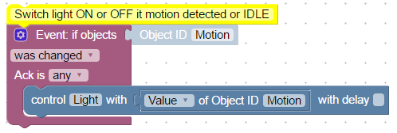
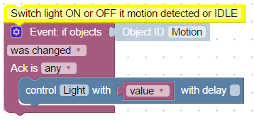
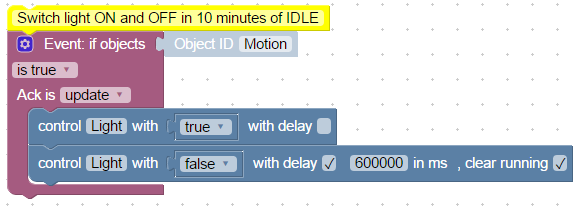
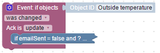
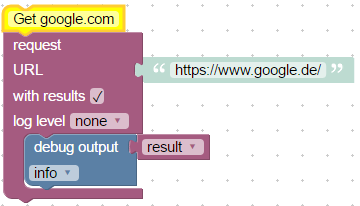
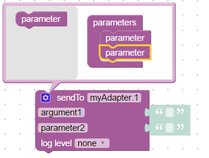
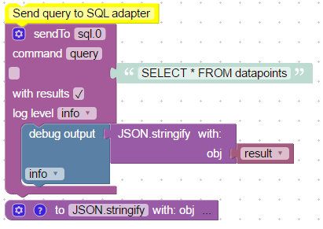
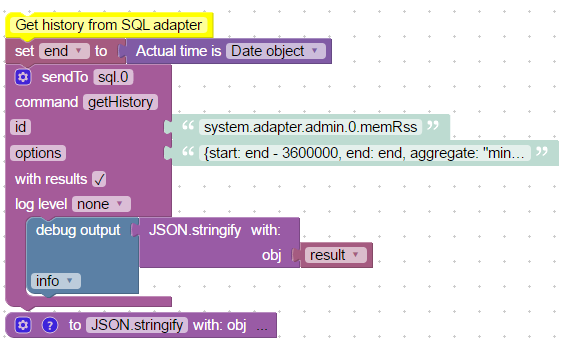

# Contents

- [Description](#description)
- [Getting started](#getting-started)
    - [Sample 1](#sample-1)
    - [Sample 2](#sample-2)
    - [Sample 3](#sample-3)
- [Blocks](#blocks)
    - [System blocks](#system-blocks)
        - [Debug output](#debug-output)
        - [Comment](#comment)
        - [Control state](#control-state)
        - [Update state](#update-state)
        - [Create state](#create-state)
        - [Get value of state](#get-value-of-state)
        - [Get Object ID](#get-object-id)
    - [Actions Blocks](#actions-blocks)
        - [Exec - execute](#exec---execute)
        - [request URL](#request-url)
    - [Send to Blocks](#send-to-blocks)
        - [Send to telegram](#send-to-telegram)
        - [Send to SayIt](#send-to-sayit)
        - [Send to pushover](#send-to-pushover)
        - [Send email](#send-email)
        - [Custom sendTo block](#custom-sendto-block)
    - [Date and Time blocks](#date-and-time-blocks)
        - [Time comparision](#time-comparision)
        - [Get actual time im specific format](#get-actual-time-im-specific-format)
        - [Get time of astro events for today](get-time-of-astro-events-for-today)
    - [Convert blocks](#convert-blocks)
        - [Convert to number](convert-to-number)
        - [Convert to boolean](convert-to-boolean)
        - [Get type of variable](get-type-of-variable)
        - [Convert to date/time object](convert-to-datetime-object)
        - [Convert date/time object to string](convert-datetime-object-to-string)    
    - [Trigger](#trigger)
        - [Trigger on states change](#trigger-on-states-change)
        - [Trigger on state change](#trigger-on-state-change)
        - [Trigger info](#trigger-info)
        - [Schedule](#schedule)
        - [Trigger on astro event](#trigger-on-astro-event)
    - [Timeouts](#timeouts)
        - [Delayed execution](#delayed-execution)
        - [Clear delayed execution](#clear-delayed-execution)
        - [Execution by interval](#execution-by-interval)
        - [Stop execution by interval](#stop-execution-by-interval)
    - [Logic](#logic)
    - [Loops](#loops)
    - [Math](#math)
    - [Text](#text)
    - [Lists](#lists)
    - [Colour](#colour)
    - [Variables](#variables)
    - [Functions](#functions)

# Description
Blockly is a visual editor that allows users to write programs by adding blocks together. 
It is designed for people with no prior experience with computer programming. 

# Getting started

## Sample 1
**Control state on change of some other state**



This is the classical rule to switch something ON or OFF on other event.

Here the light will be switched on or off if the motion was detected or motion detector sends IDLE state.

First of all insert block "Triggers=>Event: if object". Select object ID to use this state as trigger for rule.

Add to trigger other block - "System=>Control" and select in dialog other state that must be controlled by event.

Insert into control block the "System=>Get value of state" block and select in dialog the "Motion" object to write the value of this state into "Light"*[]: 
 
There is a special variable **value"" in trigger block. It is always defined there and you can use this variable for your need. It consist actual value of triggered state and you can create simpler rule by using "Variable=>item" block and renaming it into "value".



```
<xml xmlns="http://www.w3.org/1999/xhtml">
  <block type="comment" id="s7s**k+Cc_KjDnJW`(h~" x="12" y="63">
    <field name="COMMENT">Switch light ON or OFF it motion detected or IDLE</field>
    <next>
      <block type="on_ext" id="#}:B(M-o5:/]k,_msr%y">
        <mutation items="1"></mutation>
        <field name="CONDITION">ne</field>
        <field name="ACK_CONDITION"></field>
        <value name="OID0">
          <shadow type="field_oid" id="o~6)!C0IVy{WD%Km(lkc">
            <field name="oid">javascript.0.Motion</field>
          </shadow>
        </value>
        <statement name="STATEMENT">
          <block type="control" id="(ZqzhS_7*jGpk;`zJAZg">
            <mutation delay_input="false"></mutation>
            <field name="OID">javascript.0.Light</field>
            <field name="WITH_DELAY">FALSE</field>
            <value name="VALUE">
              <block type="get_value" id="a-E@UcwER=knNljh@:M/">
                <field name="ATTR">val</field>
                <field name="OID">javascript.0.Motion</field>
              </block>
            </value>
          </block>
        </statement>
      </block>
    </next>
  </block>
</xml>
```

## Sample 2 
**Switch light on by motion and switch off in 10 minutes if no motion detected.**



If state "Motion" was updated with value true do:
- switch "Light" on
- start the delayed set in 10 minutes to switch "Light" off and clear all the delayed sets for this state

You can notice, that the flag "clear running" is set by last command. This clears any running timers for this state and the timer will be started anew.

```
<xml xmlns="http://www.w3.org/1999/xhtml">
  <block type="comment" id="s7s**k+Cc_KjDnJW`(h~" x="112" y="63">
    <field name="COMMENT">Switch light ON and OFF in 10 minutes of IDLE</field>
    <next>
      <block type="on_ext" id="#}:B(M-o5:/]k,_msr%y">
        <mutation items="1"></mutation>
        <field name="CONDITION">true</field>
        <field name="ACK_CONDITION">true</field>
        <value name="OID0">
          <shadow type="field_oid" id="o~6)!C0IVy{WD%Km(lkc">
            <field name="oid">javascript.0.Motion</field>
          </shadow>
        </value>
        <statement name="STATEMENT">
          <block type="control" id="(ZqzhS_7*jGpk;`zJAZg">
            <mutation delay_input="false"></mutation>
            <field name="OID">javascript.0.Light</field>
            <field name="WITH_DELAY">FALSE</field>
            <value name="VALUE">
              <block type="logic_boolean" id="%^ADwe*2l0tLw8Ga5F*Y">
                <field name="BOOL">TRUE</field>
              </block>
            </value>
            <next>
              <block type="control" id="=]vmzp6j^V9:3?R?2Y,x">
                <mutation delay_input="true"></mutation>
                <field name="OID">javascript.0.Light</field>
                <field name="WITH_DELAY">TRUE</field>
                <field name="DELAY_MS">600000</field>
                <field name="CLEAR_RUNNING">TRUE</field>
                <value name="VALUE">
                  <block type="logic_boolean" id="!;DiIh,D]l1oN{D;skYl">
                    <field name="BOOL">FALSE</field>
                  </block>
                </value>
              </block>
            </next>
          </block>
        </statement>
      </block>
    </next>
  </block>
</xml>
```


## Sample 3
**Send email if outside temperature is more than 25 grad Celsius.**


Explanation:

First we must to define the variable to remember if the email yet sent for actual temperature alert or not and fill it with "false".
Then we subscribe on changes of temperature. We can execute our rule periodically, but is is not so effective. 

If temperature was changed we compare its value with 25 and check if the email yet sent or not. 
If email is not sent, we remember, that email sent and send the email. Of course email adapter must be installed and configured before.

If the temperature less than 23 grad, reset "emailSent" flag to send email by next temperature alert. 
We compare temperature with 23 to do not sent emails every time if temperature fluctuate about 25 grad.

To create the "if ... else if ..." block you must click on the gear icon and add required parts to "IF" block.


You can specify comment for every block by selecting "Add comment" in context menu. You can later open the comments by clicking on the question mark icon.


You can collapse some big blocks for better code presentation by selection in context menu "Collapse Block". 


Sample to import:
```
<xml xmlns="http://www.w3.org/1999/xhtml">
  <block type="comment" id="r53:ZiP]3DYe;Ly;@!v5" x="87" y="13">
    <field name="COMMENT"> Send email if outside temperature is more than 25 grad Celsius.</field>
    <next>
      <block type="variables_set" id="oyEg!Z7~qid+!HYECD8C">
        <field name="VAR">emailSent</field>
        <value name="VALUE">
          <block type="logic_boolean" id="gakxd?9T354S1#_(=)%K">
            <field name="BOOL">FALSE</field>
          </block>
        </value>
        <next>
          <block type="on_ext" id="DR}w0I%EUL-FCI%`w5L4">
            <mutation items="1"></mutation>
            <field name="CONDITION">ne</field>
            <field name="ACK_CONDITION">true</field>
            <value name="OID0">
              <shadow type="field_oid" id="}TdS?2Lg~Mt[0!o0iMG.">
                <field name="oid">javascript.0.Outside_temperature</field>
              </shadow>
            </value>
            <statement name="STATEMENT">
              <block type="controls_if" id="rBBI(VLLLRnwd|ys59si">
                <mutation elseif="1"></mutation>
                <value name="IF0">
                  <block type="logic_operation" id="B5R%#,6F,xYI1gB!jjq|">
                    <field name="OP">AND</field>
                    <value name="A">
                      <block type="logic_compare" id="I=R,TaB*pge*l#j|[HZ0">
                        <field name="OP">EQ</field>
                        <value name="A">
                          <block type="variables_get" id="wd1I0gzqle,y-:h@GF)v">
                            <field name="VAR">emailSent</field>
                          </block>
                        </value>
                        <value name="B">
                          <block type="logic_boolean" id="q5~/ZIb))r`w]/RaSXUu">
                            <field name="BOOL">FALSE</field>
                          </block>
                        </value>
                      </block>
                    </value>
                  </block>
                </value>
                <statement name="DO0">
                  <block type="variables_set" id="i):z[{@|*;4zOruzXH46">
                    <field name="VAR">emailSent</field>
                    <comment pinned="false" h="80" w="160">Remember, that email was sent</comment>
                    <value name="VALUE">
                      <block type="logic_boolean" id="56A@]MZKiuL(iuuj)MRI">
                        <field name="BOOL">FALSE</field>
                      </block>
                    </value>
                    <next>
                      <block type="email" id="3J#TXZ`oei_NMEL,_w8K">
                        <field name="INSTANCE"></field>
                        <field name="IS_HTML">FALSE</field>
                        <field name="LOG">log</field>
                        <value name="TO">
                          <shadow type="text" id="j*x?kanQQyGH/pN,r9B2">
                            <field name="TEXT">myaddress@domain.com</field>
                          </shadow>
                        </value>
                        <value name="TEXT">
                          <shadow type="text" id="QE(T_Z]{=o8~h~+vz!ZU">
                            <field name="TEXT">Temperature is over 25°C</field>
                          </shadow>
                        </value>
                        <value name="SUBJECT">
                          <shadow type="text" id="/_AxN7@=T|t@XW.^Fu1(">
                            <field name="TEXT">Temperature alert</field>
                          </shadow>
                        </value>
                      </block>
                    </next>
                  </block>
                </statement>
                <value name="IF1">
                  <block type="logic_compare" id="S?0|;{3V3!_rqUk]GJ4)">
                    <field name="OP">LT</field>
                    <value name="A">
                      <block type="variables_get" id="IJwq1,|y;l7ueg1mF{~x">
                        <field name="VAR">value</field>
                      </block>
                    </value>
                    <value name="B">
                      <block type="math_number" id="m(.v?M3ezTKz(kf5b9ZE">
                        <field name="NUM">23</field>
                      </block>
                    </value>
                  </block>
                </value>
                <statement name="DO1">
                  <block type="variables_set" id="M0{G}QBtF!FYrT,xWBnV">
                    <field name="VAR">emailSent</field>
                    <value name="VALUE">
                      <block type="logic_boolean" id="ti#H=_:;-XRC%CzR/+/0">
                        <field name="BOOL">FALSE</field>
                      </block>
                    </value>
                  </block>
                </statement>
              </block>
            </statement>
          </block>
        </next>
      </block>
    </next>
  </block>
</xml>
```

# Blocks

## System blocks

### Debug output


This block does nothing except prints line into the log. You can use it for debugging of your script.

Like this one: 


```
<xml xmlns="http://www.w3.org/1999/xhtml">
  <block type="comment" id="K|2AnJ|5})RoNZ1T%Hh#" x="38" y="13">
    <field name="COMMENT">Print time into log every second</field>
    <next>
      <block type="timeouts_setinterval" id="LNsHTl,!r6eR8J9Yg,Xn">
        <field name="NAME">interval</field>
        <field name="INTERVAL">1000</field>
        <statement name="STATEMENT">
          <block type="debug" id=".oLS7P_oFU0%PWocRlYp">
            <field name="Severity">log</field>
            <value name="TEXT">
              <shadow type="text" id="X^Z/.qUry9B5Rr#N`)Oy">
                <field name="TEXT">test</field>
              </shadow>
              <block type="time_get" id="TPo6nim+=TBb-pnKMkRp">
                <mutation format="false" language="false"></mutation>
                <field name="OPTION">hh:mm:ss</field>
              </block>
            </value>
          </block>
        </statement>
      </block>
    </next>
  </block>
</xml>
```

You can define 4 different levels of severity for message:
- debug (the debug level of javascript adapter must be enabled)
- info (default, at least info log level must be set in javascript instance settings)
- warning 
- error - will be always displayed. Other severity levels can be ignored if severity of logging in javascirpt adapter is higher.

### Comment


Comment your code to understand it later better. 

It does nothing, just a comment.

### Control state


You can write the state with two different meanings:
- to control something and send command to end hardware (this block)
- to update some state to just inform about e.g. new temperature ([next block](#update-state))

Typical usage of block:


The object ID must be selected from dialog and the value must be defined too. Depends on the type of state the value can be [string](#string-value), [number](#number-value) or [boolean](#ogical-value-trueflase).

You can read the explanation [here](https://github.com/ioBroker/ioBroker/wiki/Adapter-Development-Documentation#commands-and-statuses).

This block writes command into state (ack=false). Additionally the delay can be specified.
If delay is not 0, the state will be set not immediately but after defined in milliseconds period of time.

You can stop all running delayed sets by issuing of control command. 

E.g in following schema the state "Light" will be controlled only once (in 2 seconds):


```
<xml xmlns="http://www.w3.org/1999/xhtml">
  <block type="comment" id="K|2AnJ|5})RoNZ1T%Hh#" x="38" y="13">
    <field name="COMMENT">Will be executed only once</field>
    <next>
      <block type="control" id="IWceY@BFn9/Y?Ez^b(_-">
        <mutation delay_input="true"></mutation>
        <field name="OID">javascript.0.Light</field>
        <field name="WITH_DELAY">TRUE</field>
        <field name="DELAY_MS">1000</field>
        <field name="CLEAR_RUNNING">FALSE</field>
        <value name="VALUE">
          <block type="logic_boolean" id="I/LUv5/AknHr#[{{qd-@">
            <field name="BOOL">TRUE</field>
          </block>
        </value>
        <next>
          <block type="control" id=".Ih(K(P)SFApUP0)/K7,">
            <mutation delay_input="true"></mutation>
            <field name="OID">javascript.0.Light</field>
            <field name="WITH_DELAY">TRUE</field>
            <field name="DELAY_MS">2000</field>
            <field name="CLEAR_RUNNING">TRUE</field>
            <value name="VALUE">
              <block type="logic_boolean" id="B?)bgD[JZoNL;enJQ4M.">
                <field name="BOOL">TRUE</field>
              </block>
            </value>
          </block>
        </next>
      </block>
    </next>
  </block>
</xml>
```

But in this schema the state "Light" will be controlled twice (in 1 second and in 2 seconds):


```
<xml xmlns="http://www.w3.org/1999/xhtml">
  <block type="comment" id="K|2AnJ|5})RoNZ1T%Hh#" x="38" y="13">
    <field name="COMMENT">Will be executed twice</field>
    <next>
      <block type="control" id="IWceY@BFn9/Y?Ez^b(_-">
        <mutation delay_input="true"></mutation>
        <field name="OID">javascript.0.Light</field>
        <field name="WITH_DELAY">TRUE</field>
        <field name="DELAY_MS">1000</field>
        <field name="CLEAR_RUNNING">FALSE</field>
        <value name="VALUE">
          <block type="logic_boolean" id="I/LUv5/AknHr#[{{qd-@">
            <field name="BOOL">TRUE</field>
          </block>
        </value>
        <next>
          <block type="control" id=".Ih(K(P)SFApUP0)/K7,">
            <mutation delay_input="true"></mutation>
            <field name="OID">javascript.0.Light</field>
            <field name="WITH_DELAY">TRUE</field>
            <field name="DELAY_MS">2000</field>
            <field name="CLEAR_RUNNING">FALSE</field>
            <value name="VALUE">
              <block type="logic_boolean" id="B?)bgD[JZoNL;enJQ4M.">
                <field name="BOOL">FALSE</field>
              </block>
            </value>
          </block>
        </next>
      </block>
    </next>
  </block>
</xml>
```

### Update state


This block is similar to [control block](#control-state), but it is only updates the value. No command to control the hardware will be sent.

Typical usage example:


### Create state

There are two types of variables that can be created in scripts:
- local [variables](#set-variables-value)
- global variables or states. 

Global states are visible in all scripts, but local are visible only in this current script.

Global states can be used in vis, mobile and all other logic or visualisation modules, can be logged into db or whatever.

This block creates global state and if the state yet exist, the command will be ignored. You can safely call this block by every start of the script.

Typical usage example:


```
<xml xmlns="http://www.w3.org/1999/xhtml">
  <block type="comment" id="dBV.{0z/{Fr@RB+10H5i" x="38" y="13">
    <field name="COMMENT">Create state and subscribe on it changes</field>
    <next>
      <block type="create" id="D%[{T~!b9^V#Z.7bI+3y">
        <field name="NAME">myState</field>
        <statement name="STATEMENT">
          <block type="on_ext" id="H@F~z_,FpvXo8BptmAtL">
            <mutation items="1"></mutation>
            <field name="CONDITION">ne</field>
            <field name="ACK_CONDITION"></field>
            <value name="OID0">
              <shadow type="field_oid" id="hn{OMH9y7AP_dns;KO6*">
                <field name="oid">javascript.0.myState</field>
              </shadow>
            </value>
            <statement name="STATEMENT">
              <block type="debug" id="DjP1pU?v=))`V;styIRR">
                <field name="Severity">log</field>
                <value name="TEXT">
                  <shadow type="text" id="de?mCXefl4v#XrO])~7y">
                    <field name="TEXT">test</field>
                  </shadow>
                  <block type="text_join" id="^33}.]#ov(vUAEEn8Hdp">
                    <mutation items="2"></mutation>
                    <value name="ADD0">
                      <block type="text" id="_-p%CZq4%)v1EYvh)lf@">
                        <field name="TEXT">Value of my state is </field>
                      </block>
                    </value>
                    <value name="ADD1">
                      <block type="variables_get" id="6r!TtpfrfQ@5Nf[4#[6l">
                        <field name="VAR">value</field>
                      </block>
                    </value>
                  </block>
                </value>
              </block>
            </statement>
          </block>
        </statement>
      </block>
    </next>
  </block>
</xml>
```

You can start to use the new created state first in the block itself. 

Following code will report an error by the first execution, because subscribe for "myState" cannot find object:
 


Although no warning will be printed by the second execution, because the state yet exists.

### Get value of state


You can use this block to get the value of state. Additionally to value you can get following attributes:
- Value
- Acknowledge - command = false or update = true
- Timestamp in ms from 1970.1.1 (It has type "Date object")
- Last change of value in ms from 1970.1.1 (It has type "Date object")
- Quality
- Source - instance name, that wrote last value, like "system.adapter.javascript.0"


Example to print time of the last value change:


```
<xml xmlns="http://www.w3.org/1999/xhtml">
  <block type="comment" id="GVW732OFexZ9HP[q]B3," x="38" y="13">
    <field name="COMMENT">Print time of last change for myState</field>
    <next>
      <block type="debug" id="t,GmgLjo]1d0{xT+@Yns">
        <field name="Severity">log</field>
        <value name="TEXT">
          <shadow type="text" id="w{UF-|ashrP4e*jl~{9_">
            <field name="TEXT">test</field>
          </shadow>
          <block type="text_join" id="i~L{r:B9oU}.ANc.AV8F">
            <mutation items="2"></mutation>
            <value name="ADD0">
              <block type="text" id="r5=i|qvrII+NCAQ~t{p5">
                <field name="TEXT">Last change of myState was at</field>
              </block>
            </value>
            <value name="ADD1">
              <block type="convert_from_date" id="?cGS1/CwThX!tTDMVSoj">
                <mutation format="false" language="false"></mutation>
                <field name="OPTION">hh:mm:ss</field>
                <value name="VALUE">
                  <block type="get_value" id="k+#N2u^rx)u%Z9lA`Yps">
                    <field name="ATTR">lc</field>
                    <field name="OID">javascript.0.myState</field>
                  </block>
                </value>
              </block>
            </value>
          </block>
        </value>
      </block>
    </next>
  </block>
</xml>
```

### Get Object ID


It is just a help block to comfortable select the object ID for trigger block.

By clicking on Object ID value the select ID dialog will be opened.

Typical usage:


```
<xml xmlns="http://www.w3.org/1999/xhtml">
  <block type="comment" id="GVW732OFexZ9HP[q]B3," x="38" y="13">
    <field name="COMMENT">Typical usage of Object ID selector</field>
    <next>
      <block type="on_ext" id="D+1_tP(lF!R]wy?R#|~A">
        <mutation items="1"></mutation>
        <field name="CONDITION">ne</field>
        <field name="ACK_CONDITION"></field>
        <value name="OID0">
          <shadow type="field_oid" id="rpg#*-DXMVqzexE8-^Xc">
            <field name="oid">default</field>
          </shadow>
          <block type="field_oid" id="YYTRKxeC@l3WE~OJx4ei">
            <field name="oid">javascript.0.myState</field>
          </block>
        </value>
        <statement name="STATEMENT">
          <block type="debug" id="{;_x6LATJ,b^leE,xgz9">
            <field name="Severity">log</field>
            <value name="TEXT">
              <shadow type="text" id="-)V}_9Cxt2kj:]36y,7#">
                <field name="TEXT">Changed</field>
              </shadow>
            </value>
          </block>
        </statement>
      </block>
    </next>
  </block>
</xml>
```

## Actions Blocks

### Exec - execute


Executes defined command on system. Like someone has written this command in SSH console.

The command will be executed with permissions of user under which the iobroker was started.

If no outputs are required, they can be ignored:


If parsing of outputs must be done:


```
<xml xmlns="http://www.w3.org/1999/xhtml">
  <block type="comment" id="GVW732OFexZ9HP[q]B3," x="313" y="38">
    <field name="COMMENT">Execute some system command</field>
    <next>
      <block type="exec" id="hGkHs.IkmiTa{jR^@-}S">
        <mutation with_statement="true"></mutation>
        <field name="WITH_STATEMENT">TRUE</field>
        <field name="LOG"></field>
        <value name="COMMAND">
          <shadow type="text" id=":KG#hyuPRhQJWFSk)6Yo">
            <field name="TEXT">ls /opt/</field>
          </shadow>
        </value>
        <statement name="STATEMENT">
          <block type="debug" id="ELv(y5V4[hZ,F8,]D51x">
            <field name="Severity">log</field>
            <value name="TEXT">
              <shadow type="text" id="J[o*Fylexfu41}smph).">
                <field name="TEXT">result</field>
              </shadow>
              <block type="variables_get" id="gWo7Y^,QI=PqL(Q;7D=^">
                <field name="VAR">result</field>
              </block>
            </value>
          </block>
        </statement>
      </block>
    </next>
  </block>
</xml>
```

By analysing of outputs 3 special variables will be created: 
- result, consists normal output to the console (e.g. for "ls /opt" it consist "iobroker nodejs")
- error object if command cannot be executed by javascript module
- stderr, error output of executed program

Additionally if the log level is not "none", the same command will be sent to log.

### request URL


Calls URL and give back the result.

Example:



By analysing of outputs 3 special variables will be created: 
- result, consists body of the requested page
- error, error description 
- response (only for experts), special object and has type of [http.IncomingMessage](https://nodejs.org/api/http.html#http_class_http_incomingmessage)

If no outputs are required, they can be ignored. Just unset "with results" option.

## Send to Blocks

### Send to telegram


This block is used to send message to telegram client via telegram adapter.

Of course the telegram adapter must be installed and configured.

To send message to some specific instance, you should select the installed adapter instance (Normally telegram.0), elsewise message will be sent to all existing instances.

Property *message* is mandatory and exactly this text will be sent to client. 

User name ID is optional and this is ID from [telegram](https://core.telegram.org/bots/api#user) (Unique identifier for user or bot).

Additionally if the log level is not "none", the same message will be sent to log.

### Send to SayIt


This block is used to send text to sayit instance to pronounce this text.

Of course the sayit adapter must be installed and configured.

To send message to some specific instance, you should select the installed adapter instance (Normally sayit.0), elsewise message will be sent to all existing instances.

Property *message* is mandatory and exactly this text will be pronounced. 

You must check the language property. This will be used for text2speech engine. 

Volume is optional (normally from 0 to 100).

Additionally if the log level is not "none", the same message will be sent to log.

### Send to pushover


This block is used to send text to pushover client. You can read about pushover driver [here](https://github.com/ioBroker/ioBroker.pushover).

Of course the pushover adapter must be installed and configured.

To send message to some specific instance, you should select the installed adapter instance (Normally pushover.0), elsewise message will be sent to all existing instances.

Property *message* is mandatory and exactly this text will be sent to client. 

All other properties are optional and you can read bout them [here](https://pushover.net/api):

- *device ID* - your user's device name to send the message directly to that device, rather than all of the user's devices (multiple devices may be separated by a comma)
- *title* - your message's title, otherwise your app's name is used
- *URL* - a supplementary URL to show with your message
- *URL title* - a title for your supplementary URL, otherwise just the URL is shown
- *priority* - send as -2 to generate no notification/alert, -1 to always send as a quiet notification, 1 to display as high-priority and bypass the user's quiet hours, or 2 to also require confirmation from the user
- *time in ms* - a Unix timestamp of your message's date and time to display to the user, rather than the time your message is received by our API
- *sound* - the name of one of the sounds supported by device clients to override the user's default sound choice

Additionally if the log level is not "none", the same message will be sent to log.

### Send email


This block is used to send text as email.

Of course the email adapter must be installed, configured and tested.

To send message to some specific instance, you should select the installed adapter instance (Normally email.0), elsewise message will be sent to all existing instances.

Property *text* is mandatory and exactly this text will be sent to client. 

Of course the destination (*to*) must be filled with valid email address.

You can attach up to files (normally images) to email. To use images in the text, you must change format to HTML (check "Send as HTML" option) and text could look like:

```
<p>Embedded image 1: </p>
<p>Embedded image 2: </p>
```

You can refer to files as ``````. "file1" and "file2" are reserved IDs and cannot be changed.

"file name" must consist full path to image on disk.


```
<block xmlns="http://www.w3.org/1999/xhtml" type="email" id="VeysPTJXFh^.CW1t(s@Q" x="563" y="63">
  <field name="INSTANCE"></field>
  <field name="IS_HTML">FALSE</field>
  <field name="LOG"></field>
  <value name="TO">
    <shadow type="text" id=".6+6Rp^N7JHiNkP/.^09">
      <field name="TEXT"></field>
    </shadow>
    <block type="text" id="NC6==~4g|OB^`xZ:|Rlx">
      <field name="TEXT">user@myemail.com</field>
    </block>
  </value>
  <value name="TEXT">
    <shadow type="text" id="jaGOyI%O4wl(.s.wo(Y`">
      <field name="TEXT"></field>
    </shadow>
    <block type="text" id=")--+u-+rdoAyWpi9I87+">
      <field name="TEXT">&lt;p&gt;Embedded image 1: &lt;img src='cid:file1'/&gt;&lt;/p&gt;</field>
    </block>
  </value>
  <value name="SUBJECT">
    <shadow type="text" id="|49=rPOCP]hwFD[HX@_I">
      <field name="TEXT">From Sweet Home</field>
    </shadow>
  </value>
  <value name="FILE_1">
    <block type="text" id="tlb_Kuh5?JvPTQr)A{}4">
      <field name="TEXT">/opt/video/imageCam.png</field>
    </block>
  </value>
</block>
```

Additionally if the log level is not "none", the same message will be sent to log.

### Custom sendTo block


This is just a help block to send internal system message (sendTo) to any adapter. 

Of course you can use custom function block to do anything crazy, and to send messages too.

You can define your own parameters for sendTo command:



Read more [here](https://github.com/ioBroker/ioBroker.javascript#sendto) about "sendTo".

Example how to send SQL query to sql adapter:



```
<xml xmlns="http://www.w3.org/1999/xhtml">
  <block type="comment" id="GVW732OFexZ9HP[q]B3," x="163" y="13">
    <field name="COMMENT">Send query to SQL adapter</field>
    <next>
      <block type="sendto_custom" id="84lYloO4o+RvLszPVHZ5">
        <mutation items="" with_statement="true"></mutation>
        <field name="INSTANCE">sql.0</field>
        <field name="COMMAND">query</field>
        <field name="WITH_STATEMENT">TRUE</field>
        <field name="LOG">log</field>
        <value name="ARG0">
          <shadow type="text" id=")faamoSD,nGPXawY4|(Z">
            <field name="TEXT">SELECT * FROM datapoints</field>
          </shadow>
        </value>
        <statement name="STATEMENT">
          <block type="debug" id="Q#UJl]^_g/VHzM*G/a:f">
            <field name="Severity">log</field>
            <value name="TEXT">
              <shadow type="text" id="#!NJS43!0z@}z:6~_,9(">
                <field name="TEXT">test</field>
              </shadow>
              <block type="procedures_callcustomreturn" id="0E2fmQQduf4)-({z(om|">
                <mutation name="JSON.stringify">
                  <arg name="obj"></arg>
                </mutation>
                <value name="ARG0">
                  <block type="variables_get" id=",^2E2eT#598hI^TvABD9">
                    <field name="VAR">result</field>
                  </block>
                </value>
              </block>
            </value>
          </block>
        </statement>
      </block>
    </next>
  </block>
  <block type="procedures_defcustomreturn" id="lm*.n3kQXll8o9X^*m,k" x="163" y="263">
    <mutation statements="false">
      <arg name="obj"></arg>
    </mutation>
    <field name="NAME">JSON.stringify</field>
    <field name="SCRIPT">cmV0dXJuIEpTT04uc3RyaW5naWZ5KG9iaik7</field>
    <comment pinned="false" h="80" w="160">Describe this function...</comment>
  </block>
</xml>
```

If you will use only one parameter with empty name, so no structure will created, like here:

```
var obj, result;

/**
 * Describe this function...
 */
function JSON_stringify(obj) {
    return JSON.stringify(obj);
}


// Send query to SQL adapter
sendTo("sql.0", "query", 'SELECT * FROM datapoints', function (result) {
    console.log((JSON_stringify(result)));
  });
console.log("sql.0: " + "");
```

Or how to request history from SQL adapter:



```
<xml xmlns="http://www.w3.org/1999/xhtml">
  <block type="comment" id="GVW732OFexZ9HP[q]B3," x="263" y="13">
    <field name="COMMENT">Get history from SQL adapter</field>
    <next>
      <block type="variables_set" id="J;8I^fN*4YQ1+jPI3FS#">
        <field name="VAR">end</field>
        <value name="VALUE">
          <block type="time_get" id="kZFFxa-2%7/:=IHU|}eB">
            <mutation format="false" language="false"></mutation>
            <field name="OPTION">object</field>
          </block>
        </value>
        <next>
          <block type="sendto_custom" id="84lYloO4o+RvLszPVHZ5">
            <mutation items="id,options" with_statement="true"></mutation>
            <field name="INSTANCE">sql.0</field>
            <field name="COMMAND">getHistory</field>
            <field name="WITH_STATEMENT">TRUE</field>
            <field name="LOG"></field>
            <value name="ARG0">
              <shadow type="text" id=")faamoSD,nGPXawY4|(Z">
                <field name="TEXT">system.adapter.admin.0.memRss</field>
              </shadow>
            </value>
            <value name="ARG1">
              <shadow type="text" id="/nmT=qDw;S`#*tXN=C6n">
                <field name="TEXT">{start: end - 3600000, end: end, aggregate: "minmax"}</field>
              </shadow>
            </value>
            <statement name="STATEMENT">
              <block type="debug" id="Q#UJl]^_g/VHzM*G/a:f">
                <field name="Severity">log</field>
                <value name="TEXT">
                  <shadow type="text" id="#!NJS43!0z@}z:6~_,9(">
                    <field name="TEXT">test</field>
                  </shadow>
                  <block type="procedures_callcustomreturn" id="0E2fmQQduf4)-({z(om|">
                    <mutation name="JSON.stringify">
                      <arg name="obj"></arg>
                    </mutation>
                    <value name="ARG0">
                      <block type="variables_get" id=",^2E2eT#598hI^TvABD9">
                        <field name="VAR">result</field>
                      </block>
                    </value>
                  </block>
                </value>
              </block>
            </statement>
          </block>
        </next>
      </block>
    </next>
  </block>
  <block type="procedures_defcustomreturn" id="lm*.n3kQXll8o9X^*m,k" x="263" y="313">
    <mutation statements="false">
      <arg name="obj"></arg>
    </mutation>
    <field name="NAME">JSON.stringify</field>
    <field name="SCRIPT">cmV0dXJuIEpTT04uc3RyaW5naWZ5KG9iaik7</field>
    <comment pinned="false" h="80" w="160">JSON.stringify object</comment>
  </block>
</xml>
```

Generated javascript code:
```
var obj, end, result;

/**
 * JSON.stringify object
 */
function JSON_stringify(obj) {
    return JSON.stringify(obj);
}


// Get history from SQL adapter
end = (new Date().getTime());
sendTo("sql.0", "getHistory", {
   "id": 'system.adapter.admin.0.memRss',
   "options": {start: end - 3600000, end: end, aggregate: "minmax"}
}, function (result) {
    console.log((JSON_stringify(result)));
  });
```

If you will start value with "{" it will be interpreted as JSON string. Use double quotes in string.

## Date and Time blocks

### Time comparision

### Get actual time im specific format

### Get time of astro events for today

## Convert blocks

### Convert to number

### Convert to boolean

### Convert to string

### Get type of variable

### Convert to date/time object

### Convert date/time object to string

## Trigger

### Trigger on states change

### Trigger on state change

### Trigger info
Get information about value, timestamp or ID of the state, that triggered the trigger.

### Schedule

### Trigger on astro event

## Timeouts

### Delayed execution

### Clear delayed execution

### Execution by interval

### Stop execution by interval

## Logic

### If else block

### Comparision block

### Logical AND/OR block

### Negation block

### Logical value TRUE/FLASE 

### null block

### Test block

## Loops

### Repeat N times

### Repeat while

### Count 

### For each

### Break out of loop

## Math

### Number value

### Arithmetical operations +-*/^
 
### Square root, Abs, -, ln, log10, e^, 10^

### sin, cos, tan, asin, acos, atan

### Math constants: pi, e, phi, sqrt(2), sqrt(1/2), infinity

### Is even, odd, prime, whole, positive, negative, divisibly by

### Modify variably by value (plus or minus)

### Round, floor, ceil value

### Operations on the list of values: sum, min, max, average, median, modes, deviation, random item

### Modulus 

### Limit some value by min and max 

### Random value from 0 to 1

### Random value between min and max

## Text

### String value

### Concatenate strings

### Append string to variable

### Length of string

### Is string empty

### Find position in string

### Get symbol in string on specific position

### Get substring

### Convert to upper case or to lower case

### Trim string

## Lists

### Create empty list

### Create list with values

### Create list with same value N times

### Get length of list

### Is list empty

### Find position of item in list

### Get item in list

### Set item in list
 
### Get sublist of list

### Convert text to list and vice versa

## Colour

### Colour value

### Random colour

### RGB colour

### Mix colours

## Variables

### Set variable's value

### Get variable's value

## Functions

### Create function from blocks with no return value

### Create function from blocks with return value

### Return value in function 

### Create custom function with no return value

### Create custom function with return value

### Call function