# Содержание

- [Описание](#description)
- [Введение с примерами](#getting-started)
    - [Пример 1](#sample-1)
    - [Пример 2](#sample-2)
    - [Пример 3](#sample-3)
- [Блоки](#blocks)
    - [Системные блоки](#system-blocks)
        - [Отладка](#debug-output)
        - [Комментарий](#comment)
        - [Управление состоянием](#control-state)
        - [Обновление состояния](#update-state)
        - [Связывание состояний](#bind-states)
        - [Запись состояний](#write-states)
        - [Создание переменных](#create-state)
        - [Получение значения состояния](#get-value-of-state)
        - [Получение ID объекта](#get-object-id)
    - [Исполнительные блоки](#actions-blocks)
        - [Exec - выполнение](#exec---execute)
        - [Запросить URL](#request-url)
    - [Отправить Блокам](#send-to-blocks)
        - [Отправить к telegram](#send-to-telegram)
        - [Отправить к SayIt](#send-to-sayit)
        - [Отправить к pushover](#send-to-pushover)
        - [Отправить к email](#send-email)
        - [Пользовательское sendTo block](#custom-sendto-block)
    - [Блоки даты и времени](#date-and-time-blocks)
        - [Сравнение времени](#time-comparision)
        - [Сравнение фактического времени](#actual-time-comparision)
        - [Получение фактического формата времени](#get-actual-time-im-specific-format)
        - [Получение времени астрономических событий на сегодня](#get-time-of-astro-events-for-today)
    - [Преобразование блоков](#convert-blocks)
        - [Преобразование к числовому формату](convert-to-number)
        - [Преобразование к формату Boolean](convert-to-boolean)
        - [Получение типа переменной](get-type-of-variable)
        - [Преобразование в date/time object](convert-to-datetime-object)
        - [Преобразование date/time object к string](convert-datetime-object-to-string)    
        - [Преобразование JSON к object](convert-json-to-object)
        - [Преобразование object к JSON](convert-object-to-json)
    - [Триггер](#trigger)
        - [Триггер по состояниям](#trigger-on-states-change)
        - [Триггер по изменению состояния](#trigger-on-state-change)
        - [Информация триггера](#trigger-info)
        - [Расписание](#schedule)
        - [Триггер по астрономическому событию](#trigger-on-astro-event)
        - [Именованное расписание](#named-schedule)
        - [Очистка расписания](#clear-schedule)
        - [CRON диалог](#cron-dialog)
        - [CRON правило](#cron-rule)
    - [Таймауты](#timeouts)
        - [Задержка выполнения](#delayed-execution)
        - [Очистить отложенное выполнение](#clear-delayed-execution)
        - [Выполнение по интервалу](#execution-by-interval)
        - [Остановить выполнение по интервалу](#stop-execution-by-interval)
    - [Логические](#logic)
        - [Блок If else](#if-else-block)
        - [Блок сравнения](#comparision-block)
        - [Логический блок AND/OR](#logical-and-or-block)
        - [Блок отрицания](#negation-block)
        - [Логическое значение TRUE/FALSE](#logical-value-true-false)
        - [Нулевой блок](#null-block)
        - [Тестовый блок](#test-block)
    - [Циклы](#loops)
        - [Повторить N раз](#repeat-n-times)
        - [Повторять пока](#repeat-while)
        - [Счетчик](#count)
        - [Для каждого](#for-each)
        - [Выйти из цикла](#break-out-of-loop)
    - [Математические](#math)
        - [Числовое значение](#number-value)
        - [Арифметические операции +-\*/^](#arithmetical-operations--)
        - [Корень квадратный, Abs, -, ln, log10, e^, 10^](#square-root-abs---ln-log10-e-10)
        - [sin, cos, tan, asin, acos, atan](#sin-cos-tan-asin-acos-atan)
        - [Математические постоянные: pi, e, phi, sqrt(2), sqrt(1/2), infinity](#math-constants-pi-e-phi-sqrt2-sqrt12-infinity)
        - [Четное, нечетное, простое, целое, положительное, отрицательное, делимое на](#is-even-odd-prime-whole-positive-negative-divisibly-by)
        - [Изменение переменной со знаком плюс или минус](#modify-variably-by-value-plus-or-minus)
        - [Округленное, приближенное, действительное значение](#round-floor-ceil-value)
        - [Операции со списком значений: сумма, минимум, максимум, среднее, медиана, мода, отклонения, случайное значение](#operations-on-the-list-of-values-sum-min-max-average-median-modes-deviation-random-item)
        - [Модуль](#modulus)
        - [Установить предел для значения по минимуму и максимуму](#limit-some-value-by-min-and-max)
        - [Случайное значение от 0 до 1](#random-value-from-0-to-1)
        - [Случайное значение между минимальным или максимальным](#random-value-between-min-and-max)
    - [Текст](#text)
        - [Строковое значение](#string-value)
        - [Объединение строк](#concatenate-strings)
        - [Добавить строку в переменную](#append-string-to-variable)
        - [Длина строки](#length-of-string)
        - [Строка пустая](#is-string-empty)
        - [Найти позицию в строке](#find-position-in-string)
        - [Получить символ в строке по определенной позиции](#get-symbol-in-string-on-specific-position)
        - [Получить подстроку](#get-substring)
        - [Преобразование в верхний или в нижний регистр](#Convert-to-upper-case-or-to-lower-case)
        - [Строка обрезки](#trim-string)
    - [Списки](#lists)
        - [Создать пустой список](#create-empty-list)
        - [Создать список значений](#create-list-with-values)
        - [Создать список с тем же значением N раз](#create-list-with-same-value-n-times)
        - [Получить длину списка](#get-length-of-list)
        - [Список пуст](#is-list-empty)
        - [Найти позицию элемента в списке](#Find-position-of-item-in-list)
        - [Получить элемент в списке](#get-item-in-list)
        - [Указать элемент в списке](#set-item-in-list)
        - [Получить подсписок](#get-sublist-of-list)
        - [Преобразование текста в список и наоборот](#convert-text-to-list-and-vice-versa)
    - [Цвет](#colour)
        - [Цветовое значение](#colour-value)
        - [Произвольный цвет](#random-colour)
        - [RGB палитра](#rgb-colour)
        - [Смешанные цвета](#mix-colours)
    - [Переменные](#variables)
        - [Установить значение переменной](#set-variables-value)
        - [Получить значение переменной](#get-variables-value)
    - [Функции](#functions)
        - [Создать функцию из блоков без возвращения значения](#create-function-from-blocks-with-no-return-value)
        - [Создать функцию из блоков с возвращением значения](#create-function-from-blocks-with-return-value)
        - [Вернуть значение в функцию](#return-value-in-function)
        - [Создать пользовательскую функцию без возвращения значения](#create-custom-function-with-no-return-value)
        - [Создать пользовательскую функцию с возвращением значения](#create-custom-function-with-return-value)
        - [Вызов функции](#call-function)

# Описание
Blockly - визуальный редактор, который позволяет пользователям писать программы, составляя блоки вместе. Он предназначен для людей, у которых отсутствует опыт работы в области программирования. 

# Введение с примерами

## Пример 1
**Управление переменной по изменению какой-либо другой переменной**


Это классический случай включения или выключения чего-либо по другому событию.

В этом случае свет включается или выключается, если обнаружено движение или детектор движения посылает состояние IDLE.

Прежде всего вставьте блок «События => Событие: если объект». Выберите объект (Motion), состояние которого будет использоваться для управления этим событием.

Добавьте в событие другой блок - "Системные => установить объект на" и выберите объект (Light), состояние которого должно управляться событием.

Вставьте в блок "установить" блок - «Системные => Значение у объекта» и выберите в диалоговом окне объект (Motion), значение которого будет записано в объект (Light).

В блоке триггера есть специальная переменная ** значение "". Эта переменная всегда там определена, используйте ее по своему усмотрению. Данная переменная содержит текущее значение состояния триггера, при этом вы также можете создать более простое правило, используя блок «Переменная =>элемент» и переименовать его в «значение».


```
<xml xmlns="http://www.w3.org/1999/xhtml">
  <block type="comment" id="s7s**k+Cc_KjDnJW`(h~" x="12" y="63">
    <field name="COMMENT">Switch light ON or OFF it motion detected or IDLE</field>
    <next>
      <block type="on_ext" id="#}:B(M-o5:/]k,_msr%y">
        <mutation items="1"></mutation>
        <field name="CONDITION">ne</field>
        <field name="ACK_CONDITION"></field>
        <value name="OID0">
          <shadow type="field_oid" id="o~6)!C0IVy{WD%Km(lkc">
            <field name="oid">javascript.0.Motion</field>
          </shadow>
        </value>
        <statement name="STATEMENT">
          <block type="control" id="(ZqzhS_7*jGpk;`zJAZg">
            <mutation delay_input="false"></mutation>
            <field name="OID">javascript.0.Light</field>
            <field name="WITH_DELAY">FALSE</field>
            <value name="VALUE">
              <block type="get_value" id="a-E@UcwER=knNljh@:M/">
                <field name="ATTR">val</field>
                <field name="OID">javascript.0.Motion</field>
              </block>
            </value>
          </block>
        </statement>
      </block>
    </next>
  </block>
</xml>
```

## Пример 2 
**Включить свет при движении и выключить через 10 минут, если движение не обнаружено.**


Если состояние «Движение» стало true, выполните:
- выключатель «Свет» включить
- запустить задержку на 10 минут, чтобы выключить «Свет» и очистить все установленные задержки для этого состояния

Вы можете заметить, что флаг «очистка запущенных» уже установлен последней командой. Это позволит очистить все запущенные таймеры для данного состояния, а таймер будет перезапущен.
```
<xml xmlns="http://www.w3.org/1999/xhtml">
  <block type="comment" id="s7s**k+Cc_KjDnJW`(h~" x="112" y="63">
    <field name="COMMENT">Switch light ON and OFF in 10 minutes of IDLE</field>
    <next>
      <block type="on_ext" id="#}:B(M-o5:/]k,_msr%y">
        <mutation items="1"></mutation>
        <field name="CONDITION">true</field>
        <field name="ACK_CONDITION">true</field>
        <value name="OID0">
          <shadow type="field_oid" id="o~6)!C0IVy{WD%Km(lkc">
            <field name="oid">javascript.0.Motion</field>
          </shadow>
        </value>
        <statement name="STATEMENT">
          <block type="control" id="(ZqzhS_7*jGpk;`zJAZg">
            <mutation delay_input="false"></mutation>
            <field name="OID">javascript.0.Light</field>
            <field name="WITH_DELAY">FALSE</field>
            <value name="VALUE">
              <block type="logic_boolean" id="%^ADwe*2l0tLw8Ga5F*Y">
                <field name="BOOL">TRUE</field>
              </block>
            </value>
            <next>
              <block type="control" id="=]vmzp6j^V9:3?R?2Y,x">
                <mutation delay_input="true"></mutation>
                <field name="OID">javascript.0.Light</field>
                <field name="WITH_DELAY">TRUE</field>
                <field name="DELAY_MS">600000</field>
                <field name="CLEAR_RUNNING">TRUE</field>
                <value name="VALUE">
                  <block type="logic_boolean" id="!;DiIh,D]l1oN{D;skYl">
                    <field name="BOOL">FALSE</field>
                  </block>
                </value>
              </block>
            </next>
          </block>
        </statement>
      </block>
    </next>
  </block>
</xml>
```


## Пример 3
**Отправить электронное сообщение, если температура воздуха на улице превысит 25°С.**

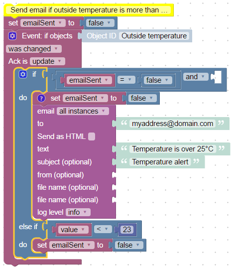

Пояснение:

Сначала мы должны определить переменную, чтобы знать, отправлялось или нет электронной почтой оповещение о превышении температуры, и заполнить ее значением «ложь».
Затем мы подписываемся на изменения температуры. Мы можем выполнять наше правило периодически, но это не настолько эффективно.

Если температура изменилась, мы сравниваем ее значение с 25 и проверяем состояние переменной отправки.
Если оповещение не отправлялось и температура превысила 25°С, мы заполняем переменную отправки значением "истина" и отправляем оповещение по электронной почте. Конечно, перед установкой и настройкой должен быть установлен адаптер электронной почты.

При понижении температуры ниже 23°С заполняем переменную отправки значением "ложь".
Мы сравниваем температуру с 23, чтобы не отправлять электронные письма каждый раз, когда температура колеблется около 25°С.

Чтобы создать блок «if ... else if ...», вы должны нажать на значок шестеренки и добавить необходимые части в блок «IF».


Вы можете указать комментарий для каждого блока, выбрав «Добавить комментарий» в контекстном меню. Позднее вы можете открыть комментарии, нажав на значок вопросительного знака.
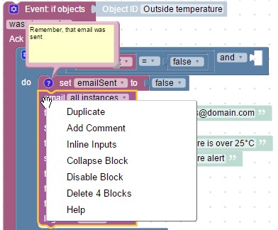

Вы можете свернуть некоторые большие блоки для лучшего представления кода путем выбора в контекстном меню «Свернуть блок».


Пример для импорта:
```
<xml xmlns="http://www.w3.org/1999/xhtml">
  <block type="comment" id="r53:ZiP]3DYe;Ly;@!v5" x="87" y="13">
    <field name="COMMENT"> Send email if outside temperature is more than 25 grad Celsius.</field>
    <next>
      <block type="variables_set" id="oyEg!Z7~qid+!HYECD8C">
        <field name="VAR">emailSent</field>
        <value name="VALUE">
          <block type="logic_boolean" id="gakxd?9T354S1#_(=)%K">
            <field name="BOOL">FALSE</field>
          </block>
        </value>
        <next>
          <block type="on_ext" id="DR}w0I%EUL-FCI%`w5L4">
            <mutation items="1"></mutation>
            <field name="CONDITION">ne</field>
            <field name="ACK_CONDITION">true</field>
            <value name="OID0">
              <shadow type="field_oid" id="}TdS?2Lg~Mt[0!o0iMG.">
                <field name="oid">javascript.0.Outside_temperature</field>
              </shadow>
            </value>
            <statement name="STATEMENT">
              <block type="controls_if" id="rBBI(VLLLRnwd|ys59si">
                <mutation elseif="1"></mutation>
                <value name="IF0">
                  <block type="logic_operation" id="B5R%#,6F,xYI1gB!jjq|">
                    <field name="OP">AND</field>
                    <value name="A">
                      <block type="logic_compare" id="I=R,TaB*pge*l#j|[HZ0">
                        <field name="OP">EQ</field>
                        <value name="A">
                          <block type="variables_get" id="wd1I0gzqle,y-:h@GF)v">
                            <field name="VAR">emailSent</field>
                          </block>
                        </value>
                        <value name="B">
                          <block type="logic_boolean" id="q5~/ZIb))r`w]/RaSXUu">
                            <field name="BOOL">FALSE</field>
                          </block>
                        </value>
                      </block>
                    </value>
                  </block>
                </value>
                <statement name="DO0">
                  <block type="variables_set" id="i):z[{@|*;4zOruzXH46">
                    <field name="VAR">emailSent</field>
                    <comment pinned="false" h="80" w="160">Remember, that email was sent</comment>
                    <value name="VALUE">
                      <block type="logic_boolean" id="56A@]MZKiuL(iuuj)MRI">
                        <field name="BOOL">FALSE</field>
                      </block>
                    </value>
                    <next>
                      <block type="email" id="3J#TXZ`oei_NMEL,_w8K">
                        <field name="INSTANCE"></field>
                        <field name="IS_HTML">FALSE</field>
                        <field name="LOG">log</field>
                        <value name="TO">
                          <shadow type="text" id="j*x?kanQQyGH/pN,r9B2">
                            <field name="TEXT">myaddress@domain.com</field>
                          </shadow>
                        </value>
                        <value name="TEXT">
                          <shadow type="text" id="QE(T_Z]{=o8~h~+vz!ZU">
                            <field name="TEXT">Temperature is over 25°C</field>
                          </shadow>
                        </value>
                        <value name="SUBJECT">
                          <shadow type="text" id="/_AxN7@=T|t@XW.^Fu1(">
                            <field name="TEXT">Temperature alert</field>
                          </shadow>
                        </value>
                      </block>
                    </next>
                  </block>
                </statement>
                <value name="IF1">
                  <block type="logic_compare" id="S?0|;{3V3!_rqUk]GJ4)">
                    <field name="OP">LT</field>
                    <value name="A">
                      <block type="variables_get" id="IJwq1,|y;l7ueg1mF{~x">
                        <field name="VAR">value</field>
                      </block>
                    </value>
                    <value name="B">
                      <block type="math_number" id="m(.v?M3ezTKz(kf5b9ZE">
                        <field name="NUM">23</field>
                      </block>
                    </value>
                  </block>
                </value>
                <statement name="DO1">
                  <block type="variables_set" id="M0{G}QBtF!FYrT,xWBnV">
                    <field name="VAR">emailSent</field>
                    <value name="VALUE">
                      <block type="logic_boolean" id="ti#H=_:;-XRC%CzR/+/0">
                        <field name="BOOL">FALSE</field>
                      </block>
                    </value>
                  </block>
                </statement>
              </block>
            </statement>
          </block>
        </next>
      </block>
    </next>
  </block>
</xml>
```

# Блоки

## Системные блоки

### Отладка


Этот блок ничего не делает, кроме как выводит строки записей в журнал. Вы можете использовать его для отладки вашего скрипта.

Как этот:


```
<xml xmlns="http://www.w3.org/1999/xhtml">
  <block type="comment" id="K|2AnJ|5})RoNZ1T%Hh#" x="38" y="13">
    <field name="COMMENT">Print time into log every second</field>
    <next>
      <block type="timeouts_setinterval" id="LNsHTl,!r6eR8J9Yg,Xn">
        <field name="NAME">interval</field>
        <field name="INTERVAL">1000</field>
        <statement name="STATEMENT">
          <block type="debug" id=".oLS7P_oFU0%PWocRlYp">
            <field name="Severity">log</field>
            <value name="TEXT">
              <shadow type="text" id="X^Z/.qUry9B5Rr#N`)Oy">
                <field name="TEXT">test</field>
              </shadow>
              <block type="time_get" id="TPo6nim+=TBb-pnKMkRp">
                <mutation format="false" language="false"></mutation>
                <field name="OPTION">hh:mm:ss</field>
              </block>
            </value>
          </block>
        </statement>
      </block>
    </next>
  </block>
</xml>
```

Для сообщения можно указать 4 уровня важности:
- отладка (уровень отладки javascript адаптера  должен быть включен)
- info (по умолчанию, по крайней мере, уровень info log должен быть установлен в настройках экземпляра javascript)
- предупреждение
- ошибка - будет отображаться всегда. Другие уровни важности могут быть проигнорированы, если важность журналирования в javascirpt адаптере  выше.
### Комментарий


Напишите комментарии к своему коду, чтобы позже было проще его понимать.

Комментарий ничего не делает, это просто комментарий.

### Управление состоянием


Вы можете описать состояние двумя различными способами:
- контролируя что-либо и отправляя команду для завершения работы технического средства (этот блок)
- обновить некоторое состояние, чтобы просто информировать о, например,новой температуре ([next block](#update-state))

Типовое использование блока:


ID объекта должен быть выбран из диалога, и значение также должно быть определено. В зависимости от типа состояния, значение может быть [string](#string-value), [number](#number-value) или [boolean](#ogical-value-trueflase)..

Описание можно прочесть [тут](https://github.com/ioBroker/ioBroker/wiki/Adapter-Development-Documentation#commands-and-statuses).

Этот блок записывает команду в состояние (ack = false). Кроме того, можно указать задержку.
Если задержка не равна 0, состояние будет установлено не сразу, а после определенного в миллисекундах периода времени.
Вы можете остановить все запущенные уставки задержек при помощи управляющей команды.

Например, в следующей схеме состояние «Свет» будет контролироваться только один раз (через 2 секунды):


```
<xml xmlns="http://www.w3.org/1999/xhtml">
  <block type="comment" id="K|2AnJ|5})RoNZ1T%Hh#" x="38" y="13">
    <field name="COMMENT">Will be executed only once</field>
    <next>
      <block type="control" id="IWceY@BFn9/Y?Ez^b(_-">
        <mutation delay_input="true"></mutation>
        <field name="OID">javascript.0.Light</field>
        <field name="WITH_DELAY">TRUE</field>
        <field name="DELAY_MS">1000</field>
        <field name="CLEAR_RUNNING">FALSE</field>
        <value name="VALUE">
          <block type="logic_boolean" id="I/LUv5/AknHr#[{{qd-@">
            <field name="BOOL">TRUE</field>
          </block>
        </value>
        <next>
          <block type="control" id=".Ih(K(P)SFApUP0)/K7,">
            <mutation delay_input="true"></mutation>
            <field name="OID">javascript.0.Light</field>
            <field name="WITH_DELAY">TRUE</field>
            <field name="DELAY_MS">2000</field>
            <field name="CLEAR_RUNNING">TRUE</field>
            <value name="VALUE">
              <block type="logic_boolean" id="B?)bgD[JZoNL;enJQ4M.">
                <field name="BOOL">TRUE</field>
              </block>
            </value>
          </block>
        </next>
      </block>
    </next>
  </block>
</xml>
```

Но в этой схеме состояние «Свет» будет контролироваться дважды (через 1 секунду и через 2 секунды):


```
<xml xmlns="http://www.w3.org/1999/xhtml">
  <block type="comment" id="K|2AnJ|5})RoNZ1T%Hh#" x="38" y="13">
    <field name="COMMENT">Will be executed twice</field>
    <next>
      <block type="control" id="IWceY@BFn9/Y?Ez^b(_-">
        <mutation delay_input="true"></mutation>
        <field name="OID">javascript.0.Light</field>
        <field name="WITH_DELAY">TRUE</field>
        <field name="DELAY_MS">1000</field>
        <field name="CLEAR_RUNNING">FALSE</field>
        <value name="VALUE">
          <block type="logic_boolean" id="I/LUv5/AknHr#[{{qd-@">
            <field name="BOOL">TRUE</field>
          </block>
        </value>
        <next>
          <block type="control" id=".Ih(K(P)SFApUP0)/K7,">
            <mutation delay_input="true"></mutation>
            <field name="OID">javascript.0.Light</field>
            <field name="WITH_DELAY">TRUE</field>
            <field name="DELAY_MS">2000</field>
            <field name="CLEAR_RUNNING">FALSE</field>
            <value name="VALUE">
              <block type="logic_boolean" id="B?)bgD[JZoNL;enJQ4M.">
                <field name="BOOL">FALSE</field>
              </block>
            </value>
          </block>
        </next>
      </block>
    </next>
  </block>
</xml>
```

### Обновление состояния


Этот блок похож на [Управление состоянием](#control-state), единственным отличием является то, что он только обновляет значение. Никаких команд по управлению техническими средствами не отправляется.

Пример типового применения:


### Связывание состояний


Данный блок просто связывает два состояния друг с другом.

Вы можете достичь этого с помощью следующих блоков:

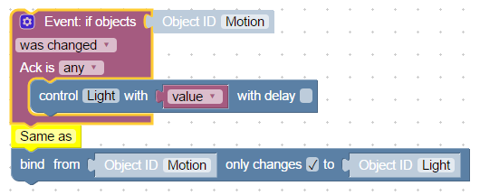

Вы можете выбрать, будет ли значение пересылаться, только тогда когда состояние источника было изменено или всегда, при обновлении состояния.
```
<block xmlns="http://www.w3.org/1999/xhtml" type="on_ext" id="w/@=5/5!D;8wn4DZ;jzG" x="287.99999999999943" y="37.999999999999716">
  <mutation items="1"></mutation>
  <field name="CONDITION">ne</field>
  <field name="ACK_CONDITION"></field>
  <value name="OID0">
    <shadow type="field_oid" id="tQBL3[;V1luVO[`h2ONM">
      <field name="oid">javascript.0.Motion</field>
    </shadow>
  </value>
  <statement name="STATEMENT">
    <block type="control" id="w=sN]yxb)5Jv!,YK[C5%">
      <mutation delay_input="false"></mutation>
      <field name="OID">javascript.0.Light</field>
      <field name="WITH_DELAY">FALSE</field>
      <value name="VALUE">
        <block type="variables_get" id="6`1|t;T%_h^|ES+nd~/?">
          <field name="VAR">value</field>
        </block>
      </value>
    </block>
  </statement>
</block>
```

### Запись состояния


Универсальный блок записи,  может делать то же самое, что и ["Обновление состояния"](#update-state) и ["Управление состоянием"](#control-state) совместно. 

Но в отличии от них вы можете определить Object ID и задать задержку с другими блоками, чтобы ваш скрипт стал более универсальным.

### Создание переменных

Существует два типа переменных, которые применяются в скриптах:
- локальные [переменные](#set-variables-value)
- глобальные переменные или состояния. 

Глобальные переменные видны во всех скриптах, в отличии от локальных, которые видны только в текущем скрипте.
Глобальные переменные могут использоваться в vis, mobile и других логических или визуальных модулях, могут быть зарегистрированы в db или как-то еще.

Этот блок создает глобальную переменную, и если переменная уже существует, то команда будет проигнорирована. Вы можете спокойно вызывать этот блок при каждом запуске скрипта.

Пример типового применения:


```
<xml xmlns="http://www.w3.org/1999/xhtml">
  <block type="comment" id="dBV.{0z/{Fr@RB+10H5i" x="38" y="13">
    <field name="COMMENT">Create state and subscribe on it changes</field>
    <next>
      <block type="create" id="D%[{T~!b9^V#Z.7bI+3y">
        <field name="NAME">myState</field>
        <statement name="STATEMENT">
          <block type="on_ext" id="H@F~z_,FpvXo8BptmAtL">
            <mutation items="1"></mutation>
            <field name="CONDITION">ne</field>
            <field name="ACK_CONDITION"></field>
            <value name="OID0">
              <shadow type="field_oid" id="hn{OMH9y7AP_dns;KO6*">
                <field name="oid">javascript.0.myState</field>
              </shadow>
            </value>
            <statement name="STATEMENT">
              <block type="debug" id="DjP1pU?v=))`V;styIRR">
                <field name="Severity">log</field>
                <value name="TEXT">
                  <shadow type="text" id="de?mCXefl4v#XrO])~7y">
                    <field name="TEXT">test</field>
                  </shadow>
                  <block type="text_join" id="^33}.]#ov(vUAEEn8Hdp">
                    <mutation items="2"></mutation>
                    <value name="ADD0">
                      <block type="text" id="_-p%CZq4%)v1EYvh)lf@">
                        <field name="TEXT">Value of my state is </field>
                      </block>
                    </value>
                    <value name="ADD1">
                      <block type="variables_get" id="6r!TtpfrfQ@5Nf[4#[6l">
                        <field name="VAR">value</field>
                      </block>
                    </value>
                  </block>
                </value>
              </block>
            </statement>
          </block>
        </statement>
      </block>
    </next>
  </block>
</xml>
```


Вы можете начать использовать только что созданную переменную сначала в самом блоке.
Следующий код сообщит об ошибке при первом выполнении, так как подписка на «myState» не может найти объект:
 


При повторном выполнении никаких предупреждений не появится, так как переменная все же существует.

### Получение значения состояния


Используйте данный блок для получения значения состояния. Вдобавок к значению, у вас появится доступ к следующим аттрибутам:
- Значение
- Подтверждение - command = false или update = true
- Отметка времени в миллисекундах с 1970.1.1 (имеет тип «Date object»)
- Последнее изменение значения в миллисекундах с 1970.1.1 (имеет тип «Date object»)
- Качество
- Источник - имя экземпляра, который написал последнее значение, например, "system.adapter.javascript.0"

Пример вывода времени последнего изменения значения:


```
<xml xmlns="http://www.w3.org/1999/xhtml">
  <block type="comment" id="GVW732OFexZ9HP[q]B3," x="38" y="13">
    <field name="COMMENT">Print time of last change for myState</field>
    <next>
      <block type="debug" id="t,GmgLjo]1d0{xT+@Yns">
        <field name="Severity">log</field>
        <value name="TEXT">
          <shadow type="text" id="w{UF-|ashrP4e*jl~{9_">
            <field name="TEXT">test</field>
          </shadow>
          <block type="text_join" id="i~L{r:B9oU}.ANc.AV8F">
            <mutation items="2"></mutation>
            <value name="ADD0">
              <block type="text" id="r5=i|qvrII+NCAQ~t{p5">
                <field name="TEXT">Last change of myState was at</field>
              </block>
            </value>
            <value name="ADD1">
              <block type="convert_from_date" id="?cGS1/CwThX!tTDMVSoj">
                <mutation format="false" language="false"></mutation>
                <field name="OPTION">hh:mm:ss</field>
                <value name="VALUE">
                  <block type="get_value" id="k+#N2u^rx)u%Z9lA`Yps">
                    <field name="ATTR">lc</field>
                    <field name="OID">javascript.0.myState</field>
                  </block>
                </value>
              </block>
            </value>
          </block>
        </value>
      </block>
    </next>
  </block>
</xml>
```

### Получение ID объекта

Данный блок вспомогательный, он существует чтобы удобнее было выбирать ID объекта для триггерного блока.

Нажав на значение ID объекта, откроется диалоговое окно выбора ID.

Типовое применение:


```
<xml xmlns="http://www.w3.org/1999/xhtml">
  <block type="comment" id="GVW732OFexZ9HP[q]B3," x="38" y="13">
    <field name="COMMENT">Typical usage of Object ID selector</field>
    <next>
      <block type="on_ext" id="D+1_tP(lF!R]wy?R#|~A">
        <mutation items="1"></mutation>
        <field name="CONDITION">ne</field>
        <field name="ACK_CONDITION"></field>
        <value name="OID0">
          <shadow type="field_oid" id="rpg#*-DXMVqzexE8-^Xc">
            <field name="oid">default</field>
          </shadow>
          <block type="field_oid" id="YYTRKxeC@l3WE~OJx4ei">
            <field name="oid">javascript.0.myState</field>
          </block>
        </value>
        <statement name="STATEMENT">
          <block type="debug" id="{;_x6LATJ,b^leE,xgz9">
            <field name="Severity">log</field>
            <value name="TEXT">
              <shadow type="text" id="-)V}_9Cxt2kj:]36y,7#">
                <field name="TEXT">Changed</field>
              </shadow>
            </value>
          </block>
        </statement>
      </block>
    </next>
  </block>
</xml>
```

## Исполнительные Блоки

### Exec - выполнение


Выполнение определенной команды в системе. По типу, когда кто-нибудь набирает такую команду при помощи консоли SSH.

Выполнение команды определяется разрешениями пользователя, под которым запускался iobroker.

Если не требуется никаких выводов, то их можно проигнорировать:


Если требуется анализ выходных данных:


```
<xml xmlns="http://www.w3.org/1999/xhtml">
  <block type="comment" id="GVW732OFexZ9HP[q]B3," x="313" y="38">
    <field name="COMMENT">Execute some system command</field>
    <next>
      <block type="exec" id="hGkHs.IkmiTa{jR^@-}S">
        <mutation with_statement="true"></mutation>
        <field name="WITH_STATEMENT">TRUE</field>
        <field name="LOG"></field>
        <value name="COMMAND">
          <shadow type="text" id=":KG#hyuPRhQJWFSk)6Yo">
            <field name="TEXT">ls /opt/</field>
          </shadow>
        </value>
        <statement name="STATEMENT">
          <block type="debug" id="ELv(y5V4[hZ,F8,]D51x">
            <field name="Severity">log</field>
            <value name="TEXT">
              <shadow type="text" id="J[o*Fylexfu41}smph).">
                <field name="TEXT">result</field>
              </shadow>
              <block type="variables_get" id="gWo7Y^,QI=PqL(Q;7D=^">
                <field name="VAR">result</field>
              </block>
            </value>
          </block>
        </statement>
      </block>
    </next>
  </block>
</xml>
```

Анализируя выходные данные необходимо будет создать три специальные переменные: 
- result, при успешном завершении результат выводится на консоль (например, для «ls/opt» он выглядит как «iobroker nodejs»)
- error object, в случае, когда команда не может быть выполнена javascript модулем.
- stderr, ошибка вывода выполняемой программы.

Кроме того, если уровень доступа к логу соответствует, то такая же команда будет отправлена в лог.

### request URL- запросить URL


Запрашивает URL и возвращает результат.

Пример:


Анализируя выходные данные будет создано 3 специальных переменных: result, результат содержит тело запрашиваемой страницы
- result, результат содержит тело запрашиваемой страницы
- error, описание ошибки
- response (только для профессионалов), ответ - специальный объект имеющий тип http.[http.IncomingMessage](https://nodejs.org/api/http.html#http_class_http_incomingmessage)

Если не требуется никаких выводов, то их можно проигнорировать. Путем отключения опции "с результатом".

## Отправить Блокам

### Отправить к telegram
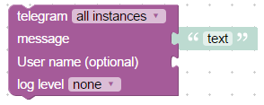

Данный блок используется для отправки сообщений в клиент telegram посредством адаптера telegram.

Соответственно, адаптер telegram должен быть установлен и сконфигурирован.

При отправке сообщения какому-нибудь специализированному драйверу, вы должны выбрать установленный адаптер драйвера (обычно telegram.0), иначе сообщение будет отправлено всем существующим драйверам.

Свойства *сообщения* являются обязательными, и именно этот текст будет отправлен клиенту.

ID пользователя не является обязательным и этот ID из [telegram](https://core.telegram.org/bots/api#user) (Уникальный идентификатор пользователя или бота).

Кроме того, если уровень доступа к логу соответствует, то такая же команда будет отправлена в лог.

### Отправить к  SayIt


Этот блок используется при отправке текста драйверу sayit для произношения этого текста.

Соответственно, адаптер sayit должен быть установлен и сконфигурирован.

При отправке сообщения какому-нибудь специализированному драйверу, вы должны выбрать установленный адаптер драйвера (обычно sayit.0), иначе сообщение будет отправлено всем существующим драйверам.

Свойства *сообщения* являются обязательными, и именно этот текст будет произнесен.

Вы должны проверить свойство language. Так как оно применяется для движка text2speech.

Громкость необязательна (обычно от 0 до 100).

Кроме того, если уровень доступа к логу соответствует, то такое же сообщение будет отправлено в лог.

### Отправить к pushover


Этот блок используется для отправки текста pushover клиенту. Про pushover драйвер вы можете прочесть [здесь](https://github.com/ioBroker/ioBroker.pushover).

Соответственно, адаптер pushover должен быть установлен и сконфигурирован.

При отправке сообщения какому-нибудь специализированному драйверу, вы должны выбрать установленный адаптер драйвера (обычно pushover.0), иначе сообщение будет отправлено всем существующим драйверам.

Свойства *сообщения* являются обязательными и именно этот текст будет отправлен клиенту.

Все остальные свойства необязательны, об этих свойствах вы можете прочесть [здесь](https://pushover.net/api):

- *ID устройства* - пользовательское имя вашего устройства для отправки сообщения прямо на это устройство, а не на все устройства пользователя (несколько устройств могут быть разделены запятой) 
- *заголовок* - заголовок вашего сообщения, иначе используется название вашего приложения
- *URL* - дополнительный URL для отображения вашего сообщения
- *URL заголовок* - заголовок для вашего дополнительного URL-адреса, иначе просто указывается URL-адрес
- *приоритет* - -2 при отправке без уведомлений/предупреждений, -1 всегда отправлять как скрытое уведомление, 1 при отображении в качестве высокоприоритетного, обходя бесшумный режим пользователя, или 2 требовать подтверждения от пользователя
- *время в мс* - временная метка Unix даты и времени вашего сообщения для отображения пользователю, а не то время, когда ваше сообщение было получено нашим API
- *звук* - наименование одного из звуков, поддерживаемых устройством клиента, чтобы не использовать выбор звука по умолчанию.

Кроме того, если уровень доступа к логу соответствует, то такое же сообщение будет отправлено в лог.

### Отправить к email


Этот блок используется для отправки текста по электронной почте.

Соответственно, адаптер email должен быть установлен и сконфигурирован.

При отправке сообщения какому-нибудь специализированному драйверу, вы должны выбрать установленный адаптер драйвера (обычно email.0), иначе сообщение будет отправлено всем существующим драйверам.

Свойства *текста* являются обязательными и именно этот текст будет отправлен клиенту.

Несомненно, адресат (to) должен быть заполнен действительным адресом электронной почты.

Вы можете прикрепить файлы (обычно изображения) к электронной почте. Чтобы использовать изображения в тексте, вы должны изменить формат на HTML (установите флажок «Отправить как HTML»), и текст будет выглядеть так:

```
<p>Embedded image 1: </p>
<p>Embedded image 2: </p>
```

Вы можете ссылаться на файлы так ``````. «File1» и «file2» являются зарезервированными идентификаторами и не могут быть изменены.

«Имя файла» должно содержать полный путь к изображению на диске.


```
<block xmlns="http://www.w3.org/1999/xhtml" type="email" id="VeysPTJXFh^.CW1t(s@Q" x="563" y="63">
  <field name="INSTANCE"></field>
  <field name="IS_HTML">FALSE</field>
  <field name="LOG"></field>
  <value name="TO">
    <shadow type="text" id=".6+6Rp^N7JHiNkP/.^09">
      <field name="TEXT"></field>
    </shadow>
    <block type="text" id="NC6==~4g|OB^`xZ:|Rlx">
      <field name="TEXT">user@myemail.com</field>
    </block>
  </value>
  <value name="TEXT">
    <shadow type="text" id="jaGOyI%O4wl(.s.wo(Y`">
      <field name="TEXT"></field>
    </shadow>
    <block type="text" id=")--+u-+rdoAyWpi9I87+">
      <field name="TEXT">&lt;p&gt;Embedded image 1: &lt;img src='cid:file1'/&gt;&lt;/p&gt;</field>
    </block>
  </value>
  <value name="SUBJECT">
    <shadow type="text" id="|49=rPOCP]hwFD[HX@_I">
      <field name="TEXT">From Sweet Home</field>
    </shadow>
  </value>
  <value name="FILE_1">
    <block type="text" id="tlb_Kuh5?JvPTQr)A{}4">
      <field name="TEXT">/opt/video/imageCam.png</field>
    </block>
  </value>
</block>
```

Кроме того, если уровень доступа к логу соответствует, то такое же сообщение будет отправлено в лог.

### Пользовательское sendTo block


Данный блок вспомогательный для отправки внутреннего системного сообщения (sendTo) любому адаптеру.

Конечно, вы также можете использовать пользовательский функциональный блок, чтобы сделать что-нибудь беспредельное, и также отправлять сообщения.

Вы можете определить свои собственные параметры для команды sendTo:


Узнать больше можно [здесь](https://github.com/ioBroker/ioBroker.javascript#sendto) о "sendTo".

Пример отправки SQL-запроса к sql адаптеру:


```
<xml xmlns="http://www.w3.org/1999/xhtml">
  <block type="comment" id="GVW732OFexZ9HP[q]B3," x="163" y="13">
    <field name="COMMENT">Send query to SQL adapter</field>
    <next>
      <block type="sendto_custom" id="84lYloO4o+RvLszPVHZ5">
        <mutation items="" with_statement="true"></mutation>
        <field name="INSTANCE">sql.0</field>
        <field name="COMMAND">query</field>
        <field name="WITH_STATEMENT">TRUE</field>
        <field name="LOG">log</field>
        <value name="ARG0">
          <shadow type="text" id=")faamoSD,nGPXawY4|(Z">
            <field name="TEXT">SELECT * FROM datapoints</field>
          </shadow>
        </value>
        <statement name="STATEMENT">
          <block type="debug" id="Q#UJl]^_g/VHzM*G/a:f">
            <field name="Severity">log</field>
            <value name="TEXT">
              <shadow type="text" id="#!NJS43!0z@}z:6~_,9(">
                <field name="TEXT">test</field>
              </shadow>
              <block type="procedures_callcustomreturn" id="0E2fmQQduf4)-({z(om|">
                <mutation name="JSON.stringify">
                  <arg name="obj"></arg>
                </mutation>
                <value name="ARG0">
                  <block type="variables_get" id=",^2E2eT#598hI^TvABD9">
                    <field name="VAR">result</field>
                  </block>
                </value>
              </block>
            </value>
          </block>
        </statement>
      </block>
    </next>
  </block>
  <block type="procedures_defcustomreturn" id="lm*.n3kQXll8o9X^*m,k" x="163" y="263">
    <mutation statements="false">
      <arg name="obj"></arg>
    </mutation>
    <field name="NAME">JSON.stringify</field>
    <field name="SCRIPT">cmV0dXJuIEpTT04uc3RyaW5naWZ5KG9iaik7</field>
    <comment pinned="false" h="80" w="160">Describe this function...</comment>
  </block>
</xml>
```

Если у вас будет хоть один параметр с пустым именем, то тогда структура не будет создана, как здесь:

```
var obj, result;

/**
 * Describe this function...
 */
function JSON_stringify(obj) {
    return JSON.stringify(obj);
}


// Send query to SQL adapter
sendTo("sql.0", "query", 'SELECT * FROM datapoints', function (result) {
    console.log((JSON_stringify(result)));
  });
console.log("sql.0: " + "");
```

Или, как запросить историю из SQL-адаптера:


```
<xml xmlns="http://www.w3.org/1999/xhtml">
  <block type="comment" id="GVW732OFexZ9HP[q]B3," x="263" y="13">
    <field name="COMMENT">Get history from SQL adapter</field>
    <next>
      <block type="variables_set" id="J;8I^fN*4YQ1+jPI3FS#">
        <field name="VAR">end</field>
        <value name="VALUE">
          <block type="time_get" id="kZFFxa-2%7/:=IHU|}eB">
            <mutation format="false" language="false"></mutation>
            <field name="OPTION">object</field>
          </block>
        </value>
        <next>
          <block type="sendto_custom" id="84lYloO4o+RvLszPVHZ5">
            <mutation items="id,options" with_statement="true"></mutation>
            <field name="INSTANCE">sql.0</field>
            <field name="COMMAND">getHistory</field>
            <field name="WITH_STATEMENT">TRUE</field>
            <field name="LOG"></field>
            <value name="ARG0">
              <shadow type="text" id=")faamoSD,nGPXawY4|(Z">
                <field name="TEXT">system.adapter.admin.0.memRss</field>
              </shadow>
            </value>
            <value name="ARG1">
              <shadow type="text" id="/nmT=qDw;S`#*tXN=C6n">
                <field name="TEXT">{start: end - 3600000, end: end, aggregate: "minmax"}</field>
              </shadow>
            </value>
            <statement name="STATEMENT">
              <block type="debug" id="Q#UJl]^_g/VHzM*G/a:f">
                <field name="Severity">log</field>
                <value name="TEXT">
                  <shadow type="text" id="#!NJS43!0z@}z:6~_,9(">
                    <field name="TEXT">test</field>
                  </shadow>
                  <block type="procedures_callcustomreturn" id="0E2fmQQduf4)-({z(om|">
                    <mutation name="JSON.stringify">
                      <arg name="obj"></arg>
                    </mutation>
                    <value name="ARG0">
                      <block type="variables_get" id=",^2E2eT#598hI^TvABD9">
                        <field name="VAR">result</field>
                      </block>
                    </value>
                  </block>
                </value>
              </block>
            </statement>
          </block>
        </next>
      </block>
    </next>
  </block>
  <block type="procedures_defcustomreturn" id="lm*.n3kQXll8o9X^*m,k" x="263" y="313">
    <mutation statements="false">
      <arg name="obj"></arg>
    </mutation>
    <field name="NAME">JSON.stringify</field>
    <field name="SCRIPT">cmV0dXJuIEpTT04uc3RyaW5naWZ5KG9iaik7</field>
    <comment pinned="false" h="80" w="160">JSON.stringify object</comment>
  </block>
</xml>
```

Сгенерированный код javascript:
```
var obj, end, result;

/**
 * JSON.stringify object
 */
function JSON_stringify(obj) {
    return JSON.stringify(obj);
}


// Get history from SQL adapter
end = (new Date().getTime());
sendTo("sql.0", "getHistory", {
   "id": 'system.adapter.admin.0.memRss',
   "options": {start: end - 3600000, end: end, aggregate: "minmax"}
}, function (result) {
    console.log((JSON_stringify(result)));
  });
```

Если вы начнете значение с "{", это будет интерпретироваться как строка JSON. Используйте двойные кавычки в строке.

## Блоки даты и времени
### Сравнение времени


Если используется оператор «между» или «не между», блок выглядит так:


Вы можете указать время, которое необходимо сравнить. Блок предполагает, что время это «Date object».


Существуют следующие режимы сравнения:

- меньше чем, проверьте, действительно ли текущее время меньше указанного времени.
- равно или меньше
- больше чем
- равно или больше
- равно
- между, проверяется попало ли время в некоторый промежуток. 
    - например, если время должно быть между 12:00 и 20:00. Проверяется фактическое время больше или равно 12:00 и меньше, чем 20:00. 20:00 вернет false.
    - или, например, для случая с 21:00 до 8:00. В данном случае будет проверено, фактическое время больше или равно 21:00 или меньше 8:00.

- не между, в случае если время не попадает в заданный промежуток дневного времени. Если время меньше начала и больше или равно концу (если время начала больше времени окончания, то оно проверяется на следующее условие - время больше или равно, чем конец и меньше, чем начало).

Действуют следующие форматы времени:
- YYYY-MM-DD hh:mm:ss
- YYYY-MM-DD hh:mm
- hh:mm:ss
- hh:mm

### Сравнение фактического времени


Этот блок используется для сравнения дневного времени с фактическим временем. Он имеет ту же логику, что и [Сравнение времени](#time-comparision), но ограничения не могут быть в виде блоков, и данный блок сравнивает только фактическое время. (для совместимости со старыми версиями)

### Получение фактического формата времени


Возвращает текущее время в определенном формате.

Поддерживаются следующие форматы:

- миллисекунды - возвращает только миллисекунды текущей секунды от 0 до 999 (не миллисекунды эпохи). Чтобы получить миллисекунды эпохи, используйте «Date object»;       
- секунды - возвращает секунды текущей минуты от 0 до 59,         
- секунд в дне - возвращает количество секунд от начала дня (от 0 до 24 * 3600 - 1),           
- минуты - возвращает минуты текущего часа от 0 до 59,
- минут в дне - возвращает количество минут от начала дня (от 0 до 24 * 60 - 1),         
- часы - возвращает часы текущего дня от 0 до 23,
- дней в месяце - получить день месяца от 1 до 31,     
- месяц как число - получить месяц как число от 1 до 12,
- месяц как текст - получить месяц как текст. Язык должен быть указан.  
- месяц как короткий текст - получить месяц как короткий текст: Янв, Фев, Мар, Апр, Май, Июнь, Июль, Авг, Сен, Окт, Ноя, Дек. Язык должен быть указан.    
- короткий год - год от 0 до 99, например, в 2016 году результат будет 16.        
- полный год - полный год: 2016
- день недели текстом - получить день недели в виде текста.
- день недели как короткий текст - получить день недели как короткий текст: Вс, Пн, Вт, Ср, Чт, Пт, Сб.
- день недели как число - день недели как число от 1 (понедельник) до 7 (воскресенье).  
- пользовательский формат - вы можете указать свой собственный [формат](https://github.com/ioBroker/ioBroker.javascript#formatdate).
- Date object - возвращает дату и время как количество миллисекунд с начала эпохи (1970.1.1 00: 00: 00.000Z GMT). Это всегда GMT.        
- yyyy.mm.dd - 2016.09.14
- yyyy/mm/dd - 2016/09/14
- yy.mm.dd - 16.09.14            
- yy/mm/dd - 16/09/14   
- dd.mm.yyyy - 14.09.2016   
- dd/mm/yyyy - 14/09/2016
- dd.mm.yy - 14.09.16             
- dd/mm/yy - 14/09/16           
- mm/dd/yyyy - 09/14/2016        
- mm/dd/yy - 09/14/16                
- dd.mm. - 14.09.            
- dd/mm - 14/09      
- mm.dd - 09.14         
- mm/dd - 09/14         
- hh:mm - 12:00         
- hh:mm:ss - 12:00:00         
- hh:mm:ss.sss - 12:00:00.000    

### Получение времени астрономических событий на сегодня


Возвращает время текущего дня в виде определенного астрономического события. 

Атрибут «offset» это смещение в минутах. Оно может быть и отрицательным, при определении времени до астрономического события.
  
Следующие значения могут использоваться в качестве атрибута астро-функции:
  
- sunrise: восход (верхний край солнца появляется на горизонте)
- sunriseEnd: восход солнца заканчивается (нижний край солнца касается горизонта)
- goldenHourEnd: конец «золотого часа» (мягкий свет, наиболее подходящее время для фотографии)
- solarNoon: солнечный полдень (солнце находится в наивысшей точке)
- goldenHour: начало «золотого часа»
- sunsetStart:  начало заката (нижний край солнца касается горизонта)
- sunset: закат (солнце полностью заходит за горизонт, начинаются вечерние гражданские сумерки)
- dusk: начало вечерних навигационных сумерек (время, когда уже достаточно темно, но всё еще можно ориентироваться по горизонту в море)
- nauticalDusk:  начало вечерних астрономических сумерек (визуально темно, но недостаточно для астрономических наблюдений)
- night: начало ночи (достаточно темно для большинства астрономических наблюдений)
- nightEnd: конец ночи (и начало утренних астрономических сумерек)
- nauticalDawn: начало утренних навигационных сумерек
- dawn: утренняя заря (начало утренних гражданских сумерек)
- nadir: надир (самый темный момент ночи, солнце находится в самом низком положении)

Возвращаемое значение имеет тип «Date Object», то есть число миллисекунд от 1970.01.01.

**Примечание:** для использования «астро-функции» в настройках адаптера javascript должны быть определены «широта» и «долгота».

## Преобразование блоков
Иногда требуется преобразовать значение в другой тип. Следующие блоки позволяют преобразовывать значение в определенные типы.

### Преобразование к числовому формату


Преобразование к числовому формату  (с плавающей запятой).

### Преобразование к формату Boolean


Преобразование к формату Boolean (правда или ложь).

### Преобразование в строку


Преобразует значение в строку.

### Получение типа переменной


Получить тип значения. Тип может быть: boolean, number, string, object.

### Преобразование в date/time object


Преобразовать значение в "Date object". Прочтите [здесь](#get-actual-time-im-specific-format), что такое "Date object".

### Преобразование date/time object к string


Преобразовать «Date object» в строку. Данное преобразование имеет те же параметры форматирования, что и [Получить фактический формат времени](#get-actual-time-im-specific-format).

### Преобразование JSON к object


Преобразует строку JSON в объект javascript. Если произойдет ошибка, будет возвращен пустой объект. (только для профессионалов)

### Преобразование object к JSON


Преобразуйте объект Javascript в строку JSON. Если выбран параметр prettify, результирующая строка выглядит так:

```
{
  "a": 1,
  "b": 2
}
```

если нет:

```
{"a": 1, "b": 2}
```

## Триггер

### Триггер по состояниям


Данный блок выполняет некоторое действие, если состояние заданных объектов изменено или обновлено. Это основной блок для построения взаимодействия между различными состояниями и, соответственно, системами.

При помощи этого блока вы можете собрать различные состояния и отправить сообщение или email по изменению значения.

Типовое использование блока:


```
<xml xmlns="http://www.w3.org/1999/xhtml">
  <block type="comment" id="]L0d;6j+=OH*[4n{C7v^" x="112" y="13">
    <field name="COMMENT">Switch light on if motion detected</field>
    <next>
      <block type="on_ext" id="QYVeQlu|#2hwniNg)=z8">
        <mutation items="1"></mutation>
        <field name="CONDITION">ne</field>
        <field name="ACK_CONDITION"></field>
        <value name="OID0">
          <shadow type="field_oid" id="Xe6D#r|nf9SEK`.oAuS0">
            <field name="oid">javascript.0.Motion</field>
          </shadow>
        </value>
        <statement name="STATEMENT">
          <block type="control" id="J(HiEvnNKw2B%V1~WXsX">
            <mutation delay_input="false"></mutation>
            <field name="OID">javascript.0.Light</field>
            <field name="WITH_DELAY">FALSE</field>
            <value name="VALUE">
              <block type="logic_boolean" id="o;j8lE#h.XE,0:0_LcW{">
                <field name="BOOL">TRUE</field>
              </block>
            </value>
          </block>
        </statement>
      </block>
    </next>
  </block>
</xml>
```

Вы можете определить столько идентификаторов ObjectID, сколько хотите, через диалоговое окно расширения:

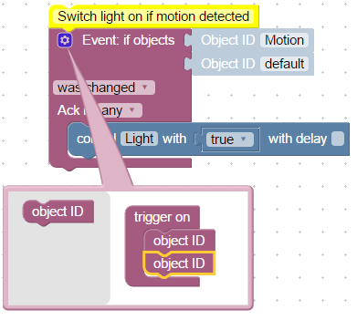

Если используется только один ID объекта, то тогда будут доступны следующие специальные переменные в заявленном блоке:
- value - фактическое значение состояния
- oldValue - устаревшее значение состояния


```
<block xmlns="http://www.w3.org/1999/xhtml" type="on_ext" id="QYVeQlu|#2hwniNg)=z8" x="38" y="39">
  <mutation items="1"></mutation>
  <field name="CONDITION">ne</field>
  <field name="ACK_CONDITION"></field>
  <value name="OID0">
    <shadow type="field_oid" id="Xe6D#r|nf9SEK`.oAuS0">
      <field name="oid">javascript.0.Motion</field>
    </shadow>
  </value>
  <statement name="STATEMENT">
    <block type="debug" id="jT6fif_FI9ua|,rL[Ra1">
      <field name="Severity">log</field>
      <value name="TEXT">
        <shadow type="text" id="}=qIm)a0)};f+J/JRgy^">
          <field name="TEXT">test</field>
        </shadow>
        <block type="text_join" id="wjgpY(Whewaqy0d8NVx%">
          <mutation items="4"></mutation>
          <value name="ADD0">
            <block type="text" id="M?[Xy1(Fu36A;b#=4~[t">
              <field name="TEXT">Actual value is</field>
            </block>
          </value>
          <value name="ADD1">
            <block type="variables_get" id="W)*G#(JDzuVpV^1P|[2m">
              <field name="VAR">value</field>
            </block>
          </value>
          <value name="ADD2">
            <block type="text" id="7TW;voPvdc#c4e/SWCjZ">
              <field name="TEXT">Old value was</field>
            </block>
          </value>
          <value name="ADD3">
            <block type="variables_get" id="s`6)4s:}%L#f]pu4E[vK">
              <field name="VAR">oldValue</field>
            </block>
          </value>
        </block>
      </value>
    </block>
  </statement>
</block>
```

В противном случае, если для триггера используется более одного ID объекта, вы можете получить доступ к значению и устаревшему значению через [Информация триггера](#trigger-info).

### Триггер по изменению состояния


Это такой же блок, что и «Триггер по состояниям», но без возможности использования нескольких ID объектов при срабатывании (для совместимости версий).


### Информация триггера


Получение информации о значении, метке времени или ID состояния, которое вызвало срабатывание триггера.

Данный блок может использоваться только внутри блоков ["Триггер по состояниям"](#trigger-on-states-change) или ["Триггер по изменению состояния"](#trigger-on-state-change).

Доступна следующая информация:

- object ID - ID состояния, которое запускает триггер               
- name - наименование состояния из common.name                
- description - описание состояния из common.desc
- channel ID - ID канала, которому принадлежит состояние. Если канал отсутствует, то он будет нулевым. 
- channel name - имя канала, которому принадлежит состояние. Если канал отсутствует, то он будет нулевым.
- device ID - ID устройства, которому принадлежит состояние. Если канал отсутствует, то он будет нулевым.
- device name - имя устройства, которому принадлежит состояние. Если канал отсутствует, то он будет нулевым.        
- state value - фактическое значение состояния сработки 
- state timestamp - фактическая временная метка в виде Date object
- state quality - фактическое качество кода значения
- origin of value - имя объекта, вызывающего изменение
- is command or update - это команда (ack = false) или update (ack = true)
- last change of state - время последнего изменения значения
- previous value - предыдущее значение состояния до срабатывания триггера
- previous timestamp - предыдущая временная метка этого состояния до срабатывания триггера
- previous quality - предыдущее качество этого состояния до срабатывания триггера
- previous origin -  предыдущее возникновение этого состояния, до того, как триггер сработал
- previous command or update - предыдущий тип этого значения, до срабатывания триггера
- previous last change - предыдущее «последнее измененное значение» этого состояния до срабатывания триггера

Типовое использование:


```
<block xmlns="http://www.w3.org/1999/xhtml" type="on_ext" id="QYVeQlu|#2hwniNg)=z8" x="113" y="238">
  <mutation items="1"></mutation>
  <field name="CONDITION">ne</field>
  <field name="ACK_CONDITION"></field>
  <value name="OID0">
    <shadow type="field_oid" id="Xe6D#r|nf9SEK`.oAuS0">
      <field name="oid">javascript.0.Motion</field>
    </shadow>
  </value>
  <statement name="STATEMENT">
    <block type="debug" id="jT6fif_FI9ua|,rL[Ra1">
      <field name="Severity">log</field>
      <value name="TEXT">
        <shadow type="text" id="}=qIm)a0)};f+J/JRgy^">
          <field name="TEXT">test</field>
        </shadow>
        <block type="text_join" id="wjgpY(Whewaqy0d8NVx%">
          <mutation items="4"></mutation>
          <value name="ADD0">
            <block type="text" id="M?[Xy1(Fu36A;b#=4~[t">
              <field name="TEXT">Actual value is</field>
            </block>
          </value>
          <value name="ADD1">
            <block type="on_source" id="_q8v0HD`c[7e76O{@4Tq">
              <field name="ATTR">state.val</field>
            </block>
          </value>
          <value name="ADD2">
            <block type="text" id="7TW;voPvdc#c4e/SWCjZ">
              <field name="TEXT">Old value was</field>
            </block>
          </value>
          <value name="ADD3">
            <block type="on_source" id="D`gpXSShKRQuy:jyMK}6">
              <field name="ATTR">oldState.val</field>
            </block>
          </value>
        </block>
      </value>
    </block>
  </statement>
</block>
```

### Расписание


Это второй основной блок для автоматизации после ["Триггер по состояниям"](#trigger-on-states-change). Этот блок позволяет выполнять некоторые действия периодически.

Описание правила построения расписания будет выполнено в хорошо документированном CRON [формате](https://en.wikipedia.org/wiki/Cron).В расширении можно определить и секунды. 
Если необходимо использовать секунды, то они должны быть определены как самый первый параметр правила CRON, и правило будет состоять из 6 частей.

В общем CRON правило состоит из 5 или 6 частей:
- правила по секундам (необязательно)
- правила по минутам
- правила по часам
- правила по дням месяца
- правила по месяцам
- правила по дням недели.

Для каждой части разрешены следующие форматы:
- \* - сработка каждую (секунду, минуту, час, ...)
- X (например, 5) - сработка только в эту секунду, минуту, час ...
- from-to (например, 1-9) - сработка только в этом интервале
- \*/X (например, * / 5) - срабатывать каждые X секунд, минут ... В случае  "\*/5"  в течение нескольких часов триггер будет срабатывать в 0, 5, 10, 15 и в 20 часов.
- числа и интервалы могут быть объединены запятой (например, 1,3,4-6). Не делайте пробелов между числами, потому что пространство является разделителем для частей правила.

\*/10 \* \* \* 6,7 - срабатывать каждые 10 минут в субботу и воскресенье.

\*/30 \* \* \* \* \* - срабатывать каждые 30 секунд.

```
 ┌───────────── мин (0 - 59)
 │ ┌────────────── час (0 - 23)
 │ │ ┌─────────────── день месяца (1 - 31)
 │ │ │ ┌──────────────── месяц (1 - 12)
 │ │ │ │ ┌───────────────── день недели (0 - 6) (0 to 6 от Воскресенья до Субботы; 7 также Воскресенье)
 │ │ │ │ │
 │ │ │ │ │
 │ │ │ │ │
 * * * * *  расписание
```

или при использовании секунд:

```
 ┌───────────── секунды (0 - 59)
 │ ┌───────────── мин (0 - 59)
 │ │ ┌────────────── час (0 - 23)
 │ │ │ ┌─────────────── день месяца (1 - 31)
 │ │ │ │ ┌──────────────── месяц (1 - 12)
 │ │ │ │ │ ┌───────────────── день недели (0 - 6) (0 to 6 от Воскресенья до Субботы; 7 также Воскресенье)
 │ │ │ │ │ │
 │ │ │ │ │ │
 │ │ │ │ │ │
 * * * * * *  расписание
```

Но вы также можете построить и свои такие же правила. Нажав на правило, откроется диалог CRON, и вы можете указать мышью свое правило.


### Триггер по астрономическому событию


Выполнение некоторых действий по астрологическому событию. Возможны следующие события:

- sunrise: восход (верхний край солнца появляется на горизонте)
- sunriseEnd: восход солнца заканчивается (нижний край солнца касается горизонта)
- goldenHourEnd: конец «золотого часа» (мягкий свет, наиболее подходящее время для фотографии)
- solarNoon: солнечный полдень (солнце находится в наивысшей точке)
- goldenHour: начало «золотого часа»
- sunsetStart:  начало заката (нижний край солнца касается горизонта)
- sunset: закат (солнце полностью заходит за горизонт, начинаются вечерние гражданские сумерки)
- dusk: начало вечерних навигационных сумерек (время, когда уже достаточно темно, но всё еще можно ориентироваться по горизонту в море)
- nauticalDusk:  начало вечерних астрономических сумерек (визуально темно, но недостаточно для астрономических наблюдений)
- night: начало ночи (достаточно темно для большинства астрономических наблюдений)
- nightEnd: конец ночи (и начало утренних астрономических сумерек)
- nauticalDawn: начало утренних навигационных сумерек
- dawn: утренняя заря (начало утренних гражданских сумерек)
- nadir: надир (самый темный момент ночи, солнце находится в самом низком положении)


**Примечание:** для использования «астро-функции» в настройках адаптера javascript должны быть определены «широта» и «долгота».

Кроме того, вы можете установить смещение в минутах до астрологического события, например, сработка триггера за 1 час до рассвета:


Как вы видите, смещение может быть и отрицательным, при указании времени перед астрологическими событиями.

### Именованное расписание


Данный блок похож на блок [Расписание](#schedule), но помимо этого у него есть возможность установки правила CRON по строке, а также возможность остановить расписание.

Вы можете присвоить уникальное имя этому блоку расписания, а затем позже очистить его с помощью  [Очистка расписания](#clear-schedule). 

Вот пример настраиваемого будильника:
 


```
<xml xmlns="http://www.w3.org/1999/xhtml">
  <block type="comment" id="QWp.l96v1;-4{x)j5K5y" x="38" y="13">
    <field name="COMMENT">Configurable alarm. Set time as: hh:mm</field>
    <next>
      <block type="create" id="5*XX`C;PgnU(q#Nk~D,o">
        <field name="NAME">alarmTime</field>
        <statement name="STATEMENT">
          <block type="on_ext" id="ot:9oFMh.(c)sxkufTxA">
            <mutation items="1"></mutation>
            <field name="CONDITION">ne</field>
            <field name="ACK_CONDITION"></field>
            <value name="OID0">
              <shadow type="field_oid" id="qV#=^mz,%qxL#}VsA)3C">
                <field name="oid">javascript.0.alarmTime</field>
              </shadow>
            </value>
            <statement name="STATEMENT">
              <block type="schedule_clear" id="ukGIQYyTpip_9!1H_xnN">
                <field name="NAME">alarm</field>
                <next>
                  <block type="schedule_create" id=")^!A|k+`1=[pFp(S-*sw">
                    <field name="NAME">alarm</field>
                    <value name="SCHEDULE">
                      <shadow type="field_cron" id="uSka7fK[T7j0m_4!4+fO">
                        <field name="CRON">* * * * *</field>
                      </shadow>
                      <block type="procedures_callcustomreturn" id=")E!Ljg1z9iQ3)Nb#CX~n">
                        <mutation name="time to CRON">
                          <arg name="time"></arg>
                        </mutation>
                        <value name="ARG0">
                          <block type="on_source" id="qs+k30Lnd1V(BSNs{}P!">
                            <field name="ATTR">state.val</field>
                          </block>
                        </value>
                      </block>
                    </value>
                    <statement name="STATEMENT">
                      <block type="debug" id="7arB5vcx^ci2Un#}TLKh">
                        <field name="Severity">log</field>
                        <value name="TEXT">
                          <shadow type="text" id="N;`AY!p#T_do@vP_OQr9">
                            <field name="TEXT">Wake up!</field>
                          </shadow>
                        </value>
                      </block>
                    </statement>
                  </block>
                </next>
              </block>
            </statement>
          </block>
        </statement>
      </block>
    </next>
  </block>
  <block type="procedures_defcustomreturn" id="_*_L4XpCr!7eLsYWS(R(" x="38" y="337">
    <mutation statements="false">
      <arg name="time"></arg>
    </mutation>
    <field name="NAME">time to CRON</field>
    <field name="SCRIPT">dmFyIHBhcnRzID0gdGltZS5zcGxpdCgnOicpOwovLyBpZiBpdCBpcyBDUk9OCmlmIChwYXJ0cy5sZW5ndGggPT09IDEpIHJldHVybiB0aW1lOwpyZXR1cm4gcGFydHNbMV0gKyAnICcgKyBwYXJ0c1swXSArICcgKiAqIConOw==</field>
    <comment pinned="false" h="80" w="160">Describe this function...</comment>
  </block>
</xml>
```

### Очистка расписания


С помощью этого функционального блока вы можете очистить Именованное расписание. Если вы измените имя еще один раз, не очищая его, то тогда останется старое имя.

Пример использования в [Именованное расписание](#named-schedule)

### CRON диалог


Создать правило CRON из диалога. Этот блок может быть соединен с [Именованное расписание](#named-schedule).


```
<xml xmlns="http://www.w3.org/1999/xhtml">
  <block type="comment" id="]aB;GhQJvYrr~:H4Ft9l" x="63" y="38">
    <field name="COMMENT">Every 0th minute every hour</field>
    <next>
      <block type="schedule_create" id="?}upFtiA@CE_Gd)SmDo|">
        <field name="NAME">schedule</field>
        <value name="SCHEDULE">
          <shadow type="field_cron" id="1Ag|noK^~u]GFEW/(lb)">
            <field name="CRON">* * * * *</field>
          </shadow>
          <block type="field_cron" id="phjg#B~@BJTO9i[HmZ4O">
            <field name="CRON">0 * * * *</field>
          </block>
        </value>
        <statement name="STATEMENT">
          <block type="debug" id="Lv[a}BtvBDO-2Lt,s+z4">
            <field name="Severity">log</field>
            <value name="TEXT">
              <shadow type="text" id="evxnn0R1(AC^Y_U`oT_a">
                <field name="TEXT">It is exactly</field>
              </shadow>
              <block type="text_join" id="6!2uB_db8.g}63I{^e}#">
                <mutation items="3"></mutation>
                <value name="ADD0">
                  <block type="text" id="HH((bCdxr?A5)8Svuo6(">
                    <field name="TEXT">It is exactly </field>
                  </block>
                </value>
                <value name="ADD1">
                  <block type="time_get" id="7{BBfF0jmKD[qX,y6voK">
                    <mutation format="false" language="false"></mutation>
                    <field name="OPTION">h</field>
                  </block>
                </value>
                <value name="ADD2">
                  <block type="text" id="edML0zJ2V9kN}5/DLdS5">
                    <field name="TEXT"> o'clock</field>
                  </block>
                </value>
              </block>
            </value>
          </block>
        </statement>
      </block>
    </next>
  </block>
</xml>
```

### CRON правило


Составляет правило CRON из разных частей.

Вы можете отобразить правило, как блок или как строку:


Вы также можете указать секунды для правила CRON при помощи дополнительного параметра «с секундами»


Этот блок может использоваться (как и [CRON диалог](#cron-dialog)) только с [Именованное расписание](#named-schedule).

## Таймауты

### Задержка выполнения


При помощи этого блока вы можете выполнять другие блоки, отложенные на некоторое время, указанное в миллисекундах. Если вы знаете Javascript, то это такая же функция, как setTimeout.

В блочном режиме нет «паузы», но вы можете использовать этот блок для имитации паузы. Если вы разместите все блоки, которые должны быть выполнены после паузы, то вы получите тот же эффект, что и при паузе.

У каждого отложенного выполнения может быть свое уникальное имя. Оно может быть отменено другим блоком. [Очистить отложенное выполнение](#clear-delayed-execution)


```
<xml xmlns="http://www.w3.org/1999/xhtml">
  <block type="debug" id=":6GZ!E*FHy@vPKKl{`hV" x="487" y="163">
    <field name="Severity">log</field>
    <value name="TEXT">
      <shadow type="text" id="LV!-dx[I(8bAu(_kcG.U">
        <field name="TEXT">Make a pause 5 seconds</field>
      </shadow>
    </value>
    <next>
      <block type="timeouts_settimeout" id="~?BW3eBK_t:TzNk}x9l3">
        <field name="NAME">timeout</field>
        <field name="DELAY">5000</field>
        <statement name="STATEMENT">
          <block type="debug" id="glbs:mQxsDfEieLaru!0">
            <field name="Severity">log</field>
            <value name="TEXT">
              <shadow type="text" id="_7T9e{FEJTWcpLl*BltU">
                <field name="TEXT">After pause</field>
              </shadow>
            </value>
          </block>
        </statement>
      </block>
    </next>
  </block>
</xml>
```

### Очистить отложенное выполнение


Данный блок используется для отмены задержки запуска по имени. Типовое использование - имитация сценария обнаружения движения. По первому движению свет должен загореться, а после последнего движения, через 30 секунд, свет должен погаснуть.


```
<xml xmlns="http://www.w3.org/1999/xhtml">
  <block type="on_ext" id="+nZ`H6mh/;g(e3u,t;wJ" x="163" y="12">
    <mutation items="1"></mutation>
    <field name="CONDITION">ne</field>
    <field name="ACK_CONDITION"></field>
    <value name="OID0">
      <shadow type="field_oid" id="{mRcPH:!k^_5q-hwg1q%">
        <field name="oid">node-red.0.javascript.0.Motion</field>
      </shadow>
    </value>
    <statement name="STATEMENT">
      <block type="controls_if" id="]lX4.m?HnwXigM.6wY/D">
        <value name="IF0">
          <block type="logic_compare" id="s0DHFun9e*,c3AawmP_~">
            <field name="OP">EQ</field>
            <value name="A">
              <block type="variables_get" id="g}IH`Bx0T(mkht8~{Ul0">
                <field name="VAR">value</field>
              </block>
            </value>
            <value name="B">
              <block type="logic_boolean" id="Meek9{gS-NOR?|(fgbVg">
                <field name="BOOL">TRUE</field>
              </block>
            </value>
          </block>
        </value>
        <statement name="DO0">
          <block type="debug" id=":6GZ!E*FHy@vPKKl{`hV">
            <field name="Severity">log</field>
            <value name="TEXT">
              <shadow type="text" id="LV!-dx[I(8bAu(_kcG.U">
                <field name="TEXT">Motion detected</field>
              </shadow>
            </value>
            <next>
              <block type="comment" id="6_T-s#wApgZhu0+4uEk}">
                <field name="COMMENT">Switch light ON</field>
                <next>
                  <block type="control" id="fxgT@s0r?[`LJIsqR~M_">
                    <mutation delay_input="false"></mutation>
                    <field name="OID">javascript.0.Light</field>
                    <field name="WITH_DELAY">FALSE</field>
                    <value name="VALUE">
                      <block type="logic_boolean" id="0mgo#`N%Zm{MTELxw%~0">
                        <field name="BOOL">TRUE</field>
                      </block>
                    </value>
                    <next>
                      <block type="comment" id="rZ^o06`}^uFftKj2oYvE">
                        <field name="COMMENT">Stop timer, even if it not running</field>
                        <next>
                          <block type="timeouts_cleartimeout" id="#H#~HxipC8_-/{%,2R1P">
                            <field name="NAME">lightOff</field>
                            <next>
                              <block type="timeouts_settimeout" id="~?BW3eBK_t:TzNk}x9l3">
                                <field name="NAME">lightOff</field>
                                <field name="DELAY">5000</field>
                                <statement name="STATEMENT">
                                  <block type="debug" id="glbs:mQxsDfEieLaru!0">
                                    <field name="Severity">log</field>
                                    <value name="TEXT">
                                      <shadow type="text" id="_7T9e{FEJTWcpLl*BltU">
                                        <field name="TEXT">Light OFF</field>
                                      </shadow>
                                    </value>
                                    <next>
                                      <block type="control" id="McdOD=k4)MlO42RVgB~r">
                                        <mutation delay_input="false"></mutation>
                                        <field name="OID">javascript.0.Light</field>
                                        <field name="WITH_DELAY">FALSE</field>
                                        <value name="VALUE">
                                          <block type="logic_boolean" id="XLHrXB)/|dqGlh,nXl^[">
                                            <field name="BOOL">FALSE</field>
                                          </block>
                                        </value>
                                      </block>
                                    </next>
                                  </block>
                                </statement>
                              </block>
                            </next>
                          </block>
                        </next>
                      </block>
                    </next>
                  </block>
                </next>
              </block>
            </next>
          </block>
        </statement>
      </block>
    </statement>
  </block>
</xml>
```

### Выполнение по интервалу


Данный блок позволяет вам периодически выполнять какое-либо действие. Конечно, есть блок CRON, но у CRON блока наименьший интервал равен одной секунде. 
Этот блок может выполнять действия в миллисекундных периодах.

Если вы установите интервал меньше (менее 100 мс) чем он может быть, то эти интервалы будут больше.

Аналогично блоку таймаута, вы также можете присвоить уникальное имя интервалу.

### Остановить выполнение по интервалу


При помощи этого блока вы можете отменить периодическое выполнение блока интервалов по их именам.

## Логические

### Блок If else 

### Блок сравнения

### Логический блок AND/OR

### Блок отрицания

### Логическое значение TRUE/FALSE

### Нулевой блок

### Тестовый блок

## Циклы

### Повторить N раз

### Повторять пока

### Счетчик

### Для каждого

### Выйти из цикла

## Математические

### Числовое значение

### Арифметические операции +-\*/^

### Корень квадратный, Abs, -, ln, log10, e^, 10^

### sin, cos, tan, asin, acos, atan

### Математические постоянные: pi, e, phi, sqrt(2), sqrt(1/2), infinity

### Четное, нечетное, простое, целое, положительное, отрицательное, делимое на

### Изменение переменной со знаком плюс или минус

### Округленное, приближенное, действительное значение

### Операции со списком значений: сумма, минимум, максимум, среднее, медиана, мода, отклонения, случайное значение

### Модуль

### Установить предел для значения по минимуму и максимуму

### Случайное значение от 0 до 1

### Случайное значение между минимальным или максимальным

## Текст

### Строковое значение

### Объединение строк

### Добавить строку в переменную

### Длина строки

### Строка пустая

### Найти позицию в строке

### Получить символ в строке по определенной позиции

### Получить подстроку

### Преобразование в верхний или в нижний регистр

### Строка обрезки

## Списки

### Создать пустой список

### Создать список значений

### Создать список с тем же значением N раз

### Получить длину списка

### Список пуст

### Найти позицию элемента в списке

### Получить элемент в списке

### Указать элемент в списке

### Получить подсписок

### Преобразование текста в список и наоборот

## Цвет

### Цветовое значение

### Произвольный цвет

### RGB палитра

### Смешанные цвета

## Переменные

### Установить значение переменной


Чтобы понять, как использовать этот блок, вы должны знать основные правила программирования, в частности, как использовать переменные.

С помощью этого блока вы можете записать в глобальную переменную (видимую отовсюду в этом скрипте) и использовать ее для хранения некоторых значений. Если переменная не существует, она будет объявлена автоматически.

Этот блок может создать новую переменную или использовать существующую.


Вот этот код:


```
<block xmlns="http://www.w3.org/1999/xhtml" type="variables_set" id="ch{H@omhfzI(QA{syxAG" x="212.99999999999977" y="37.99999999999994">
  <field name="VAR">item</field>
  <value name="VALUE">
    <block type="math_number" id="SbmD7,uR:hMW!(P%IZRc">
      <field name="NUM">0</field>
    </block>
  </value>
</block>
```

делает только это:
```
var item;
item = 0;
```

### Получить значение переменной


Этот блок получает значение переменной. Вы можете создать новый или использовать уже существующий.


Существует одно исключение с триггерными блоками:  [Триггер по состояниям](#trigger-on-states-change) и [Триггер по изменению состояния](#trigger-on-state-change).
Внутри этих блоков переменная «значение» уже существует, но в любом случае для чтения этих значений вам необходимо переименовать переменную в значение и затем использовать ее.


## Функции

### Создать функцию из блоков без возвращения значения


С помощью этого блока вы можете комбинировать некоторые повторяющиеся последовательности в функции, а затем использовать эту функцию повсюду в текущем блочном режиме.

Ниже приведен пример функции, которая просто печатает текущее время в лог.

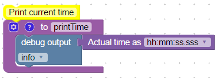

```
<xml xmlns="http://www.w3.org/1999/xhtml">
  <block type="comment" id=";LE@QUg[hpGG!Ed6(?Hf" x="463" y="88">
    <field name="COMMENT">Print current time</field>
  </block>
  <block type="procedures_defnoreturn" id="zz#oL]VPR)s}NMK9htHa" x="463" y="113">
    <field name="NAME">printTime</field>
    <comment pinned="false" h="80" w="160">Describe this function...</comment>
    <statement name="STACK">
      <block type="debug" id="ak(`[aJB-AH@Hvc;B,[D">
        <field name="Severity">log</field>
        <value name="TEXT">
          <shadow type="text" id="aGuA=^(ge/)=lXes9f]?">
            <field name="TEXT">test</field>
          </shadow>
          <block type="time_get" id="M}z9(p(melE7BbTGqczO">
            <mutation format="false" language="false"></mutation>
            <field name="OPTION">hh:mm:ss.sss</field>
          </block>
        </value>
      </block>
    </statement>
  </block>
</xml>
```

После создания функции вы можете использовать эту функцию следующим образом:


```
<block xmlns="http://www.w3.org/1999/xhtml" type="timeouts_setinterval" id="hp;?}l3uStXhm+a2s!9t" x="62.99999999999943" y="112.99999999999994">
  <field name="NAME">interval</field>
  <field name="INTERVAL">1000</field>
  <statement name="STATEMENT">
    <block type="procedures_callnoreturn" id="(/)MPv+z_|516CuG%[XD">
      <mutation name="printTime"></mutation>
    </block>
  </statement>
</block>
```

Вы сможете найти эту новую функцию в меню блоков:


Помимо этого, через диалог конфигурации вы можете указать аргументы для функции. Вам доступно редактирование имен аргументов в одном и том же диалоговом окне.


Пример функции, которая выводит сумму первого и второго аргумента:


```
<xml xmlns="http://www.w3.org/1999/xhtml">
  <block type="comment" id=";LE@QUg[hpGG!Ed6(?Hf" x="463" y="88">
    <field name="COMMENT">Print sum of a and b</field>
  </block>
  <block type="procedures_defnoreturn" id="zz#oL]VPR)s}NMK9htHa" x="463" y="113">
    <mutation>
      <arg name="a"></arg>
      <arg name="b"></arg>
    </mutation>
    <field name="NAME">printSum</field>
    <comment pinned="false" h="80" w="160">Describe this function...</comment>
    <statement name="STACK">
      <block type="debug" id="ak(`[aJB-AH@Hvc;B,[D">
        <field name="Severity">log</field>
        <value name="TEXT">
          <shadow type="text" id="aGuA=^(ge/)=lXes9f]?">
            <field name="TEXT">test</field>
          </shadow>
          <block type="math_arithmetic" id="qUGc!b+U]:yE!I+3I+Lp">
            <field name="OP">ADD</field>
            <value name="A">
              <shadow type="math_number" id="OqjQ{@*pgO,~Xd(ef)9~">
                <field name="NUM">1</field>
              </shadow>
              <block type="variables_get" id="]dC)!=A3{(5?9hJ:1gET">
                <field name="VAR">a</field>
              </block>
            </value>
            <value name="B">
              <shadow type="math_number" id="aDp|:rn#.wve0]WKi(D[">
                <field name="NUM">1</field>
              </shadow>
              <block type="variables_get" id="5];ao,?ce{;GJ;OOW~S4">
                <field name="VAR">b</field>
              </block>
            </value>
          </block>
        </value>
      </block>
    </statement>
  </block>
</xml>
```

В меню переменных, вы можете найти аргументы:

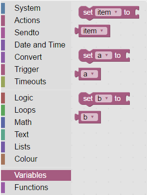

И использовать эту функцию следующим образом:


```
<block xmlns="http://www.w3.org/1999/xhtml" type="procedures_callnoreturn" id="(-G|y+Y7AC]w2CTQGjYC" x="138" y="188">
  <mutation name="printSum">
    <arg name="a"></arg>
    <arg name="b"></arg>
  </mutation>
  <value name="ARG0">
    <block type="math_number" id="!.UT=[{Xkz-*wlPh)sYn">
      <field name="NUM">5</field>
    </block>
  </value>
  <value name="ARG1">
    <block type="math_number" id="EMhKM9Cn#;DjMZ#Ko%EN">
      <field name="NUM">6</field>
    </block>
  </value>
</block>
```

### Создать функцию из блоков с возвращением значения


Данный блок похож на предыдущий, но он еще и возвращает результат функции, который в дальнейшем можно использовать в блоках.


```
<block xmlns="http://www.w3.org/1999/xhtml" type="procedures_defreturn" id="4)|}1YzV}e6YUvVV^sY{" x="413" y="138">
  <mutation statements="false">
    <arg name="a"></arg>
    <arg name="b"></arg>
  </mutation>
  <field name="NAME">do something</field>
  <comment pinned="false" h="80" w="160">Return sum of a and b</comment>
  <value name="RETURN">
    <block type="math_arithmetic" id="qUGc!b+U]:yE!I+3I+Lp">
      <field name="OP">ADD</field>
      <value name="A">
        <shadow type="math_number" id="OqjQ{@*pgO,~Xd(ef)9~">
          <field name="NUM">1</field>
        </shadow>
        <block type="variables_get" id="]dC)!=A3{(5?9hJ:1gET">
          <field name="VAR">a</field>
        </block>
      </value>
      <value name="B">
        <shadow type="math_number" id="aDp|:rn#.wve0]WKi(D[">
          <field name="NUM">1</field>
        </shadow>
        <block type="variables_get" id="5];ao,?ce{;GJ;OOW~S4">
          <field name="VAR">b</field>
        </block>
      </value>
    </block>
  </value>
</block>
```

Применение схоже с другими функциональными блоками:

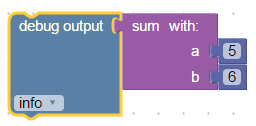

```
<xml xmlns="http://www.w3.org/1999/xhtml">
  <block type="debug" id="zgr7b0g)}uMe1ySGYL7X" x="163" y="137">
    <field name="Severity">log</field>
    <value name="TEXT">
      <shadow type="text" id="q-]m1ptAzK4Rq20wWRBq">
        <field name="TEXT">test</field>
      </shadow>
      <block type="procedures_callreturn" id="0RX?V1j|FZHK@*Lw3W-g">
        <mutation name="sum">
          <arg name="a"></arg>
          <arg name="b"></arg>
        </mutation>
        <value name="ARG0">
          <block type="math_number" id="Xd52^_Qp83=ah2RTWzSU">
            <field name="NUM">5</field>
          </block>
        </value>
        <value name="ARG1">
          <block type="math_number" id="-M9A9EhrgJSRc*4(X^[;">
            <field name="NUM">6</field>
          </block>
        </value>
      </block>
    </value>
  </block>
  <block type="procedures_defreturn" id="4)|}1YzV}e6YUvVV^sY{" x="413" y="138">
    <mutation statements="false">
      <arg name="a"></arg>
      <arg name="b"></arg>
    </mutation>
    <field name="NAME">sum</field>
    <comment pinned="false" h="80" w="160">Return sum of a and b</comment>
    <value name="RETURN">
      <block type="math_arithmetic" id="qUGc!b+U]:yE!I+3I+Lp">
        <field name="OP">ADD</field>
        <value name="A">
          <shadow type="math_number" id="OqjQ{@*pgO,~Xd(ef)9~">
            <field name="NUM">1</field>
          </shadow>
          <block type="variables_get" id="]dC)!=A3{(5?9hJ:1gET">
            <field name="VAR">a</field>
          </block>
        </value>
        <value name="B">
          <shadow type="math_number" id="aDp|:rn#.wve0]WKi(D[">
            <field name="NUM">1</field>
          </shadow>
          <block type="variables_get" id="5];ao,?ce{;GJ;OOW~S4">
            <field name="VAR">b</field>
          </block>
        </value>
      </block>
    </value>
  </block>
</xml>
```

Для всех функций вы можете добавить комментарий или описание.

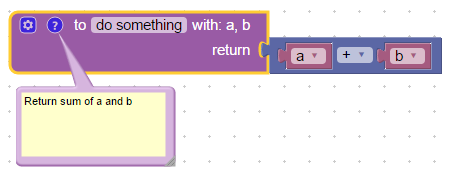

В блоке возврата вы можете использовать специальный элемент возврата:

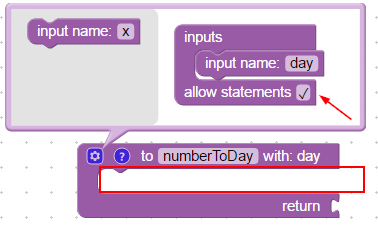

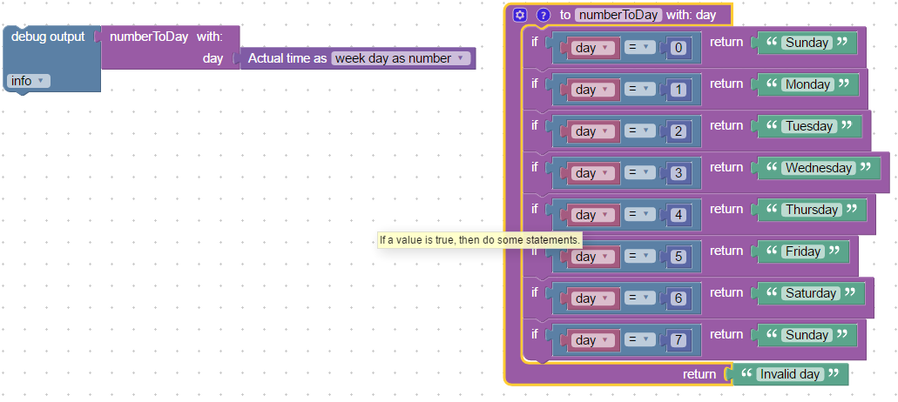

```
<xml xmlns="http://www.w3.org/1999/xhtml">
  <block type="debug" id="zgr7b0g)}uMe1ySGYL7X" x="63" y="12">
    <field name="Severity">log</field>
    <value name="TEXT">
      <shadow type="text" id="q-]m1ptAzK4Rq20wWRBq">
        <field name="TEXT">test</field>
      </shadow>
      <block type="procedures_callreturn" id="0RX?V1j|FZHK@*Lw3W-g">
        <mutation name="numberToDay">
          <arg name="day"></arg>
        </mutation>
        <value name="ARG0">
          <block type="math_number" id="Xd52^_Qp83=ah2RTWzSU">
            <field name="NUM">5</field>
          </block>
        </value>
      </block>
    </value>
  </block>
  <block type="debug" id="@i@bdG^90dp,cJ#W*[nB" x="12" y="188">
    <field name="Severity">log</field>
    <value name="TEXT">
      <shadow type="text" id="8:/`}T!:6Wz.d/;)jpHl">
        <field name="TEXT">test</field>
      </shadow>
      <block type="procedures_callreturn" id="hvzS!O_Q=FlccQR@*%tk">
        <mutation name="numberToDay">
          <arg name="day"></arg>
        </mutation>
        <value name="ARG0">
          <block type="time_get" id=":A,Ba,yrW_QgiX*cs9zh">
            <mutation format="false" language="false"></mutation>
            <field name="OPTION">wd</field>
          </block>
        </value>
      </block>
    </value>
  </block>
  <block type="procedures_defreturn" id="4)|}1YzV}e6YUvVV^sY{" x="588" y="163">
    <mutation>
      <arg name="day"></arg>
    </mutation>
    <field name="NAME">numberToDay</field>
    <comment pinned="false" h="80" w="160">Return sum of a and b</comment>
    <statement name="STACK">
      <block type="procedures_ifreturn" id="/qJjm#cr-naS}joAL0eT">
        <mutation value="1"></mutation>
        <value name="CONDITION">
          <block type="logic_compare" id="cbxuAYxF,ptMi.`E/nB.">
            <field name="OP">EQ</field>
            <value name="A">
              <block type="variables_get" id="`mWQWp).?qDuD=)NX2dA">
                <field name="VAR">day</field>
              </block>
            </value>
            <value name="B">
              <block type="math_number" id="s,20+9X6bB/2nL{v?g:/">
                <field name="NUM">0</field>
              </block>
            </value>
          </block>
        </value>
        <value name="VALUE">
          <block type="text" id="iI)V7P`3YP]{-S-7HcO1">
            <field name="TEXT">Sunday</field>
          </block>
        </value>
        <next>
          <block type="procedures_ifreturn" id="3=FBSCS{jzu[}2L5Spi[">
            <mutation value="1"></mutation>
            <value name="CONDITION">
              <block type="logic_compare" id="V[;S84AH5cf93^5/[AN^">
                <field name="OP">EQ</field>
                <value name="A">
                  <block type="variables_get" id=";ShgVu*+:nn9WSzbm[fA">
                    <field name="VAR">day</field>
                  </block>
                </value>
                <value name="B">
                  <block type="math_number" id="jY?Wj8lC1-~SiIHa*I)0">
                    <field name="NUM">1</field>
                  </block>
                </value>
              </block>
            </value>
            <value name="VALUE">
              <block type="text" id="=aVg_FatldZUUsS(8G`;">
                <field name="TEXT">Monday</field>
              </block>
            </value>
            <next>
              <block type="procedures_ifreturn" id="(g_VE2e?U^J-nhk,bP|0">
                <mutation value="1"></mutation>
                <value name="CONDITION">
                  <block type="logic_compare" id="M;B+SSw[Mc.iu;fUjvcV">
                    <field name="OP">EQ</field>
                    <value name="A">
                      <block type="variables_get" id="yT{.UQ)qXY8-@2XzpxQo">
                        <field name="VAR">day</field>
                      </block>
                    </value>
                    <value name="B">
                      <block type="math_number" id="Q-JC5_JZ=i{[+~:^|BpU">
                        <field name="NUM">2</field>
                      </block>
                    </value>
                  </block>
                </value>
                <value name="VALUE">
                  <block type="text" id="9`665+j*i_?3BCZWODGt">
                    <field name="TEXT">Tuesday</field>
                  </block>
                </value>
                <next>
                  <block type="procedures_ifreturn" id="{+9IT6E:N-a+Y.cFNMsw">
                    <mutation value="1"></mutation>
                    <value name="CONDITION">
                      <block type="logic_compare" id="B}D{JSK|}=bk|-|D#/_h">
                        <field name="OP">EQ</field>
                        <value name="A">
                          <block type="variables_get" id="s{Zxm|sBbEGA1#~Tv3EE">
                            <field name="VAR">day</field>
                          </block>
                        </value>
                        <value name="B">
                          <block type="math_number" id="f!3KoyGu4bWpxdaJY`JI">
                            <field name="NUM">3</field>
                          </block>
                        </value>
                      </block>
                    </value>
                    <value name="VALUE">
                      <block type="text" id="yS4pn;Fdg9JT[MjvPu,4">
                        <field name="TEXT">Wednesday</field>
                      </block>
                    </value>
                    <next>
                      <block type="procedures_ifreturn" id="g*VMz;jyw4,@;Qb*/8TN">
                        <mutation value="1"></mutation>
                        <value name="CONDITION">
                          <block type="logic_compare" id="(^azMqi{:`?S.tJ@y7-m">
                            <field name="OP">EQ</field>
                            <value name="A">
                              <block type="variables_get" id="P*CAI!ug.Xl*BM2v/kpb">
                                <field name="VAR">day</field>
                              </block>
                            </value>
                            <value name="B">
                              <block type="math_number" id="YN@VzF~X=BOcWm+P]c3i">
                                <field name="NUM">4</field>
                              </block>
                            </value>
                          </block>
                        </value>
                        <value name="VALUE">
                          <block type="text" id="H`yzv!j_GjSw|@f7Gap8">
                            <field name="TEXT">Thursday</field>
                          </block>
                        </value>
                        <next>
                          <block type="procedures_ifreturn" id=")htNPjBWw1J/gp-Y5#Kg">
                            <mutation value="1"></mutation>
                            <value name="CONDITION">
                              <block type="logic_compare" id="nFZ;s`3ij0v|.wQqw`AB">
                                <field name="OP">EQ</field>
                                <value name="A">
                                  <block type="variables_get" id="Q^3OKKD]aGa0/qxWf%*g">
                                    <field name="VAR">day</field>
                                  </block>
                                </value>
                                <value name="B">
                                  <block type="math_number" id="#brnWNXj0_dx[JwHjgh0">
                                    <field name="NUM">5</field>
                                  </block>
                                </value>
                              </block>
                            </value>
                            <value name="VALUE">
                              <block type="text" id="Y1-{3UJxFrpq{uJp6DkB">
                                <field name="TEXT">Friday</field>
                              </block>
                            </value>
                            <next>
                              <block type="procedures_ifreturn" id="K2~CLXTJ5b=T+=/6%m=~">
                                <mutation value="1"></mutation>
                                <value name="CONDITION">
                                  <block type="logic_compare" id="Cjh^D.y[m3YQn},sC1(0">
                                    <field name="OP">EQ</field>
                                    <value name="A">
                                      <block type="variables_get" id="|uXT]6-.XcdAG-6HtffC">
                                        <field name="VAR">day</field>
                                      </block>
                                    </value>
                                    <value name="B">
                                      <block type="math_number" id="N@!AqGy7OCz9:zhv@f?K">
                                        <field name="NUM">6</field>
                                      </block>
                                    </value>
                                  </block>
                                </value>
                                <value name="VALUE">
                                  <block type="text" id="omKlSmgS{[5T:v{9(j}?">
                                    <field name="TEXT">Saturday</field>
                                  </block>
                                </value>
                                <next>
                                  <block type="procedures_ifreturn" id=".XFx#9RZIGl!joSiMNyq">
                                    <mutation value="1"></mutation>
                                    <value name="CONDITION">
                                      <block type="logic_compare" id="aqkbbBOzUTv/%JlX)V}S">
                                        <field name="OP">EQ</field>
                                        <value name="A">
                                          <block type="variables_get" id="qrl+C-GvBF7QzLz8?@:u">
                                            <field name="VAR">day</field>
                                          </block>
                                        </value>
                                        <value name="B">
                                          <block type="math_number" id="_[;I?)){=vm_jnSYHumL">
                                            <field name="NUM">7</field>
                                          </block>
                                        </value>
                                      </block>
                                    </value>
                                    <value name="VALUE">
                                      <block type="text" id="MCTQyN!}ig#3~)B[r#q[">
                                        <field name="TEXT">Sunday</field>
                                      </block>
                                    </value>
                                  </block>
                                </next>
                              </block>
                            </next>
                          </block>
                        </next>
                      </block>
                    </next>
                  </block>
                </next>
              </block>
            </next>
          </block>
        </next>
      </block>
    </statement>
    <value name="RETURN">
      <block type="text" id="revjgT`{%j^1mn*-SJ1a">
        <field name="TEXT">Invalid day</field>
      </block>
    </value>
  </block>
</xml>
```

### Вернуть значение в функцию


Просмотреть использование данного блока можно в  [Создать функцию из блоков с возвращением значения](#create-function-from-blocks-with-return-value]).

Данный блок может использоваться только там и необходим для возврата значения в середину функции.

### Создать пользовательскую функцию без возвращения значения


Иногда существующие блоки не подходят для решения конкретной проблемы. С помощью этого блока вы можете создать свой собственный блок как функцию, которая может принимать параметры и выполнять некоторые действия. Чтобы написать такую функцию, вы должны знать javascript. Вы можете использовать внутри все функции, написанные скриптами.

Чтобы написать код, вы должны щелкнуть '...' в конце блока, и откроется диалоговое окно редактора.

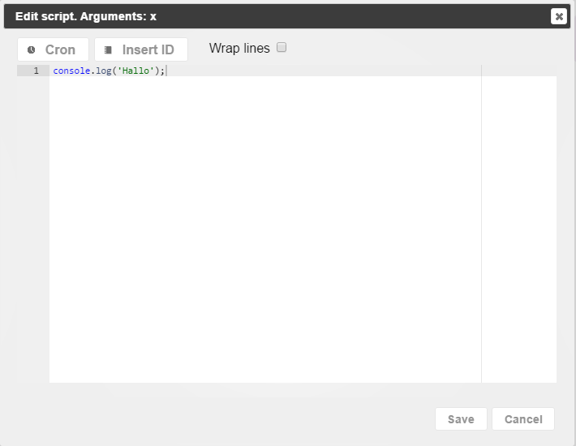

В противном случае, использование этого блока аналогично использованию стандартных функциональных блоков, таких как [Создать функцию из блоков с возвращением значения](#create-function-from-blocks-with-return-value]) или [Создать функцию из блоков без возвращения значения](#create-function-from-blocks-with-no-return-value]).

### Создать пользовательскую функцию с возвращением значения


Данный пользовательский функциональный блок возвращает значения. Для того, чтобы вернуть результат из функции напишите:

```
return 'your result';
```

Как здесь:

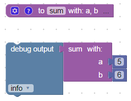

```
<xml xmlns="http://www.w3.org/1999/xhtml">
  <block type="procedures_defcustomreturn" id="mG^pXm=MO7vPl!c^/.Px" x="163" y="63">
    <mutation statements="false">
      <arg name="a"></arg>
      <arg name="b"></arg>
    </mutation>
    <field name="NAME">sum</field>
    <field name="SCRIPT">cmV0dXJuIGEgKyBiOw==</field>
    <comment pinned="false" h="80" w="160">Summarise a and b</comment>
  </block>
  <block type="debug" id="U6pI-lE0VS#G):ELrQ(0" x="163" y="138">
    <field name="Severity">log</field>
    <value name="TEXT">
      <shadow type="text" id="PBg^5*vuC?Isr)]pqx/u">
        <field name="TEXT">test</field>
      </shadow>
      <block type="procedures_callcustomreturn" id="XuhUUF65jRZGB#YE(GTC">
        <mutation name="sum">
          <arg name="a"></arg>
          <arg name="b"></arg>
        </mutation>
        <value name="ARG0">
          <block type="math_number" id="h_[^zH{ILtnHrsxY0j~z">
            <field name="NUM">5</field>
          </block>
        </value>
        <value name="ARG1">
          <block type="math_number" id="iIoph|b.?suX;)R=d|),">
            <field name="NUM">6</field>
          </block>
        </value>
      </block>
    </value>
  </block>
</xml>
```

### Вызов функции


Для каждой созданной функции в меню появляется дополнительный блок с названием этой функции.

Вы можете использовать этот блок как обычные блоки в своих скриптах.
